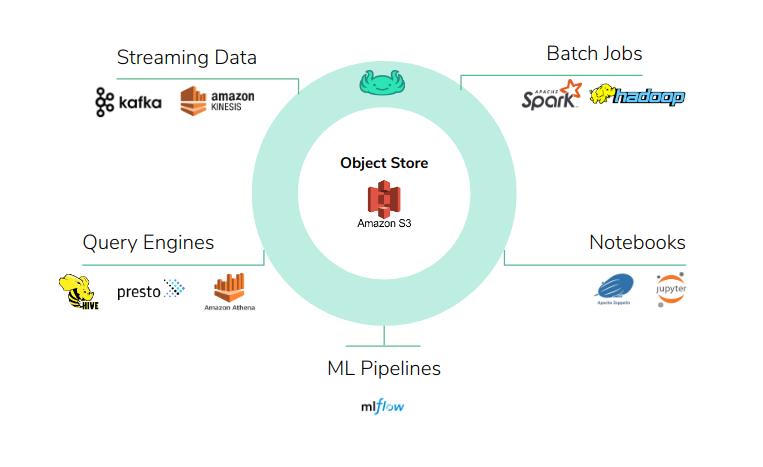
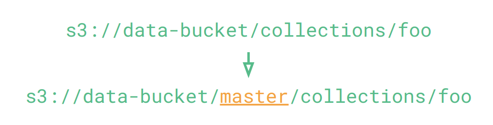

# What is lakeFS
{: .no_toc }  

lakeFS is an open source platform that delivers resilience and manageability to object-storage based data lakes.

With lakeFS you can build repeatable, atomic and versioned data lake operations - from complex ETL jobs to data science and analytics.

lakeFS supports AWS S3, Azure Blob Storage and Google Cloud Storage as its underlying storage service. It is [API compatible with S3](reference/s3.md) and works seamlessly with all modern data frameworks such as Spark, Hive, AWS Athena, Presto, etc.

{: .pb-5 }

## Why you need lakeFS and what it can do

lakeFS provides a [Git-like branching and committing model](branching/model.md) that scales to exabytes of data by utilizing S3 or GCS for storage.

This branching model makes your data lake ACID compliant by allowing changes to happen in isolated branches that can be created, merged and rolled back atomically and instantly.

Since lakeFS is compatible with the S3 API, all popular applications will work without modification, by simply adding the branch name to the object path:

## Here's why you need it:

### Development Environment for Data
* **Experimentation** - try tools, upgrade versions and evaluate code changes in isolation. By creating a branch of the lake you get an isolated snapshot of the lake you can experiment with while others are not exposed. You can compare branches with different experiments or compare your branch to the main branch of the lake.  
* **Reproducibility** - go back to any point in time to a consistent version of your data lake. By making commit history available for a configurable duration - you can read from the lake at any point in time, compare changes made, and safely roll back if necessary.

[Learn more](https://github.com/treeverse/lakeFS/blob/master/docs/branching/recommendations.md#development-environment){:id="user-content-learn-more-env"}

### Continuous Data Integration
* **Ingest new data safely by enforcing best practices** - make sure new data sources adhere to your lake’s best practices such as format and schema enforcement, naming convention, etc. By consuming data to an isolated branch and creating pre-merge hooks you can define automated rules and tests that are required to pass before introducing new data sources.
* **Metadata validation** - prevent breaking changes from entering the production data environment. Ingesting data to an isolated branch can also prevent breaking changes from entering your production data environment.

[Learn more](https://github.com/treeverse/lakeFS/blob/master/docs/branching/recommendations.md#continuous-integration){:id="user-content-learn-more-int"}

### Continuous Data Deployment
* **Instantly revert changes to data** - if low quality data is exposed to your consumers, you can revert instantly to a former, consistent and correct snapshot of your data lake. By making commit history available for a configurable duration - you can revert the lake to the previous version instantly with one atomic action.
* **Enforce cross collection consistency** - provide to consumers several collections of data that must be synchronized, in one atomic, revertable, action. Using branches, writers can provide consistency guarantees across different logical collections - merging to the main branch is only done after all relevant datasets have been created successfully.
* **Prevent data quality issues by enabling** -
   * Testing of production data before exposing it to users / consumers
   * Testing of intermediate results in your DAG to avoid cascading quality issues
   
[Learn more](https://github.com/treeverse/lakeFS/blob/master/docs/branching/recommendations.md#continuous-deployment){:id="user-content-learn-more-dep"}

## Next steps

Read about the [branching model](branching/model.md) of lakeFS or run it locally and see how it works for yourself!

Check out the [Quick Start Guide](quickstart/index.md)
