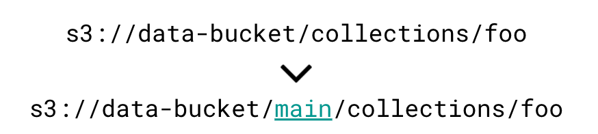

# What is lakeFS
{: .no_toc }  

lakeFS is an open source platform that delivers resilience and manageability to object-storage based data lakes.

With lakeFS you can build repeatable, atomic and versioned data lake operations - from complex ETL jobs to data science and analytics.

lakeFS is [API compatible with AWS S3](reference/s3.md), Google Cloud Storage (GCS), and works seamlessly with all modern data frameworks such as Spark, Hive, AWS Athena, Presto, etc.

 

{: .pb-5 }

## Why you need lakeFS and what it can do

lakeFS provides a [Git-like branching and committing model](branching/model.md) that scales to Petabytes of data by utilizing S3 for storage.

This branching model makes your data lake ACID compliant by allowing changes to happen in isolated branches that can be created, merged and rolled back atomically and instantly.

Since lakeFS is compatible with the S3 API, all popular applications will work without modification, by simply adding the branch name to the object path:

Here's why you need it:

### Fragile Writers

Writing to object stores is simple, scalable and cheap but could also be error prone, for example:

* Jobs (both streaming and batch) can fail, leaving partially written data
* It's hard to signal to readers that a collection of objects is ready to be consumed. This is sometimes worked around using SUCCESS files, Metastore registration or other home-grown solutions.
   It's even harder to keep multiple such collections in sync.
* Unless we know the exact prior state, cleanly undoing operations is extremely difficult
* Eventual consistency may cause corruption or failure. For example, S3's list operation might not show recently written objects, leading to failing jobs

lakeFS overcomes these obstacles by providing:

* **Atomic Operations** - lakeFS allows data producers to manipulate multiple objects as a single, atomic operation. If something fails half-way, all changes can be instantly rolled back. lakeFS enables this by allowing branch creation. When creating a branch, all objects manipulated within that branch are only visible inside it. Once processing completes successfully, merging to the "main" branch is an atomic operation. If something fails mid-way, we can simply (and atomically) revert our branch to its previous committed state.
* **Consistency** - lakeFS enables object-level and cross-collection consistency:
    * **object-level** consistency ensures all operations within a branch are strongly consistent (read-after-write, list-after-write, read-after-delete, etc).
    * **cross-collection** consistency is achieved by providing [snapshot isolation](https://en.wikipedia.org/wiki/Snapshot_isolation){: target="_blank" }. Using branches, writers can provide consistency guarantees across different logical collections - merging to "main" is only done after several datasets have been created successfully.
* **History** - By using a branch/commit model, we can atomically and safely rollback any set of changes made to the lake. By making commit history available for a configurable amount of time - we can read from the lake at any given point in time, compare changes made - and undo them if necessary.

### Fragile Readers

Reading data from the lake can also generate problems:

- Data is constantly changing, sometimes during an experiment or while a long-running job is executing.
- it's almost impossible to build reproducible, testable queries - we have no guarantee that the input data won't change.

lakeFS provides:

* **Cross-Lake Isolation** - Creating a lakeFS branch provides you with a snapshot of the entire lake at a given point in time. All reads from that branch are guaranteed to always return the same results.
* **Consistency** - When data is produced in isolated branches and merged atomically into "main", writers can provide data that readers can trust as complete and validated.
* **History** - Since previous commits are retained for a configurable duration, readers can query data from the latest commit, or from any other point in time.

### Data CI/CD

Data is useless, unless it's trustworthy. When data is written today, it's already being exposed to readers and there's no clear validation process, like the one we have in-place for code.

* There's no way to enforce naming conventions, schema rules, or the use of specific file formats.
* Validating the quality of the written data is usually done too late - it has already been written and is visible to readers. 
 
 lakeFS introduces the concept of **Data CI/CD** - The ability to define automated rules and tests that are required
 to pass before committing or merging changes to data. 
 
Data engineers can now define rules such as:

* *No breaking schema changes allowed under the following paths: \[...\]*
* *The main branch should only contain Parquet and ORC files. CSV and TSV are not allowed.*
* *Data validation jobs must finish successfully for this set of collections: \[...\]*
* *The proportion of rows with a given value in a certain column is dramatically lower than usual (a possible bug in data collection)*

## Next steps

Read about the [branching model](branching/model.md) of lakeFS or run it locally and see how it works for yourself!

Check out the [Quick Start Guide](quickstart/index.md)
