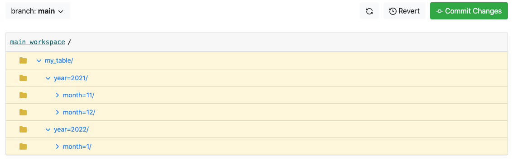

# Using lakeFS with Amazon Athena
[Amazon Athena](https://aws.amazon.com/athena/) is an interactive query service that makes it easy to analyze data in Amazon S3 using standard SQL.
{:.pb-5 }

Amazon Athena works directly above S3 and can't access lakeFS. Tables created using Athena aren't readable by lakeFS.
However, tables stored in lakeFS (that were created with [glue/hive](glue_hive_metastore.md)) can be queried by Athena.

To support querying data from lakeFS with Amazon Athena, we will use `create-symlink`, one of the [metastore commands](glue_hive_metastore.md) in [lakectl](../reference/cli.html).
`create-symlink` receives a source table, destination table, and the table location. It performs two actions:
1. It creates partitioned directories with symlink files in the underlying S3 bucket.
1. It creates a table in Glue catalog with symlink format type and location pointing to the created symlinks.

**Note**
`.lakectl.yaml` file should be configured with the proper hive/glue credentials. [For more information](glue_hive_metastore.md#configurations) 
{: .note }

create-symlink receives a table in glue or hive pointing to lakeFS and creates a copy of the table in glue.
The table data will use the `SymlinkTextInputFormat`, which will point to the lakeFS repository storage namespace. You will be able to query your data with Athena without copying any data. However, the symlinks table will only show the data that existed during 
the copy. If the table changed in lakeFS, you need to run `create-symlink` again for your changed to be reflected in Athena.

### Example:

Let's assume that some time ago, we created a hive table `my_table` that is stored in lakeFS repo `example` under branch `main`, using the command:
```shell
CREATE EXTERNAL TABLE `my_table`(
   `id` bigint, 
   `key` string 
)
PARTITIONED BY (YEAR INT, MONTH INT)
LOCATION 's3://example/main/my_table';
WITH (format = 'PARQUET', external_location 's3a://example/main/my_table' );
```

The repository `example` has the S3 storage space `s3://my-bucket/my-repo-prefix/`. 
After inserting some data into it, the object structure under `lakefs://example/main/my_table` looks as follows:



To query that table with Athena, you need to use the `create-symlink` command as follows:

```shell
lakectl metastore create-symlink \
--repo example \
--branch main \
--path my_table \
--from-client-type hive \
--from-schema default \
--from-table my_table \
--to-schema default \ 
--to-table my_table  
```

The command will generate two notable outputs:

1. For each partition, the command will create a symlink file:

```shell
➜   aws s3 ls s3://my-bucket/my-repo-prefix/my_table/ --recursive
2021-11-23 17:46:29          0 my-repo-prefix/my_table/symlinks/example/main/my_table/year=2021/month=11/symlink.txt
2021-11-23 17:46:29         60 my-repo-prefix/my_table/symlinks/example/main/my_table/year=2021/month=12/symlink.txt
2021-11-23 17:46:30         60 my-repo-prefix/my_table/symlinks/example/main/my_table/year=2022/month=1/symlink.txt
```

An example content of a symlink file, where each line represents a single object of the specific partition:
```text
s3://my-bucket/my-repo-prefix/5bdc62da516944b49889770d98274227
s3://my-bucket/my-repo-prefix/64262fbf3d6347a79ead641d2b2baee6
s3://my-bucket/my-repo-prefix/64486c8de6484de69f12d7d26804c93e
s3://my-bucket/my-repo-prefix/b0165d5c5b13473d8a0f460eece9eb26
```

1. A glue table pointing to the symlink directories structure:

```shell
aws glue get-table --name my_table --database-name default

{
  "Table": {
    "Name": "my_table",
    "DatabaseName": "default",
    "Owner": "anonymous",
    "CreateTime": "2021-11-23T17:46:30+02:00",
    "UpdateTime": "2021-11-23T17:46:30+02:00",
    "LastAccessTime": "1970-01-01T02:00:00+02:00",
    "Retention": 0,
    "StorageDescriptor": {
      "Columns": [
        {
          "Name": "id",
          "Type": "bigint",
          "Comment": ""
        },
        {
          "Name": "key",
          "Type": "string",
          "Comment": ""
        }
      ],
      "Location": "s3://my-bucket/my-repo-prefix/symlinks/example/main/my_table",
      "InputFormat": "org.apache.hadoop.hive.ql.io.SymlinkTextInputFormat",
      "OutputFormat": "org.apache.hadoop.hive.ql.io.HiveIgnoreKeyTextOutputFormat",
      "Compressed": false,
      "NumberOfBuckets": -1,
      "SerdeInfo": {
        "Name": "default",
        "SerializationLibrary": "org.apache.hadoop.hive.serde2.lazy.LazySimpleSerDe",
        "Parameters": {
          "serialization.format": "1"
        }
      },
      "StoredAsSubDirectories": false
    },
    "PartitionKeys": [
      {
        "Name": "year",
        "Type": "int",
        "Comment": ""
      },
      {
        "Name": "month",
        "Type": "int",
        "Comment": ""
      }
    ],
    "ViewOriginalText": "",
    "ViewExpandedText": "",
    "TableType": "EXTERNAL_TABLE",
    "Parameters": {
      "EXTERNAL": "TRUE",
      "bucketing_version": "2",
      "transient_lastDdlTime": "1637681750"
    },
    "CreatedBy": "arn:aws:iam::************:user/********",
    "IsRegisteredWithLakeFormation": false,
    "CatalogId": "*********"
  }
}
```

You can now safely use Athena to query `my_table`.
