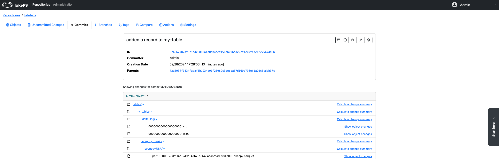
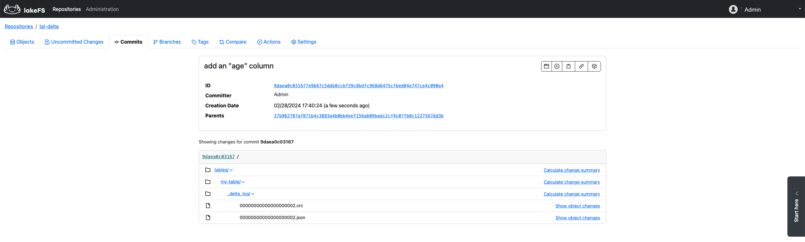
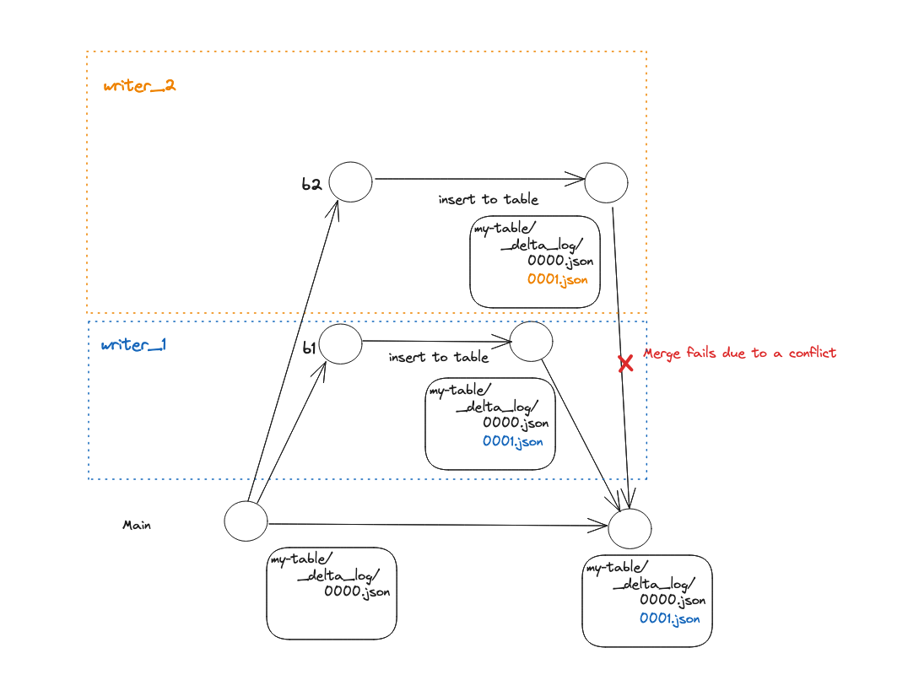
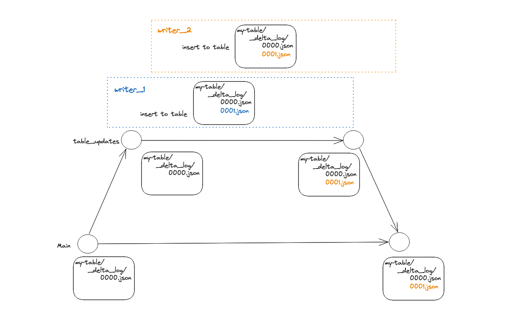
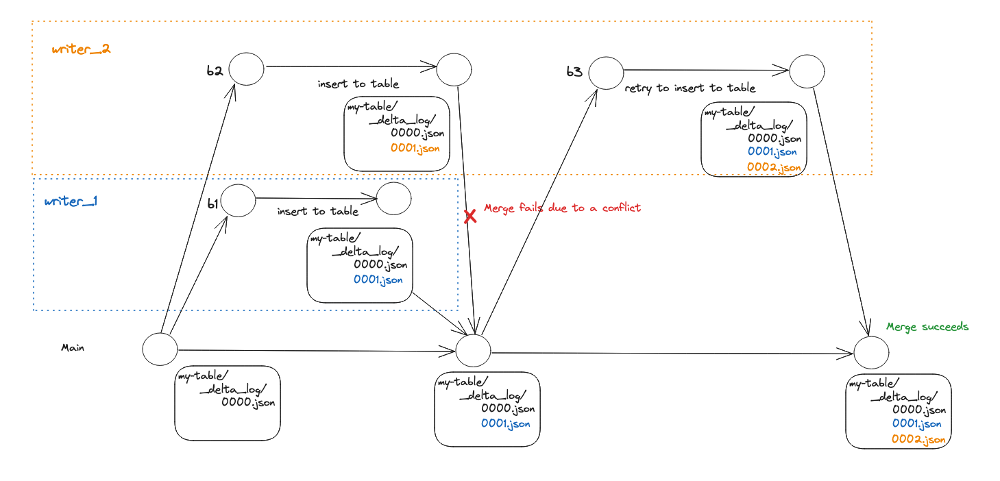

# Using lakeFS with Delta Lake

[Delta Lake](https://delta.io/) Delta Lake is an open-source storage framework designed to improve performance and provide transactional guarantees to data lake tables.

Because lakeFS is format-agnostic, you can save data in Delta format within a lakeFS repository and benefit from the advantages of both technologies. Specifically:

1. ACID operations can span across multiple Delta tables.
2. [CI/CD hooks][data-quality-gates] can validate Delta table contents, schema, or even referential integrity.
3. lakeFS supports zero-copy branching for quick experimentation with full isolation.



## Delta Lake Tables from the lakeFS Perspective

lakeFS is a data versioning tool, functioning at the **object** level. This implies that, by default, lakeFS remains agnostic 
to whether the objects within a Delta table location represent a table, table metadata, or data. As per the Delta Lake [protocol](https://github.com/delta-io/delta/blob/master/PROTOCOL.md), 
any modification to a table—whether it involves adding data or altering table metadata—results in the creation of a new object 
in the table's [transaction log](https://www.databricks.com/blog/2019/08/21/diving-into-delta-lake-unpacking-the-transaction-log.html). 
Typically, residing under the `_delta_log` path, relative to the root of the table's directory. This new object has an incremented version compared to its predecessor.

Consequently, when making changes to a Delta table within the lakeFS environment, these changes are reflected as changes 
to objects within the table location. For instance, inserting a record into a table named "my-table," which is partitioned 
by 'category' and 'country,' is represented in lakeFS as added objects within the table prefix (i.e., the table data) and the table transaction log.


Similarly, when performing a metadata operation such as renaming a table column, new objects are appended to the table transaction log, 
indicating the schema change.


## Using Delta Lake with lakeFS from Apache Spark

_Given the native integration between Delta Lake and Spark, it's most common that you'll interact with Delta tables in a Spark environment._

To configure a Spark environment to read from and write to a Delta table within a lakeFS repository, you need to set the proper credentials and endpoint in the S3 Hadoop configuration, like you'd do with any [Spark](./spark.md) environment.

Once set, you can interact with Delta tables using regular Spark path URIs. Make sure that you include the lakeFS repository and branch name:

```scala
df.write.format("delta").save("s3a://<repo-name>/<branch-name>/path/to/delta-table")
```

Note: If using the Databricks Analytics Platform, see the [integration guide](./spark.md#installation) for configuring a Databricks cluster to use lakeFS.

To see the integration in action see [this notebook](https://github.com/treeverse/lakeFS-samples/blob/main/00_notebooks/delta-lake.ipynb) in the [lakeFS Samples Repository](https://github.com/treeverse/lakeFS-samples/).

## Using Delta Lake with lakeFS from Python

The [delta-rs](https://github.com/delta-io/delta-rs) library provides bindings for Python. This means that you can use Delta Lake and lakeFS directly from Python without needing Spark. Integration is done through the [lakeFS S3 Gateway](#s3-gateway)

The documentation for the `deltalake` Python module details how to [read](https://delta-io.github.io/delta-rs/python/usage.html#loading-a-delta-table), [write](https://delta-io.github.io/delta-rs/python/usage.html#writing-delta-tables), and [query](https://delta-io.github.io/delta-rs/python/usage.html#querying-delta-tables) Delta Lake tables. To use it with lakeFS use an `s3a` path for the table based on your repository and branch (for example, `s3a://delta-lake-demo/main/my_table/`) and specify the following `storage_options`:

```python
storage_options = {"AWS_ENDPOINT": <your lakeFS endpoint>,
                   "AWS_ACCESS_KEY_ID": <your lakeFS access key>,
                   "AWS_SECRET_ACCESS_KEY": <your lakeFS secret key>,
                   "AWS_REGION": "us-east-1",
                   "AWS_S3_ALLOW_UNSAFE_RENAME": "true"
                  }
```

If your lakeFS is not using HTTPS (for example, you're just running it locally) then add the option

```python
                   "AWS_STORAGE_ALLOW_HTTP": "true"
```

To see the integration in action see [this notebook](https://github.com/treeverse/lakeFS-samples/blob/main/00_notebooks/delta-lake-python.ipynb) in the [lakeFS Samples Repository](https://github.com/treeverse/lakeFS-samples/).

## Exporting Delta Lake tables from lakeFS into Unity Catalog

This option is for users who are managing Delta Lake tables with lakeFS and access them through Databricks [Unity Catalog](https://www.databricks.com/product/unity-catalog). lakeFS offers 
a [Data Catalog Export](../howto/catalog_exports.md) functionality that provides read-only access to your Delta tables from within Unity catalog. Using the data catalog exporters,  
you can work on Delta tables in isolation and easily explore them within the Unity Catalog.

Once exported, you can query the versioned table data with:
```sql
SELECT * FROM my_catalog.main.my_delta_table
```
Here, 'main' is the name of the lakeFS branch from which the delta table was exported.

To enable Delta table exports to Unity catalog use the Unity [catalog integration guide](unity-catalog.md).

<iframe width="420" height="315" src="https://www.youtube.com/embed/rMDsnh7S2O0"></iframe>

## Limitations

### Multi-Writer Support in lakeFS for Delta Lake Tables
{: .no_toc}

lakeFS currently supports a single writer for Delta Lake tables. Attempting to utilize multiple writers for writing to a Delta table may result in two types of issues:
1. Merge Conflicts: These conflicts arise when multiple writers modify a Delta table on different branches, and an attempt is made to merge these branches.

2. Concurrent File Overwrite: This issue occurs when multiple writers concurrently modify a Delta table on the same branch.


Note: lakeFS currently lacks its own implementation for a LogStore, and the default Log store used does not control concurrency.
{: .note }
To address these limitations, consider following [best practices for implementing multi-writer support](#use-lakefs-branches-and-merges-to-support-multi-writers).

## Best Practices

### Implementing Multi-Writer Support through lakeFS Branches and Merges

To achieve safe multi-writes to a Delta Lake table on lakeFS, we recommend following these best practices:
1. **Isolate Changes:** Make modifications to your table in isolation. Each set of changes should be associated with a dedicated lakeFS branch, branching off from the main branch.
2. **Merge Atomically:** After making changes in isolation, try to merge them back into the main branch. This approach guarantees that the integration of changes is cohesive.

The workflow involves:
* Creating a new lakeFS branch from the main branch for any table change.
* Making modifications in isolation.
* Attempting to merge the changes back into the main branch.
* Iterating the process in case of a merge failure due to conflicts.

The diagram below provides a visual representation of how branches and merges can be utilized to manage concurrency effectively:


### Follow Vacuum by Garbage Collection

To delete unused files from a table directory while working with Delta Lake over lakeFS you need to first use Delta lake
[Vacuum](https://docs.databricks.com/en/sql/language-manual/delta-vacuum.html) to soft-delete the files, and then use
[lakeFS Garbage Collection](../howto/garbage-collection) to hard-delete them from the storage.

**Note:** lakeFS enables you to recover from undesired vacuum runs by reverting the changes done by a vacuum run before running Garbage Collection.     
{: .note }

### When running lakeFS inside your VPC (on AWS)

When lakeFS runs inside your private network, your Databricks cluster needs to be able to access it. 
This can be done by setting up a VPC peering between the two VPCs 
(the one where lakeFS runs and the one where Databricks runs). For this to work on Delta Lake tables, you would also have to disable multi-cluster writes with:

```
spark.databricks.delta.multiClusterWrites.enabled false
```

### Using multi cluster writes (on AWS)

When using multi-cluster writes, Databricks overrides Delta’s S3-commit action. 
The new action tries to contact lakeFS from servers on Databricks’ own AWS account, which of course won’t be able to access your private network. 
So, if you must use multi-cluster writes, you’ll have to allow access from Databricks’ AWS account to lakeFS. 
If you are trying to achieve that, please reach out on Slack and the community will try to assist.

## Further Reading

See [Guaranteeing Consistency in Your Delta Lake Tables With lakeFS](https://lakefs.io/blog/guarantee-consistency-in-your-delta-lake-tables-with-lakefs/) post on the lakeFS blog to learn how to 
guarantee data quality in a Delta table by utilizing lakeFS branches.


[data-quality-gates]:  #using-hooks-as-data-quality-gates
[deploy-docker]:  #docker

