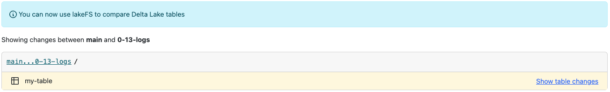
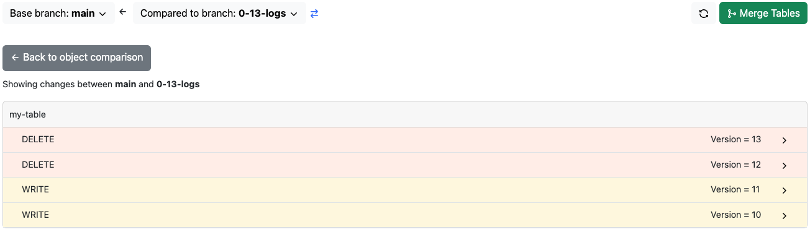

# Using lakeFS with Delta Lake
{: .no_toc }

[Delta Lake](https://delta.io/) is an open file format designed to improve performance and provide transactional guarantees to data lake tables.

lakeFS is format-agnostic, so you can save data in Delta format within a lakeFS repository to reap the benefits of both technologies. Specifically:

1. ACID operations can now span across many Delta tables.
2. [CI/CD hooks](../use_cases/cicd_for_data.md#using-hooks-as-data-quality-gates) can validate Delta table contents, schema, or even referential integrity.
3. lakeFS supports zero-copy branching for quick experimentation with full isolation.



## Beta: Viewing Delta table changes in lakeFS 

Using lakeFS, you can compare different versions of Delta tables, view the table operations done since the tables diverged and their details.


For example, comparing branches `dev` and `main`, we can see that the _movies_ table has changed on `dev` since the branches diverged. 
Expanding the delete operation, we learn that all movies with a rating < 4 were deleted from the table on the `dev` branch.






**Note:** 
The diff is available as long as the table history in Delta is retained ([30 days by default](https://docs.databricks.com/delta/history.html#configure-data-retention-for-time-travel)). A delta lake table history is derived from the delta log JSON files.

## Spark Configuration

_Given the native integration between Delta Lake and Spark, it's most common that you'll interact with Delta tables in a Spark environment._

To configure a Spark environment to read from and write to a Delta table within a lakeFS repository, you need to set the proper credentials and endpoint in the S3 Hadoop configuration, like you'd do with any [Spark](./spark.md) environment.

Once set, you can interact with Delta tables using regular Spark path URIs. Make sure that you include the lakeFS repository and branch name:

```scala
df.write.format("delta").save("s3a://<repo-name>/<branch-name>/path/to/delta-table")
```

Note: If using the Databricks Analytics Platform, see the [integration guide](./spark.md#installation) for configuring a Databricks cluster to use lakeFS.

## Best Practices

Production workflows should ideally write to a single lakeFS branch that could then be safely merged into `main`. This is because the [Delta log](https://databricks.com/blog/2019/08/21/diving-into-delta-lake-unpacking-the-transaction-log.html) is an auto-generated sequence of text files used to keep track of transactions on a Delta table sequentially. Writing to one Delta table from multiple lakeFS branches is possible, but note that it would result in conflicts if later attempting to merge one branch into the other.

### When running lakeFS inside your VPC (on AWS)

When lakeFS runs inside your private network, your Databricks cluster needs to be able to access it. 
This can be done by setting up a VPC peering between the two VPCs 
(the one where lakeFS runs and the one where Databricks runs). For this to work on Delta Lake tables, you would also have to disable multi-cluster writes with:

```
spark.databricks.delta.multiClusterWrites.enabled false
```

### Using multi cluster writes (on AWS)

When using multi-cluster writes, Databricks overrides Delta’s S3-commit action. 
The new action tries to contact lakeFS from servers on Databricks’ own AWS account, which of course won’t be able to access your private network. 
So, if you must use multi-cluster writes, you’ll have to allow access from Databricks’ AWS account to lakeFS. 
If you are trying to achieve that, please reach out on Slack and the community will try to assist.


## Further Reading

See [Guaranteeing Consistency in Your Delta Lake Tables With lakeFS](https://lakefs.io/guarantee-consistency-in-your-delta-lake-tables-with-lakefs/) post on the lakeFS blog to learn how to 
guarantee data quality in a Delta table by utilizing lakeFS branches.
