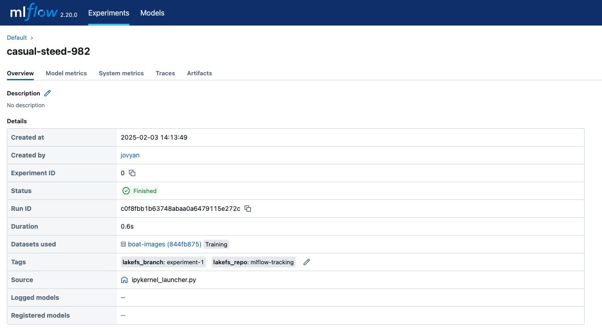

# Using MLflow with lakeFS

[MLflow](https://mlflow.org/docs/latest/index.html) is a comprehensive tool designed to manage the machine learning lifecycle,
assisting practitioners and teams in handling the complexities of ML processes. It focuses on the full lifecycle of machine
learning projects, ensuring that each phase is manageable, traceable, and reproducible.

MLflow comprises multiple core components, and lakeFS seamlessly integrates with the [MLflow Tracking](https://mlflow.org/docs/latest/tracking.html#tracking)
component. MLflow tracking enables experiment tracking that accounts for both inputs and outputs, allowing for visualization
and comparison of experiment results.



## Why use MLflow with lakeFS? 

1. **Experiment Reproducibility**: As a data versioning system, lakeFS enables dataset versioning. Combined with MLflow's
[input logging](https://mlflow.org/docs/latest/python_api/mlflow.html#mlflow.log_input) capability, lakeFS helps you track
not only the dataset used for an experiment run but its exact version. Accurate tracking of run inputs makes experiments
truly reproducible.
2. **Parallel Experiments with Zero Data Copy**: lakeFS employs a copy-on-write technique, allowing for efficient 
[branch](../understand/model.md#branches) creation without duplicating data. This enables multiple experiments to be 
conducted in parallel, with each branch providing an isolated environment for modifications. Changes made in one branch
do not affect others, ensuring safe collaboration among team members. Once an experiment is complete, the branch can be
merged back into the main dataset, incorporating the new insights seamlessly.

## How to use MLflow with lakeFS

We will demonstrate how to load versioned data from lakeFS into MLflow experiment runs, log run inputs, and later trace
back the exact dataset used for a run to reproduce experiment results.

We will use the [mlflow.data](https://mlflow.org/docs/latest/python_api/mlflow.data.html#mlflow-data) module that helps record 
and retrieve dataset information into MLflow experiment runs. 

### The recommended lakeFS branching strategy   

1. **Create a branch per experiment**: Before you start an experiment, create a dedicated lakeFS branch for it. This will allow you to make changes to your input dataset
without copying it. You will load data from this branch to your MLflow runs. 
2. **Commit dataset changes**: ML development is an iterative process that includes trial and error. If you reached a point in 
which you made changes to your input dataset, commit them to lakeFS using a meaningful commit message. During an experiment 
run we will load the dataset version that corresponds to the branch head commit and will make sure to keep track of this 
reference so that we can later reproduce run results. 

### Load versioned datasets

mlflow.data provides APIs for constructing Datasets from a variety of Python data objects, Spark DataFrames, and more. 
lakeFS seamless integration with both Spark and common Python libraries enables creating MLflow 
[Datasets](https://mlflow.org/docs/latest/python_api/mlflow.data.html#mlflow.data.dataset.Dataset) with pointing to 
[Dataset source](https://mlflow.org/docs/latest/python_api/mlflow.data.html#mlflow.data.dataset_source.DatasetSource) on
lakeFS. 

* s3 gateway only? 

#### Python libraries integration


#### Spark-based

##### Configuration

To configure lakeFS to load a Spark dataframe or multiple formats, including Delta Lake tables, configure Spark to work 
with lakeFS [S3-compatible API](spark.md#s3-compatible-api), and Delta Lake as follows: 

```python
from pyspark.sql import SparkSession
spark = SparkSession.builder.appName("lakeFS / Mlflow") \
    .config("spark.hadoop.fs.s3.impl", "org.apache.hadoop.fs.s3a.S3AFileSystem") \
    .config("spark.hadoop.fs.s3a.endpoint", 'https://example-org.us-east-1.lakefscloud.io') \
    .config("spark.hadoop.fs.s3a.path.style.access", "true") \
    .config("spark.hadoop.fs.s3a.access.key", 'AKIAlakefs12345EXAMPLE') \
    .config("spark.hadoop.fs.s3a.secret.key", 'abc/lakefs/1234567bPxRfiCYEXAMPLEKEY') \
    .config("spark.jars.packages", "io.delta:delta-core_2.12:2.3.0") \
    .config("spark.sql.extensions", "io.delta.sql.DeltaSparkSessionExtension") \
    .config("spark.sql.catalog.spark_catalog", "org.apache.spark.sql.delta.catalog.DeltaCatalog") \
    .getOrCreate()
```

##### Spark example 

```python
import lakefs 
import mlflow

repo = lakefs.Repository("mlflow-tracking").create(storage_namespace="bucket/my-namespace", default_branch="main", exist_ok=True)
repo_id = repo.id

exp_branch = repo.branch("experiment-1").create(source_reference="main", exist_ok=True)
branch_id = exp_branch.id
head_commit_id = exp_branch.head.id

table_path = "gold/train_v2/"

dataset_source_url = f"s3://{repo_id}/{head_commit_id}/{table_path}"

# Load delta lake table from lakeFS, at its most updated version to which the head commit id is pointing
dataset = mlflow.data.load_delta(path=dataset_source_url, name="boat-images")

# View some of the recorded Dataset information
print(f"Dataset name: {dataset.name}")
print(f"Dataset source URI: {dataset.source.path}")

# Use mlflow input logging to track the dataset versioned by lakeFS
with mlflow.start_run() as run:
    mlflow.log_input(dataset, context="training")
    mlflow.set_tag("lakefs_repo", repo_id)
    mlflow.set_tag("lakefs_branch", branch_id) # Log the branch id, to have a friendly lakeFS reference to search the input dataset in 

# Inspect run's dataset
logged_run = mlflow.get_run(run.info.run_id) # 

# Retrieve the Dataset object
logged_dataset = logged_run.inputs.dataset_inputs[0].dataset

# View some of the recorded Dataset information
print(f"Dataset name: {logged_dataset.name}")
print(f"Dataset source URI: {logged_dataset.source}")
```

Output 
```text
Dataset name: boat-images
Dataset source URI: s3://mlflow-tracking/3afddad4fef987b4919f5e82f16682c018f59ed2ff003a6a81adf72edaad23c3/gold/train_v2/
Dataset name: boat-images
Dataset source URI: {"path": "s3://mlflow-tracking/3afddad4fef987b4919f5e82f16682c018f59ed2ff003a6a81adf72edaad23c3/gold/train_v2/"}
```



```python
import mlflow

# Inspect run's dataset and tags
run = mlflow.get_run("c0f8fbb1b63748abaa0a6479115e272c") # 

# Retrieve the Dataset object
logged_dataset = run.inputs.dataset_inputs[0].dataset

# View some of the recorded Dataset information
print(f"Dataset name: {logged_dataset.name}")
print(f"Dataset source URI: {logged_dataset.source}")

# Retrieve run's tags 
logged_tags = run.data.tags
print(f"Run tags: {logged_tags}")
```

```text
Dataset name: boat-images
Dataset source URI: {"path": "s3://mlflow-tracking/3afddad4fef987b4919f5e82f16682c018f59ed2ff003a6a81adf72edaad23c3/gold/train_v2/"}
Run tags: {'lakefs_branch': 'experiment-1', 'lakefs_repo': 'mlflow-tracking'}
```


##### Load dataset 

```python
import mlflow

dataset_lakefs_uri = "s3://repo/my-experiment/gold/train_v2/"

# Load delta lake table from lakeFS
dataset = mlflow.data.load_delta(path=dataset_lakefs_uri, name="boat-images")

# View some of the recorded Dataset information
print(f"Dataset name: {dataset.name}")
print(f"Dataset source URI: {dataset.source.path}")
```

Output:
```text
Dataset name: boat-images
Dataset source URI: {"path": "s3://repo/experiment-branch/gold/train_v2/"}
```

**Note:** 
The URI schema is s3 because we configured lakeFS to use Spark via the s3 gateway. with these configurations the `lakefs://`
schema won't work. 


### Log run input

Once you created an MLflow dataset of the type of your choice, use it in yout experiment runs and log it as input of a run.  

```python
with mlflow.start_run() as run:
    mlflow.log_input(dataset, context="training")
    mlflow.set_tag("lakefs_repo", "mlflow-tracking")
    mlflow.set_tag("lakefs_branch", "my-experiment")
    mlflow.set_tag("lakefs_head_commit_id", "b2d721a4a06b4071de425cfade0f41b0346512a4a0b5db440f53087abea925d3")
```

**Notes:** 
* The dataset source will point to its lakeFS URI on branch "my-experiment".
* To retrieve the dataset version used on a run, make sure that the branch head commit points to the logged lakeFS head
commit id.

### Inspecting runs input  

MLflow's tracking UI allows you to inspect the inputs of each run, including the specific dataset logged. However, to 
inspect the exact dataset version we recommend the following approach.  

1. Get runID: go to the MLflow UI and copy the runID of your choice.
2. Extract dataset information: extract the information of the dataset used in this run.  

```python
# Retrieve the run information
logged_run = mlflow.get_run("5f7c01e28b2e41b0963dab99198f278f")

# Retrieve the Dataset object
logged_dataset = logged_run.inputs.dataset_inputs[0].dataset

# View some of the recorded Dataset information
print(f"Dataset name: {logged_dataset.name}")
print(f"Dataset digest: {logged_dataset.digest}")
print(f"Dataset source URI: {logged_dataset.source}")
```
Output 
```text
## Output
Dataset name: boat-images
Dataset digest: e88c85ce
Dataset source URI: {"path": "s3://repo/experiment-branch/gold/train_v2/"}
```


### Bonus

* You can assert if two experiment runs used the same dataset by comparing dataset sources. 