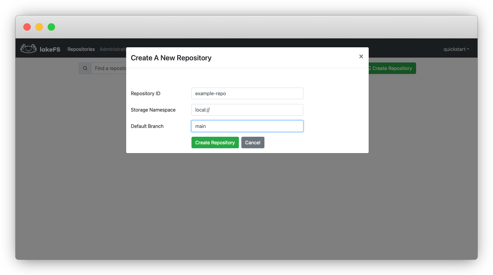

# Setting up a Repository
{: .no_toc }

Once you have a running lakeFS instance, we'll need to set up an initial admin user in order to log in to the UI and make our first steps in lakeFS! In this guide, we're going to run an initial setup and then create a new [repository](../branching/model.md#repositories).

Once we have a repository created, we can start [copying and modifying objects](./aws_cli.md), [commit](../reference/commands.md#lakectl-commit) and [reset](../reference/commands.md#lakectl-branch-reset) changes - and even communicate with this repository from [Spark](../using/spark.md), [Presto](../using/presto.md) or other S3-compatible tools using our [S3 Gateway API](../architecture.md#s3-gateway).

1. Open [http://127.0.0.1:8000/setup](http://127.0.0.1:8000/setup){:target="_blank"} in your web browser to set up an initial admin user, used to login and send API requests.

   

1. Follow the steps to create an initial administrator user. Save the credentials you've received somewhere safe, you won't be able to see them again!

   

1. Follow the link and go to the login screen

   

1. Use the credentials from step #2 to login as an administrator
1. Click `Create Repository`
    
   

   A [repository](../branching/model.md#repositories) is lakeFS's basic namespace, akin to S3's Bucket (read more about the data model [here](../branching/model.md)).
   Since we're using the `local` block adapter, the value used for `Storage Namespace` should be a static `local://`.
   For a deployment that uses S3 as a block adapter, this would be a bucket name with an optional prefix, e.g. `s3://my-bucket/prefix`.
   Notice that lakeFS will only manage the data written under that prefix. All actions on the managed data must go through lakeFS endpoint.
   Data written directly to the bucket under different paths will be accessible in the same way it was before.   
   {: .note .note-info }
   
### Next steps

You just created your first lakeFS repository! Go to [Copy Files](aws_cli.md) for adding data to your new repository.
