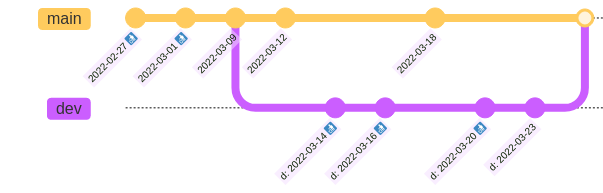

# Garbage Collection
{: .no_toc }

By default, lakeFS keeps all your objects forever. This allows you to travel back in time to previous versions of your data.
However, sometimes you may want to hard-delete your objects - namely, delete them from the underlying storage. 
Reasons for this include cost-reduction and privacy policies.

Garbage collection rules in lakeFS define for how long to retain objects after they have been deleted (see more information [below](#considerations)).
lakeFS provides a Spark program to hard-delete objects that have been deleted and whose retention period has ended according to the GC rules.
The GC job does not remove any commits: you will still be able to use commits containing hard-deleted objects,
but trying to read these objects from lakeFS will result in a `410 Gone` HTTP status.

**Note**
At this point, lakeFS supports Garbage Collection only on S3 and Azure.  We have [concrete plans](https://github.com/treeverse/lakeFS/issues/3626) to extend the support to GCP.     
{: .note}

1. TOC
{:toc .pb-5 }

## Understanding Garbage Collection

For every branch, the GC job retains deleted objects for the number of days defined for the branch.
In the absence of a branch-specific rule, the default rule for the repository is used.
If an object is present in more than one branch ancestry, it's retained according to the rule with the largest number of days between those branches.
That is, it's hard-deleted only after the retention period has ended for all relevant branches.

Example GC rules for a repository:
```json
{
  "default_retention_days": 14,
  "branches": [
    {"branch_id": "main", "retention_days": 21},
    {"branch_id": "dev", "retention_days": 7}
  ]
}
```

In the above example, objects are retained for 14 days after deletion by default. However, if they are present in the branch `main`, they are retained for 21 days.
Objects present in the `dev` branch (but not in any other branch) are retained for 7 days after they are deleted.

### What gets collected

Because each object in lakeFS may be accessible from multiple branches, it
might not be obvious which objects will be considered garbage and collected.

Garbage collection is configured by specifying the number of days to retain
objects on each branch. If a branch is configured to retain objects for a
given number of days, any object that was accessible from the HEAD of a
branch in that past number of days will be retained.

The garbage collection process proceeds in two main phases:

* **Discover which commits will retain their objects.**  For every branch,
  the garbage collection job looks at the HEAD of the branch that many days
  ago; every commit at or since that HEAD must be retained.

  
  
  Continuing the example, branch `main` retains for 21 days and branch `dev`
  for 7. When running GC on 2022-03-31:

  - 7 days ago, on 2022-03-24 the head of branch `dev` was `d:
    2022-03-23`. So, that commit is retained (along with all more recent
    commits on `dev`) but all older commits `d: *` will be collected.
  - 21 days ago, on 2022-03-10, the head of branch `main` was
    `2022-03-09`. So that commit is retained (along with all more recent
    commits on `main`) but commits `2022-02-27` and `2022-03-01` will be
    collected.

* **Discover which objects need to be garbage collected.** Hold (_only_)
  objects accessible on some retained commits.

  In the example, all objects of commit `2022-03-12`, for instance, are
  retained. This _includes_ objects added in previous commits. However,
  objects added in commit `d: 2022-03-14` which were overwritten or
  committed in commit `d: 2022-03-20` are not visible in any retained commit
  and will be garbage collected.
  
* **Garbage collect those objects by deleting them.** The data of any
  deleted object will no longer be accessible. lakeFS retains all metadata
  about the object, but attempting to read it via the lakeFS API or the S3
  gateway will return HTTP status 410 ("Gone").

### What does _not_ get collected

From the above definition of what gets collected, some objects will _not_ be
collected regardless of configured GC rules:

* Any object that was _uploaded but never committed_ cannot be collected.  See
  [#1933](https://github.com/treeverse/lakeFS/issues/1933) for more details.
* Any object that is present on a branch HEAD is visible on that branch.
  Commits at the HEAD of a branch are retained, so such an object will not
  be collected.

## Configuring GC rules

### Using lakectl
{: .no_toc }

Use the `lakectl` CLI to define the GC rules: 

```bash
cat <<EOT >> example_repo_gc_rules.json
{
  "default_retention_days": 14,
  "branches": [
    {"branch_id": "main", "retention_days": 21},
    {"branch_id": "dev", "retention_days": 7}
  ]
}
EOT

lakectl gc set-config lakefs://example-repo -f example_repo_gc_rules.json 
```

### From the lakeFS UI
{: .no_toc }

1. Navigate to the main page of your repository.
2. Go to _Settings_ -> _Retention_.
3. Click _Edit policy_ and paste your GC rule into the text box as a JSON.
4. Save your changes.


## Running the GC job

The GC job is a Spark program that can be run using `spark-submit` (or using your preferred method of running Spark programs).
The job will hard-delete objects that were deleted and whose retention period has ended according to the GC rules.

First, you'll have to download the lakeFS Spark client Uber-jar. The Uber-jar can be found on a public S3 location:

For Spark 2.4.7: \
http://treeverse-clients-us-east.s3-website-us-east-1.amazonaws.com/lakefs-spark-client-247/${CLIENT_VERSION}/lakefs-spark-client-247-assembly-${CLIENT_VERSION}.jar

For Spark 3.0.1: \
http://treeverse-clients-us-east.s3-website-us-east-1.amazonaws.com/lakefs-spark-client-301/${CLIENT_VERSION}/lakefs-spark-client-301-assembly-${CLIENT_VERSION}.jar

`CLIENT_VERSION`s for Spark 2.4.7 can be found [here](https://mvnrepository.com/artifact/io.lakefs/lakefs-spark-client-247), and for Spark 3.0.1 they can be found [here](https://mvnrepository.com/artifact/io.lakefs/lakefs-spark-client-301).

Running options:

<div class="tabs">
  <ul>
    <li><a href="#aws-option">On AWS</a></li>
	<li><a href="#azure-option">On Azure</a></li>
  </ul>
  <div markdown="1" id="aws-option">
You should specify the Uber-jar path instead of `<APPLICATION-JAR-PATH>` and run the following command to make the garbage collector start running:

  ```bash
spark-submit --class io.treeverse.clients.GarbageCollector \
  -c spark.hadoop.lakefs.api.url=https://lakefs.example.com:8000/api/v1  \
  -c spark.hadoop.lakefs.api.access_key=<LAKEFS_ACCESS_KEY> \
  -c spark.hadoop.lakefs.api.secret_key=<LAKEFS_SECRET_KEY> \
  -c spark.hadoop.fs.s3a.access.key=<S3_ACCESS_KEY> \
  -c spark.hadoop.fs.s3a.secret.key=<S3_SECRET_KEY> \
  <APPLICATION-JAR-PATH> \
  example-repo us-east-1
  ```
  </div>

  <div markdown="1" id="azure-option">
You should run the following command to make the garbage collector start running:

  ```bash
spark-submit --class io.treeverse.clients.GarbageCollector \
  -c spark.hadoop.lakefs.api.url=https://lakefs.example.com:8000/api/v1  \
  -c spark.hadoop.lakefs.api.access_key=<LAKEFS_ACCESS_KEY> \
  -c spark.hadoop.lakefs.api.secret_key=<LAKEFS_SECRET_KEY> \
  -c spark.hadoop.fs.azure.account.key.<AZURE_STORAGE_ACCOUNT>.dfs.core.windows.net=<AZURE_STORAGE_ACCESS_KEY> \
  s3://treeverse-clients-us-east/lakefs-spark-client-312-hadoop3/0.2.2/lakefs-spark-client-312-hadoop3-assembly-0.2.2.jar \
  example-repo
  ```

**Notes:**
* To run GC on Azure, use `lakefs-spark-client-312-hadoop3` only. This client is compiled for Spark 3.1.2 with Hadoop 3.2.1, but may work with other Spark versions and higher Hadoop versions. Specifically, this client was tested on Databricks runtime DBR 11.0 (Spark 3.3.0, 3.3.2).
* GC on Azure is supported from Spark client version >= v0.2.0.
* In case you don't have `hadoop-azure` package as part of your environment, you should add the package to your spark-submit with `--packages org.apache.hadoop:hadoop-azure:3.2.1`
* For GC to work on Azure blob, [soft delete](https://docs.microsoft.com/en-us/azure/storage/blobs/soft-delete-blob-overview) should be disabled.
  
</div>

### Networking

Garbage collection communicates with the lakeFS server.  Very large
repositories may require increasing a read timeout.  If you run into timeout errors during communication from the Spark job to lakefs consider increasing these timeouts:

* Add `-c spark.hadoop.lakefs.api.read.timeout_seconds=TIMEOUT_IN_SECONDS`
  (default 10) to allow lakeFS more time to respond to requests.
* Add `-c
  spark.hadoop.lakefs.api.connection.timeout_seconds=TIMEOUT_IN_SECONDS`
  (default 10) to wait longer for lakeFS to accept connections.

## Considerations
1. In order for an object to be hard-deleted, it must be deleted from all branches.
   You should remove stale branches to prevent them from retaining old objects.
   For example, consider a branch that has been merged to `main` and has become stale.
   An object which is later deleted from `main` will always be present in the stale branch, preventing it from being hard-deleted.
   
1. lakeFS will never delete objects outside your repository's storage namespace.
   In particular, objects that were imported using `lakefs import` or `lakectl ingest` will not be affected by GC jobs.
   
1. In cases where deleted objects are brought back to life while a GC job is running, said objects may or may not be
   deleted. Such actions include:
   1. Reverting a commit in which a file was deleted.
   1. Branching out from an old commit.
   1. Expanding the retention period of a branch.
   1. Creating a branch from an existing branch, where the new branch has a longer retention period.
