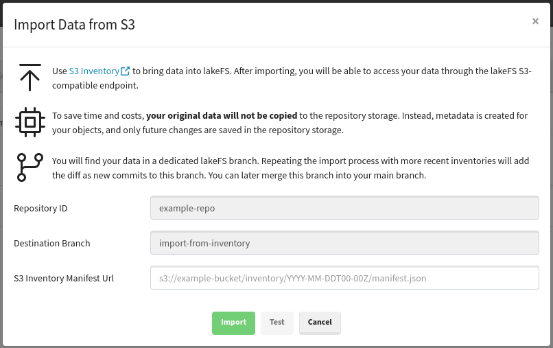
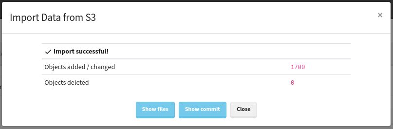

# Importing data from S3
{: .no_toc }

## Table of contents
{: .no_toc .text-delta }

1. TOC
{:toc}

## Copying using external tools

In order to import existing data to lakeFS, you may choose to copy it using [S3 CLI](../using/aws_cli.md#copy-from-a-local-path-to-lakefs) 
or using tools like [Apache DistCp](../using/distcp.md#from-s3-to-lakefs). This is the most straightforward way, and we recommend it if it’s applicable for you.

## Limitations
Unfortunately, copying data is not always feasible for the following reasons:
1. Some data is just too big to copy.
2. It requires you to stop making changes to the data before starting to copy.
3. It requires you to switch to using the lakeFS endpoint in all places at once.

## Using lakeFS import API
To solve this, we offer an import API which will not copy any data and allow for a more gradual onboarding process.

### About the import API
The lakeFS import API will use the [S3 Inventory](https://docs.aws.amazon.com/AmazonS3/latest/dev/storage-inventory.html) feature to create lakeFS metadata.
The imported metadata will be reflected in lakeFS under a special branch, called `import-from-inventory`.
You should not make any changes or commit anything to this branch: it will be operated on only by lakeFS.
After importing, you will be able to merge this branch into your main branch.

The imported data is not copied to the repository’s dedicated bucket.
Rather, it will be read directly from your existing bucket when you access it through lakeFS.
Files created or replaced through lakeFS will then be stored in the repository’s dedicated bucket.

It is important to note that due to the deduplication feature of lakeFS, data will stay in your original bucket even
when accessing it through other branches. In a sense, your original bucket becomes an initial snapshot of your data.

**Note:** lakeFS will never make any changes to the import source bucket.
{: .note .pb-3 }  

### Prerequisites
- Your bucket should have S3 Inventory enabled.
- The inventory should be in Parquet format.
- The inventory must contain (at least) the size, last-modified-at, and e-tag columns.
- The S3 credentials you provided to lakeFS should have GetObject permissions on the source bucket and on the bucket where the inventory is stored.
- If you want to use the API for [gradual import](#gradual-import), you should not delete the data for the most recently imported inventory, until a more recent inventory is successfully imported.
 
### Usage
The import API can accessed from the web interface, through the repository settings page.
In the dialog, provide the URL for you inventory manifest.json file. You can press the *Test* button to have lakeFS read your manifest and display the expected number of added files. 
 

Then, press `Import` to start the process. When finished, you will see a summary of the import.

After importing, note that a commit was added to your `import-from-inventory` branch, and that you can see the files in the web interface under this branch.

**Warning:** the *import-from-inventory* branch should only be used by lakeFS. You should not make any operations on it.
{: .note } 

### Gradual Import

Once you switch to using the lakeFS S3-compatible endpoint in all places, you can stop making changes to your original bucket.
However, if your operation still requires that you work on the original bucket,
you can repeat using the import API with up-to-date inventories every day, until you complete the onboarding process.
The changes will be added as new commits to the `import-from-inventory` branch, which you can in turn merge into your main branch.

### Limitations

Note that lakeFS cannot manage your metadata if you make changes to data in the original bucket.
The following table describes the results of making changes in the original bucket, without importing it to lakeFS:

| Object action in the original bucket | ListObjects result in lakeFS                 | GetObject result in lakeFS |
|--------------------------------------|----------------------------------------------|----------------------------|
| Create                               | Object not visible                           | Object not accessible      |
| Overwrite                            | Object visible with outdated metadata        | Updated object accessible  |
| Delete                               | Object visible                               | Object not accessible      |