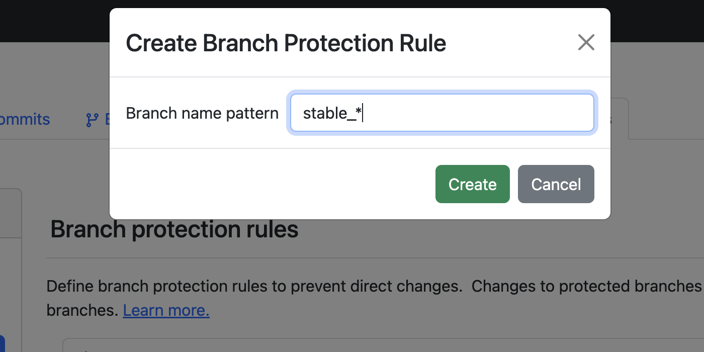
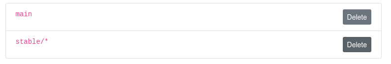

# Branch Protection Rules

Define branch protection rules to prevent direct changes and commits to specific branches.
Only merges are allowed into protected branches. Together with the power of pre-merge [hooks](../setup/hooks.md){: .button-clickable},
you can run validations on your data before it reaches your important branches and is exposed to consumers.

You can create rules for a specific branch, or to any branch that matches a name pattern you specify with [glob](https://en.wikipedia.org/wiki/Glob_(programming)){: .button-clickable} syntax (supporting `?` and `*` wildcards).

## How it works

When at least one protection rules applies to a branch, the branch is protected. The following operations will fail on protected branches:
1. Object write operations: **upload** and **delete** objects.
1. Branch operations: **commit** and **reset uncommitted changes**.

To operate on a protected branch, merge commits from other branches into it. Use pre-merge [hooks](../setup/hooks.md){: .button-clickable}
to validate the changes before they are merged.

Reverting a previous commit using `lakectl branch revert` is **allowed** on a protected branch.
{: .note }

## Managing branch protection rules

This section explains how to use the lakeFS UI to manage rules. You can also use the [command line](./commands.md#lakectl-branch-protect){: .button-clickable}.

### Reaching the branch protection rules page 

1. On lakeFS, navigate to the main page of the repository.
2. Click on the _Settings_ tab.
3. In the left menu, click _Branches_.

### Adding a rule

To add a new rule, click the _Add_ button. In the dialog, enter the branch name pattern and then click _Create_.

### Deleting a rule
To delete a rule, click the _Delete_ button next to it.

