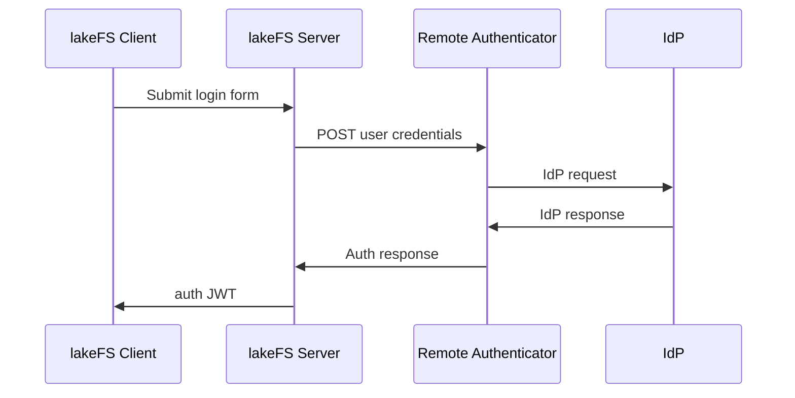

# Remote Authenticator

Remote Authenticator is a pluggable architecture for lakeFS which allows you to use existing organizational identity policies and infrastructure with the authentication mechanism of lakeFS. The Remote Authenticator's job is to abstract away the complexities of existing infrastructure and implement a standard interface, which lakeFS can use to resolve user identity and manage access to lakeFS. This loose coupling allows you to implement federated identity without providing lakeFS with direct access to your identity infrastructure.

## Architecture

Here's the authentication flow that lakeFS uses when configured with a remote authenticator:



## The Interface

To configure lakeFS to work with a Remote Authenticator add the following YAML to your lakeFS configuration:

```yaml
auth:
    remote_authenticator:
        enabled: true
        endpoint: <url-to-remote-authenticator-endpoint>
        default_user_group: "Developers"
    ui_config:
        logout_url: /logout
        login_cookie_names:
            - internal_auth_session
```

- `auth.remote_authenticator.enabled` - set lakeFS to use the remote authenticator
- `auth.remote_authenticator.endpoint` - an endpoint where the remote authenticator is able to receive a POST request from lakeFS
- `auth.remote_authenticator.default_user_group` - the group assigned by default to new users
- `auth.ui_config.logout_url` - the URL to redirect the browser when clicking the logout link in the user menu
- `auth.ui_config.login_cookie_names` - the name of the cookie(s) lakeFS will set following a successful authentication. The value is the authenticated user's JWT

A Remote Authenticator implementation should expose a single endpoint, which expects the following JSON request:

```json
{
    "username": "testy.mctestface@example.com",
    "password": "Password1"
}
```

and returns a JSON response like this:

```json
{
    "external_user_identifier": "TestyMcTestface"
}
```

### Example Request & Responses

#### Request

```http
POST https://remote-authenticator.example.com/auth
Content-Type: application/json

{
  "username": "testy.mctestface@example.com",
  "password": "Password1"
}
```

#### Successful Response
```http
HTTP/1.1 200 OK
Content-Type: application/json


{
  "external_user_identifier": "TestyMcTestface"
}
```

#### Unauthorized Response
```http
HTTP/1.1 401 Unauthorized
Content-Type: application/json

{
  "external_user_identifier": ""
}
```

If the Remote Authenticator returns any HTTP status in the 2xx range, lakeFS considers this a successful authentication. Any HTTP status < 200 or > 300 is considered a failed authentication. If the Remote Authenticator returns a non-empty value for the `external_user_identifier` property along with a success HTTP status, lakeFS will show this identifier instead of an internal lakeFS user identifier in the UI.

## Sample Implementation

Here is a sample Remote Authenticator implemented using [node](https://nodejs.org/) and [express](https://expressjs.com/) and written in TypeScript. This example implementation doesn't integrate with any real IdP but illustrates the expected request/response patterns that you need to implement.

```javascript
import dotenv from "dotenv";
import express, { Express, Request, Response } from "express";
import { StatusCodes } from "http-status-codes";

type AuthRequestBody = {
  username: string;
  password: string;
};

type AuthResponseBody = {
  external_user_identifier: string;
};

const DEFAULT_PORT = 80;

dotenv.config();

const port = process.env.PORT || DEFAULT_PORT;
const app: Express = express();

app.post(
  "/auth",
  (req: Request<AuthResponseBody, {}, AuthRequestBody>, res: Response) => {
    const { username, password } = req.body;
    if (!username?.length || !password?.length) {
      return res.status(StatusCodes.BAD_REQUEST).json({
        external_user_identifier: "",
      });
    }

    // 👇🏻 This is where you would implement your own authentication logic
    if (
      username === "testy.mctestface@example.com" &&
      password === "Password1"
    ) {
      return res.status(StatusCodes.OK).json({
        external_user_identifier: "TestyMcTestface",
      });
    } else {
      return res.status(StatusCodes.UNAUTHORIZED).json({
        external_user_identifier: "",
      });
    }
  }
);

app.listen(port, () => {
  console.log(`Remote Authenticator listening on port ${port}`);
});
```

To run this service on the sub-domain `idp.example.com`, use a lakeFS configuration that looks like this:

```yaml
auth:
    remote_authenticator:
        enabled: true
        endpoint: https://idp.example.com/auth
        default_user_group: "Developers"
    ui_config:
        logout_url: /logout
        login_cookie_names:
            - internal_auth_session
```
