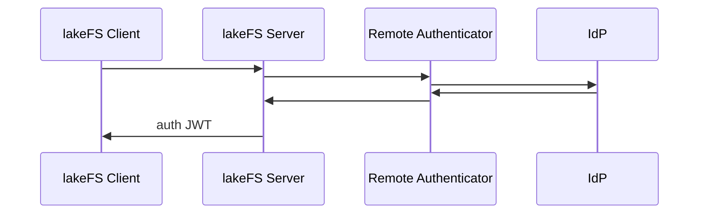

# Remote Authenticator

Remote Authenticator is lakeFS's pluggable architecture, which allows you to integrate any existing organizational identity policies and infrastructure into lakeFS's authentication mechanism. This flexibility will allow you to fulfill any security requirement without the need to allow lakeFS direct access to your identity infrastructure.

## Architecture

The new lakeFS authentication flow is detailed the diagram below.



The Remote Authenticator's job is to abstract away the complexities of existing infrasturucture and implement a standard interface, which lakeFS can use to resolve user identity and manage access to lakeFS. This loose coupling allows you to implement Remote Authenticator to work with any existing identity backend without needing to provide lakeFS with direct access to your identity infrastructure.

## The Interface

To allow lakeFS to work with a Remote Authenticator, you'll first need to add the following YAML to your lakeFS configuration

```yaml
auth:
    remote_authenticator:
        enabled: true
        endpoint: <url-to-remote-authenticator-endpoint>
        default_user_group: "Developers"
    ui_config:
        logout_url: /logout
        login_cookie_names:
            - internal_auth_session
```

- `auth.remote_authenticator.enabled` - set lakeFS to use the remote authenticator
- `auth.remote_authenticator.endpoint` - an endpoint where the remote authenticator is able to receive a POST request from lakeFS
- `auth.remote_authenticator.default_user_group` - the group assigned by default to new users
- `auth.ui_config.logout_url` - the URL to redirect the browser when clicking the logout link in the user menu
- `auth.ui_config.login_cookie_names` - the name of the cookie(s) lakeFS will set following a successful authentication. The value is the authenticated user's JWT

A Remote Authenticator implementation should expose a single endpoint, which receives the following JSON request:

```JSON
{
    "username": "testy.mctestface@testing.com",
    "password": "Password1"
}
```

and return a JSON response like this:

```JSON
{
    "external_user_identifier": "TestyMcTestface"
}
```

If the Remote Authenticator returns any HTTP status in the 2xx range, lakeFS considers this a successful authentication. Any HTTP status < 200 or > 300 is considered a failed authentication. If the Remote Authenticator returns a non-empty value for the `external_user_identifier` property along with a success HTTP status, lakeFS will use this external identifier in place of the internal lakeFS user identifier anywhere in the UI where a username is shown.

## Sample Implementation

To assist with implementing a Remote Authenticator, below you can find a sample Remote Authenticator implemented using [node](https://nodejs.org/) and [express](https://expressjs.com/) and written in TypeScript. Obviously, this is an example implementation, which doesn't integrate with any real IdP, but can serve as a starting point for reference. A fully functional implementation can be done with any programming language and/or platform of your choise and can integrate with any existing IdP infrastructure you are currently running.

```TypeScript
import dotenv from "dotenv";
import express, { Express, Request, Response } from "express";
import { StatusCodes } from "http-status-codes";

type AuthRequestBody = {
  username: string;
  password: string;
};

type AuthResponseBody = {
  external_user_identifier: string;
};

const DEFAULT_PORT = 80;

dotenv.config();

const port = process.env.PORT || DEFAULT_PORT;
const app: Express = express();

app.post(
  "/auth",
  (req: Request<AuthResponseBody, {}, AuthRequestBody>, res: Response) => {
    const { username, password } = req.body;
    if (!username?.length || !password?.length) {
      return res.status(StatusCodes.BAD_REQUEST).json({
        external_user_identifier: "",
      });
    }

    // 👇🏻 This is where you would implement your own authentication logic
    if (
      username === "testy.mctestface@testing.com" &&
      password === "Password1"
    ) {
      return res.status(StatusCodes.OK).json({
        external_user_identifier: "TestyMcTestface",
      });
    } else {
      return res.status(StatusCodes.UNAUTHORIZED).json({
        external_user_identifier: "",
      });
    }
  }
);

app.listen(port, () => {
  console.log(`Remote Authenticator listening on port ${port}`);
});
```

Assuming you'd be running this service on the sub-domain `idp.testing.com`, you're corresponding lakeFS configuration would look like this:

```yaml
auth:
    remote_authenticator:
        enabled: true
        endpoint: https://idp.testing.com/auth
        default_user_group: "Developers"
    ui_config:
        logout_url: /logout
        login_cookie_names:
            - internal_auth_session
```
