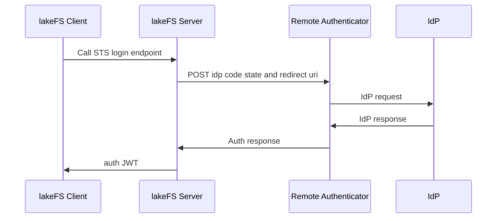

# STS Login

{: .d-inline-block }
<a style="color: white;" href="#sso-for-lakefs-cloud">lakeFS Cloud</a>
{: .label .label-green }

{: .d-inline-block }
<a style="color: white;" href="#sso-for-lakefs-enterprise">lakeFS Enterprise</a>
{: .label .label-purple }

{: .note}
> STS Login is available in lakeFS Cloud and lakeFS Enterprise. currently only tested on lakeFS Enterprise.

Secure Token Service (STS) authentication in lakeFS allows users to authenticate via an Identity Provider (IdP), using OIDC Authentication workflow.
This document outlines the process, from setting up the STS authentication flow to integrating with lakeFS through the [high-level Python SDK](../../integrations/python.md).

## Architecture

{: .note}
> The architecture does include the steps to generate the code using the remote authenticator. this should be done prior to the STS login flow.
> There is a sample implementation to generate the code, redirect_uri and state at the end of this document.

The STS authentication flow involves several components that facilitate secure communication between the lakeFS client, lakeFS server, the remote authenticator, and the IdP.


- lakeFS Client: Initiates the authentication process by providing IdP credentials.
- lakeFS Server: Facilitates the authentication request between the client and the remote authenticator.
- Remote Authenticator: Acts as a bridge between lakeFS and the IdP, handling credential validation.
- IdP (Identity Provider): Validates the provided credentials and returns the authentication status.

## Configuration

To enable STS authentication, configure your lakeFS instance with the appropriate endpoint to the external Authentication Service.


```yaml

auth:
    authentication_api:
        endpoint: <url-to-remote-authenticator-endpoint>


```

- `auth.authentication_api.endpoint` `(string: https://external.authentication-service/api/v1)` - URL to external Authentication Service described at [authentication.yml](https://github.com/treeverse/lakeFS/blob/master/api/authentication.yml)

Ensure you replace <url-to-remote-authenticator-endpoint> with the actual URL of your Authentication Service.


## STS Login with high level python client

The Python client simplifies initiating a client session with STS login. Use the following example to start a new session:

```python
import lakefs
myclient = lakefs.client.from_web_identity(code = '', redirect_uri = '', state = '' , ttl_seconds = 7200)
```


## Sample implementation to generate the code, redirect_uri and state
The following code snippet demonstrates how to generate the code, redirect_uri and state values that are required to initiate a new client session using the STS login feature.
replace `<Your-auth-client-id>` with your auth client id and `<path-to-your-idp-authorize>` with the path to your IdP authorize endpoint.
e.g in case of Auth0, the authorize endpoint is `https://<your-auth0-domain>/authorize` in case of entra the authorize endpoint is `https://<your-entra-domain>/oauth2/v2.0/authorize`
```javascript
import crypto from 'crypto';

import express from 'express';
import axios from 'axios';
import url from 'url';
import jsonwebtoken from 'jsonwebtoken';
const app = express();


const authClientId = '<Your-auth-client-id>'
// the local script will will spin up the server and the IdP provider will return to this endpoint the response.
const callback = "http://localhost:8080/oidc/callback"

// step 1 
// Create a code_verifier, which is a cryptographically-random, Base64-encoded key that will eventually be sent to Auth0 to request tokens.
function base64URLEncode(str) {
    return str.toString('base64')
        .replace(/\+/g, '-')
        .replace(/\//g, '_')
        .replace(/=/g, '');
}
var verifier = base64URLEncode(crypto.randomBytes(32));
console.log(`verifier: ${verifier}`);

// step 2 
// Generate a code_challenge from the code_verifier that will be sent to Auth0 to request an authorization_code.
function sha256(buffer) {
    return crypto.createHash('sha256').update(buffer).digest();
}

var challenge = base64URLEncode(sha256(verifier));
console.log(`challenge: ${challenge}`);


const authorizeURL = `https://<path-to-your-idp-authorize>?response_type=code&code_challenge=${challenge}&code_challenge_method=S256&client_id=${auth0ClientId}&redirect_uri=${callback}&scope=openid&state=${verifier}`

console.log(`authorizeURL: ${authorizeURL}`)

// Endpoint for OIDC callback
app.get('/oidc/callback', async (req, res) => {
    try {
        const code = req.query.code;
        const state = req.query.state;
        console.log(`code: ${code}`);
        console.log(`state: ${state}`);
        // Return a success response
        res.status(200).json({ code, state, redirect_uri: callback, python-cmd: `lakefs.client.from_web_identity(code = ${code} redirect_uri = ${callback} state = ${state}, ttl_seconds = 7200) ` });
        return
    } catch (err) {
        console.error(err);
        res.status(500).json({ message: 'Internal server error' });
    }
});

// Start the server
const PORT = 8080;
app.listen(PORT, () => {
    console.log(`Server is running on port ${PORT}`);
});
```