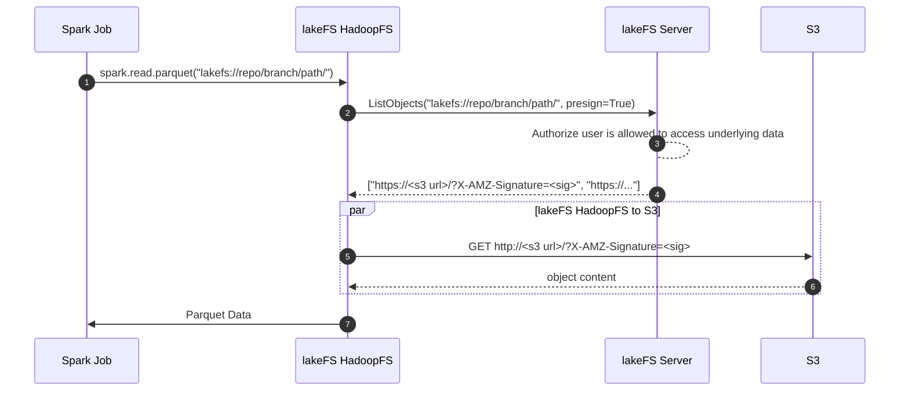

# Roadmap
{: .no_toc }



---
## Ecosystem

### Presigned URL support in LakeFSHadoopFS High Priority{: .label .label-blue }

We plan on implementing support for the lakeFS pre-signed URL API into the [lakeFS Hadoop Filesystem](./integrations/spark.md#use-the-lakefs-hadoop-filesystem).
Currently, users have to choose between:
- managing authorization in lakeFS as well as the object store to allow direct access to lakeFS-managed data
- Use a gateway or proxy component such as the [S3 Gateway](./integrations/spark.md#use-the-s3-gateway) that requires additional sizing

Using pre-signed URLs, users will be able to enjoy both worlds: direct access without a proxy, with access control managed in one place

Here's a simplified example of what this would look like:

[Track and discuss it on GitHub](https://github.com/treeverse/lakeFS/pull/5346){: target="_blank" class="btn" }

### Table format support

#### Iceberg support High Priority{: .label .label-blue }

A table in Iceberg points to a single metadata file, containing a "location" property. Iceberg uses this location to store:
1. Manifests describing where the data is stored.
2. The actual data.

Once a table is created, the location property doesn't change. Therefore, a branch creation in lakeFS in meaningless, since new data added to this branch will be added to the main branch. There are some workarounds for this, but it is our priority to create an excellent integration with Iceberg.

[Track and discuss it on GitHub](https://github.com/treeverse/lakeFS/issues/3381){: target="_blank" class="btn" }

#### Metastore integration hooks

Allow lakeFS users that query and manipulate data using Hive Metastore to automate the integration between both components.

1. Creating a branch/tag with a predefined naming convention will result in automatic creation of metastore tables (for a predefined set of table names)
1. Deleting a branch/tag with a predefined naming convention will result in automatic deletion of metastore tables (for a predefined set of table names)
1. Merging a branch into another branch will result in metastore changes between branches being applied to the metastore for modified tables defined on the destination branch

[Track and discuss it on GitHub](https://github.com/treeverse/lakeFS/issues/3069){: target="_blank" class="btn" }

#### Delta Lake merges

Delta lake stores metadata files that represent a [logical transaction log that relies on numerical ordering](https://github.com/delta-io/delta/blob/master/PROTOCOL.md#delta-log-entries).

Currently, when trying to modify a Delta table from two different branches, lakeFS would correctly recognize a conflict: this log diverged into two different copies, representing different changes.
Users would then have to forgo one of the change sets by either retaining the destination's branch set of changes or the source's branch.

A much better user experience would be to allow merging this log into a new unified set of changes, representing changes made in both branches as a new set of log files (and potentially, data files too!).

[Track and discuss it on GitHub](https://github.com/treeverse/lakeFS/issues/3380){: target="_blank" class="btn" }

### Improved Azure Support

#### HadoopFS: Support Azure Blob Storage

Extend the lakeFS HadoopFilesystem to support working directly with Azure Blob Storage (see also: [support for pre-signed URLs in the lakeFS Hadoop Filesystem](#presigned-url-support-in-lakefshadoopfs-span-high-priority-span---label-label-blue-) above)

[Track and discuss it on GitHub](https://github.com/treeverse/lakeFS/issues/5105){: target="_blank" class="btn" }

#### Support Azure CosmosDB as backend KV store

Allow Azure users to use a serverless database such as CosmosDB as their backing KV for lakeFS metadata.

This will also allow auto-provisioning of a CosmosDB database and table as part of the Helm installation process, similar to how its done for DynamoDB on AWS.

[Track and discuss it on GitHub](https://github.com/treeverse/lakeFS/issues/4458){: target="_blank" class="btn" }

### Improved streaming support for Apache Kafka

Committing (along with attaching useful information to the commit) makes a lot of sense for batch workloads: 
- run a job or a pipeline on a separate branch and commit,
- record information such as the git hash of the code executed, the versions of frameworks used, and information about the data artifacts,
- once the pipeline has completed successfully, commit, and attach the recorded information as metadata.

For streaming, however, this is currently less clear: There's no obvious point in time to commit as things never actually "finish successfully".
[The recommended pattern](./understand/data_lifecycle_management/production.md#example-1-rollback---data-ingested-from-a-kafka-stream) would be to ingest from a stream on a separate branch, periodically committing - storing not only the data added since last commit but also capturing the offset read from the stream, for reproducibility.
These commits can then be merged into a main branch given they pass all relevant quality checks and other validations using hooks, exposing consumers to validated, clean data.

In practice, implementing such a workflow is a little challenging. Users need to:

1. Orchestrate the commits and merge operations.
2. Figure out how to attach the correct offset read from the stream broker.
3. Handle writes coming in while the commit is taking place.

Ideally, lakeFS should provide tools to automate this, with native support for [Apache Kafka](https://kafka.apache.org/){: target="_blank" }.

[Track and discuss it on GitHub](https://github.com/treeverse/lakeFS/issues/2358){: target="_blank" class="btn" }

### Native connector: Trino

Currently, the Trino integration works well using the [lakeFS S3 Gateway](understand/architecture.md#s3-gateway). 

While easy to integrate and useful out-of-the-box, due to the S3 protocol, it means that the data itself must pass through the lakeFS server.

For larger installations, a native integration where lakeFS handles metadata and returns locations in the underlying object store that Trino can then access directly would allow reducing the operational overhead and increasing the scalability of lakeFS.
This would be done in a similar way to the [Native Spark integration](integrations/spark.md) using the [Hadoop Filesystem implementation](integrations/spark.md#use-the-lakefs-hadoop-filesystem).

[Track and discuss it on GitHub](https://github.com/treeverse/lakeFS/issues/2357){: target="_blank" class="btn" }

## Versioning Capabilities

### Support long-running quality checks

Support running quality checks on a branch that might take many minutes to complete. 

Currently, `pre-commit` and `pre-merge` hooks in lakeFS are tied to the lifecycle of the API request that triggers the said commit or merge operation.
In order to support long-running checks, there are enhancements to make to lakeFS APIs in order to support an asynchronous commit and merge operations that are no longer tied to the HTTP request that triggered them.

[Track and discuss it on GitHub](https://github.com/treeverse/lakeFS/pull/5152){: target="_blank" class="btn" }

### Git Integration

Support an integration between a lakeFS repository and a Git repository. 
Allow versioning data assets along with the code that was used to modify/generate them.

[Track and discuss it on GitHub](https://github.com/treeverse/lakeFS/issues/2073){: target="_blank" class="btn" }
