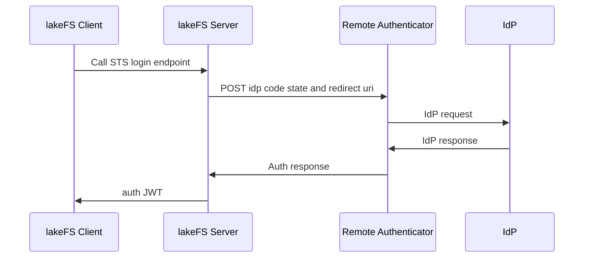

# Short-lived token (STS like)
{: .d-inline-block }
lakeFS Cloud
{: .label .label-green }

lakeFS Enterprise
{: .label .label-purple }

{: .note}
> STS Login is available in lakeFS Cloud and lakeFS Enterprise. currently only tested on lakeFS Enterprise.

Secure Token Service (STS) authentication in lakeFS enables users to authenticate to lakeFS using temporary credentials obtained from an Identity Provider (IdP) via the OpenID Connect (OIDC) Authentication workflow.
This document outlines the process of setting up the STS authentication flow and using the temporary credentials to interact with lakeFS through the [high-level Python SDK](../integrations/python.md).


## Login

Initiate a client session with temporary credentials using the [high-level Python SDK](../integrations/python.md):

```python
import lakefs

my_client = lakefs.client.from_web_identity(code = '<CODE_FROM_IDP>', state = '<STATE_FROM_IDP>' , redirect_uri = '<URI_USED_FOR_REDIRECT_FROM_IDP>', ttl_seconds = 7200)
```

## Setup

### Prerequisites
Ensure you have a way to generate the code, redirect_uri, and state values that are required to initiate a new client session using the STS login feature.
For a reference implementation, see the [sample implementation](#sample-implementation-to-generate-the-code-redirect_uri-and-state) section.

### Configuration

To enable STS authentication, configure your lakeFS instance with the endpoint of the external Authentication Service.

```yaml

auth:
    authentication_api:
        endpoint: <url-to-remote-authenticator-endpoint>


```

The endpoint value should point to the external Authentication Service described at [authentication.yml](https://github.com/treeverse/lakeFS/blob/master/api/authentication.yml).    
Make sure to replace <url-to-remote-authenticator-endpoint> with the actual URL of your Authentication Service.


### Sample implementation to generate the code, redirect_uri, and state
The following code snippet demonstrates how to generate the values that are required to initiate a new client session using the STS login feature.

{: .note}
> Replace `<your-authorize-endpoint>` with the path to your IdP authorize endpoint.  
> *Examples:*  
> Auth0: The authorize endpoint will be `https://<your-auth0-domain>/authorize`  
> Entra ID: The authorize endpoint will be `https://<your-entra-domain>/oauth2/v2.0/authorize`

```javascript
import crypto from 'crypto';

import express from 'express';
import axios from 'axios';
import url from 'url';
import jsonwebtoken from 'jsonwebtoken';

const app = express();
// the local script will will spin up the server and the IdP provider will return to this endpoint the response.
const callback = "http://localhost:8080/oidc/callback"
const authorizeEndpoint = "<your-authorize-endpoint>"

// step 1 
// Create a code_verifier, which is a cryptographically-random, Base64-encoded key that will eventually be sent to Auth0 to request tokens.
function base64URLEncode(str) {
    return str.toString('base64')
        .replace(/\+/g, '-')
        .replace(/\//g, '_')
        .replace(/=/g, '');
}
var verifier = base64URLEncode(crypto.randomBytes(32));
console.log(`verifier: ${verifier}`);

// step 2 
// Generate a code_challenge from the code_verifier that will be sent to Auth0 to request an authorization_code.
function sha256(buffer) {
    return crypto.createHash('sha256').update(buffer).digest();
}

var challenge = base64URLEncode(sha256(verifier));
console.log(`challenge: ${challenge}`);


const authorizeURL = `${authorizeEndpoint}?response_type=code&code_challenge=${challenge}&code_challenge_method=S256&client_id=${auth0ClientId}&redirect_uri=${callback}&scope=openid&state=${verifier}`

console.log(`authorizeURL: ${authorizeURL}`)

// Endpoint for OIDC callback
app.get('/oidc/callback', async (req, res) => {
    try {
        const code = req.query.code;
        const state = req.query.state;
        console.log(`code: ${code}`);
        console.log(`state: ${state}`);
        // Return a success response
        res.status(200).json({ code, state, redirect_uri: callback, python-cmd: `lakefs.client.from_web_identity(code = ${code} redirect_uri = ${callback} state = ${state}, ttl_seconds = 7200) ` });
        return
    } catch (err) {
        console.error(err);
        res.status(500).json({ message: 'Internal server error' });
    }
});

// Start the server
const PORT = 8080;
app.listen(PORT, () => {
    console.log(`Server is running on port ${PORT}`);
});
```


## Architecture

The STS authentication flow involves several components that facilitate secure communication between the lakeFS client, lakeFS server, the remote authenticator, and the IdP.


- lakeFS Client: Initiates the authentication process by providing IdP credentials.
- lakeFS Server: Facilitates the authentication request between the client and the remote authenticator.
- Remote Authenticator: Acts as a bridge between lakeFS and the IdP, handling credential validation.
- IdP (Identity Provider): Validates the provided credentials and returns the authentication status.

