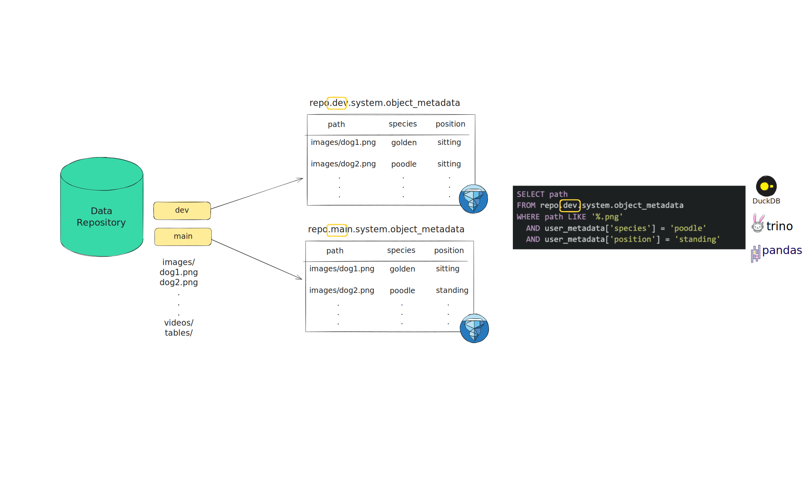

# Metadata Search

!!! info
    Available in **lakeFS Enterprise**

!!! note
    lakeFS Metadata search is currently in private preview for [lakeFS Enterprise](../enterprise/index.md) customers.
    [Contact us](https://lakefs.io/lp/metadata-search/) to get started!

## Overview

lakeFS Metadata Search makes large-scale data lakes easily searchable by [object metadata](../understand/glossary.md#object-metadata),
while adding the power of versioning to search. This enables reproducible queries which are essential in collaborative 
and ML-driven environments where data evolves constantly and metadata is key to making informed decisions. 

With Metadata Search, you can query object metadata by both:

* **System metadata**: Automatically captured properties such as object path, size, last modified time, and committer.
* **User-defined metadata**: Custom labels, annotations, or tags stored as lakeFS object metadata, typically added during
ingestion, processing, or curation.



To enable simple and scalable search, lakeFS exposes object metadata as versioned Iceberg tables, fully compatible with
clients like DuckDB, PyIceberg, Spark, Trino, and others - enabling fast, expressive queries across any lakeFS version. 
See [How It Works](#how-it-works) for details. 

<iframe data-uc-allowed="true" width="560" height="315" src="https://www.youtube.com/embed/6JkQK51AaqY" title="YouTube video player" frameborder="0" allow="accelerometer; autoplay; clipboard-write; encrypted-media; gyroscope; picture-in-picture" allowfullscreen></iframe>```

## Benefits

* **Scalable**: Search metadata across millions or billions of objects.
* **Query Reproducibility**: Run metadata queries against specific commits or tags for consistent results.
* **No infrastructure burden**: lakeFS manages metadata collection and indexing natively: no need to build, deploy or 
maintain a separate metadata tracking system.

## Use cases 

* **Data Discovery & Exploration**: Quickly find relevant data using flexible filters (e.g., annotations, object size, timestamps).
* **Data Governance**: Audit metadata tags, detect sensitive data (like PII), and ensure objects are properly labeled with 
ownership or classification to support internal policies and external compliance requirements.
* **Operational Troubleshooting**: Filter and inspect data using metadata like workflow ID or publish time to trace lineage, 
debug pipeline issues, and understand how data was created or modified - all within a specific lakeFS version. 

## How it Works

lakeFS Metadata Search is built on top of [lakeFS Iceberg support](../integrations/iceberg.md#lakefs-iceberg-rest-catalog), 
using catalog-level system tables to manage and expose versioned object metadata for querying.

Metadata Search works by enabling metadata indexing on selected repositories and branches (see 
[Configuration](#configuration)). Once configured, lakeFS automatically:

1. **Creates a metadata repository** for each selected **data repository**, following the naming convention: `<repo>-metadata`, 
where `repo` is the data repository id.  
2. **Creates matching branches** in the metadata repository for each configured branch in the data repository. For example, a `dev`
branch in data repository `my-repo`, will have a corresponding `dev` branch in `my-repo-metadata`.
3. **Maintains a versioned Iceberg object metadata table** on each matching branch in the metadata repository.
4. **Continuously syncs metadata** via a background processing pipeline that keeps the object metadata tables
   [eventually consistent](#consistency) with changes in the corresponding data repository branches.
5. **Wraps the lakeFS Iceberg REST catalog** to translate table queries issued against data repository references (branches,
commits, or tags) and resolve them to the corresponding tables in the metadata repository. This indirection allows metadata
queries to be expressed entirely in the data repository namespace, while lakeFS handles the mapping to the underlying metadata 
storage.

### Querying Metadata

Metadata queries are always performed through the **data repository namespace**, not the metadata repository that lakeFS
manages internally. You can query metadata by: 

* **Branch name**: `<repo>.<branch>.system.object_metadata`, to search the latest metadata state on a given branch.
* **Commit ID**: `<repo>.<commit_id>.system.object_metadata`, to retrieve the metadata snapshot at a specific commit.
* **Tag name**: `<repo>.<tag_name>.system.object_metadata`, to retrieve the metadata snapshot at a tagged commit.

!!! tip
    Using commit IDs or tags ensures [reproducible queries](#writing-reproducible-queries) , letting you always access the 
    exact metadata state from an immutable point in time.

Queries are executed through the lakeFS Iceberg REST catalog, which is fully compatible with standard engines like Trino,
DuckDB, Spark, PyIceberg, and others.

!!! info
    You can use Metadata Search even without a license for full Iceberg support in lakeFS.
    The feature relies on the lakeFS-managed Iceberg REST catalog for querying object metadata, but it can work 
    side-by-side with any other catalog you use to manage additional Iceberg tables. 

### Object Metadata Table Schema

Each row in the lakeFS object metadata table represents the latest metadata version for a given object on the corresponding
branch. The table contains at most one row per object, ensuring that query performance remains consistent and predictable.

| Column name   | Required| Data Type           | Description                                                                                                                                          |
|---------------|---------|---------------------|------------------------------------------------------------------------------------------------------------------------------------------------------|
| repository    | yes     | string              | The name of the repository where the object is **stored**.                                                                                               |
| path          | yes     | string              | The unique path identifying the object within the repository.                                                                                        | 
| commit_id     | yes     | string              | The **latest commit ID** where the object was added or modified.                                                                                     |
| size          | yes     | Long                | The object's size in bytes.                                                                                                                          |
| last_modified | yes     | Timestamp           | The time the object was last modified.                                                                                                                   |
| etag          | yes     | string              | The object’s ETag (content hash). This reflects changes to the object's content only, not its metadata.                   |
| user_metadata | no      | Map<string, string> | User-defined metadata (e.g., annotations, tags). If none exists, an empty map is stored. |
| committer     | yes     | string              | The user who committed the object’s latest change.                                                                                                     |
| content_type  | no      | string              | The MIME type of the object (e.g., `application/json`, `image/png`).                                                                                                                                                     |

### Consistency 

lakeFS object metadata tables are eventually consistent, which means that it may take up to a few minutes for newly committed 
objects to become searchable. Metadata becomes searchable **atomically** — either all object metadata from the commit 
is available, or none of it is. Commits are processed sequentially: a child commit will only be processed after its parent
has been fully ingested.

!!! tip 
    To check whether the most recent state of your branch is available for metadata search queries, check if the following 
    query returns results:
    ```sql
    USE "<repo>.<branch>.system";
    SELECT * FROM object_metadata
    WHERE commit_id = <head_commit> -- Replace with the head commit ID of the branch you are looking at 
    LIMIT 1;
    ```

## Getting Started

### Configuration

lakeFS Metadata Search runs as a separate service that integrates with your lakeFS server.  

If you are **self-hosting lakeFS Enterprise**:

1. [Contact us](https://lakefs.io/lp/metadata-search/) to enable the feature.  
2. Add the configuration below to your Helm values file.
3. Install or upgrade the Helm chart with the updated configuration.

If you are using **lakeFS cloud**:

[Contact us](https://lakefs.io/lp/metadata-search/) to enable the feature. We’ll request the information included in the 
sample configuration below.

The Metadata Search service requires:

* **lakeFS server connection settings**: so the service can communicate with your lakeFS instance.
* **Metadata-specific settings**: to control how metadata is captured and which repositories and branches are searchable.

#### Configuration Reference

* `lakefs.endpoint` `(string : "")`- the lakeFS server endpoint
* `lakefs.access_key_id` `(string : "")`- a lakeFS access key 
* `lakefs.secret_access_key` `(string : "")`- a lakeFS secret access key
* `metadata_settings.since` `(string : "")`- ISO 8601 timestamp (e.g., `2025-07-15T00:00:00+00`) that sets the earliest
point in time from which to process commits for metadata extraction. If omitted, metadata will be captured from the time 
the branch was created.
* `metadata_settings.max_commits` `(int : 0)` - The maximum number of commits to process per searchable branch.
  Uses 0 by default that disables the limit.
* `repositories` `(map[string]branches:string[] : {})` - A mapping of repositories and the branches in each where metadata 
search should be enabled. You can specify full branch names or use branch prefixes for flexibility. Prefixes should be expressed using a trailing
asterisk, e.g., `dev-*`.  

!!! note
    Metadata search is disabled by default. You must explicitly configure which repositories and branches to include.

!!! tip
    Use branch name prefixes (e.g., `feature-*`) to reduce the need for manual updates when new branches are added.

#### Sample Configuration

!!! example
    ```yaml
    lakefs:
      endpoint: "https://example.lakefs.io"
      access_key_id: "AKIAIOSFOLEXAMPLE"
      secret_access_key: "wJalrXUtnFEMI/K7MDENG/bPxRfiCYEXAMPLEKEY"
    metadata_settings:
      since: "2025-07-15T00:00:00+00"
      max_commits: 100
    repositories:
      "example-repo-1":
        branches:
         - "main"
         - "dev"
      "example-repo-2":
        branches:  
         - "main"
         - "feature-*"
    ```

## How to Search by Metadata

To search by object metadata in lakeFS, query the Iceberg `object_metadata` tables that lakeFS automatically creates and
manages. These tables are always available under the data repository namespace: 

```
<repo>.<ref>.system.object_metadata
```  

You can use any Iceberg-compatible engine, such as DuckDB, Trino, Spark, PyIceberg, or others.

If you're using DuckDB, note the Iceberg REST Catalog [guide](../integrations/iceberg.md#relative-namespace-support) for 
details on how to reference `object_metadata` tables.

!!! requirements 
    Your Iceberg client must meet the [authorization requirements](../integrations/iceberg.md#authorization) of the lakeFS
    Iceberg REST catalog. 
    To perform metadata search queries, ensure users have access to the appropriate metadata repository (see 
    [How it Works](#how-it-works)). 

#### Search Steps
 
1. Initialize lakeFS Iceberg catalog, and authenticate.
The following example uses PyIceberg:
```python
from pyiceberg.catalog.rest import RestCatalog

catalog = RestCatalog(name = "my_catalog", **{
    'prefix': 'lakefs',
    'uri': f'{lakefs_endpoint}/mds/iceberg/api',
    'oauth2-server-uri': f'{lakefs_endpoint}/mds/iceberg/api/v1/oauth/tokens',
    'credential': f'{lakefs_client_key}:{lakefs_client_secret}',
})
``` 
2. Load the object metadata table that represents the reference you would like to query.
3. Use SQL to search by system or user-defined metadata.

Here’s an example using PyIceberg and DuckDB:

!!! requirements 
    This requires duckdb to be [installed](https://duckdb.org/docs/installation/?version=stable&environment=python). 

```python
from pyiceberg.catalog import load_catalog

# Initialize the catalog
catalog = RestCatalog(name = "my_catalog", **{
    'prefix': 'lakefs',
    'uri': 'https://lakefs.example.com/mds/iceberg/api',
    'oauth2-server-uri': 'https://lakefs.example.com/mds/iceberg/api/iceberg/api/v1/oauth/tokens',
    'credential': f'AKIAlakefs12345EXAMPLE:abc/lakefs/1234567bPxRfiCYEXAMPLEKEY',
})

# `repo` is the repository name we would like to search 
con = catalog.load_table('repo.main.system.object_metadata').scan().to_duckdb('object_metadata')

query = f"""
SELECT path   
FROM object_metadata
WHERE user_metadata['animal'] = 'cat' 
  AND last_modified > (now() - INTERVAL '20 days') 
"""

df = con.execute(query).df()
```

This query finds all newly added cat images (added in the past week), demonstrating how you can combine user-defined and
system metadata fields in powerful, version-aware searches.

!!! note
    This catalog initialization differs from the [classic lakeFS Iceberg catalog](../integrations/iceberg.md#catalog-initialization-example-using-pyiceberg).
    Notice the additional `mds` path segment in the endpoints, which routes requests through the Metadata Search catalog.

### Writing Reproducible Queries

In collaborative environments or during iterative development, it's important to ensure that metadata queries return consistent,
reproducible results. To achieve this, you should query object metadata tables using commit IDs or tag names, which are 
immutable references, instead of branch names.

**Why not use Branch names?**

Querying metadata tables using a branch name, e.g., `repo.main.system.object_metadata` return results based on
the state of the branch’s HEAD commit at the time of the query, assuming the metadata has already been ingested (within 
[eventual consistency](#consistency) constraints). However, because branch heads are mutable and advance with each new
commit, the results of such queries can change over time.

**Use commit ID or tag name for stability**

To ensure stability and reproducibility, use lakeFS commit IDs or tag names in your queries. Each commit or tag created 
on the **data repository** reference a specific, fixed snapshot of the repository state, including its metadata. 
This guarantees that the same query always returns the same results, regardless of subsequent changes to the branch.

#### Using Commit ID 

1. Identify the relevant commit ID from the data repository (e.g., `dc3117ec3a727104226c896bf7ab9350ee5da06ae052406262840e9a4a8c9ffb`
on branch `dev` in repo `my-repo`). 
2. Query the object metadata table using the following pattern: 
```
<repo>.<commit_id>.system.object_metadata
```
Examples:
```
my-repo.dc3117e.system.object_metadata
my-repo.dc3117ec3a727104226c896bf7ab9350ee5da06ae052406262840e9a4a8c9ffb.system.object_metadata
```  
Both table paths return the metadata for commit `dc3117ec3a727104226c896bf7ab9350ee5da06ae052406262840e9a4a8c9ffb`.

!!! tip
    For readability, prefer using the short commit SHA (e.g., `dc3117e`).  

#### Using Tag Name

1. Identify the relevant tag from the data repository (e.g., `v0.2.1` on branch `main` in repo `my-repo`).
2. Query the object metadata table using the following pattern:
```
<repo>.<tag_name>.system.object_metadata
```
Examples:
```
my-repo.v0.2.1.system.object_metadata
```  

!!! tip
    For end-to-end reproducibility, include the **commit ID** or **tag name** directly in your queries, and version those
    queries with Git.

### Example Queries

This section showcases how to use lakeFS Metadata Search to answer different types of questions using standard SQL.

For simplicity and readability, the examples are written in Trino SQL. If you're using another engine (e.g., DuckDB, 
Spark, or PyIceberg), you may need to adjust the syntax accordingly.

The examples below use **branch names** as references for simplicity. However, for reproducible results, it is recommended
to use **commit IDs** or **tag names** instead. You can convert any example into a [reproducible query](#writing-reproducible-queries)
by replacing the branch reference accordingly.

<h4>Object Annotation and Labeling</h4> 

<h5>Filter by Object Labels</h5>

The following example returns images labeled as dogs that are not in a sitting position:
```sql
USE "repo.main.system";

SELECT * FROM object_metadata
WHERE path LIKE `%.jpg`
  AND user_metadata['animal'] = 'dog'
  AND user_metadata['position'] != 'sitting';
```

<h5>View Metadata from AI-Powered Annotators</h5>

Assume that any object annotated by an AI-powered tool includes the object metadata key-value pair `source: autolabel` to 
indicate its origin. The following example returns all such AI-annotated objects: 

```sql
USE "repo.main.system";

SELECT *
FROM object_metadata
WHERE user_metadata['source'] = 'autolabel';
```

<h4>File Properties and Storage</h4>

<h5>Filter by File Extension & Size</h5>

Find all `.png` files larger than 2MB.

```sql
USE "repo.main.system";

SELECT *
FROM object_metadata
WHERE path LIKE '%.png'
  AND size::INT > 2000000;
```

<h5>Filter objects by addition Time</h5>

This example finds all objects added in the last 7 days.

```sql
USE "repo.main.system";

SELECT *
FROM object_metadata
WHERE last_modified >= current_timestamp - interval '7' day;
```

<h4>Audit and Governance</h4>

<h5>Detect Errors in Sensitive Data Tagging</h5>

Assume all objects under `customers/` must have user metadata `PII=true`. 
This example returns objects where `PII=false`, or PII key is missing. 

```sql
USE "repo.main.system";

SELECT *
FROM object_metadata
WHERE path LIKE 'customers/%'
  AND (
    user_metadata['PII'] = 'false'
        OR user_metadata['PII'] IS NULL
    );
```
