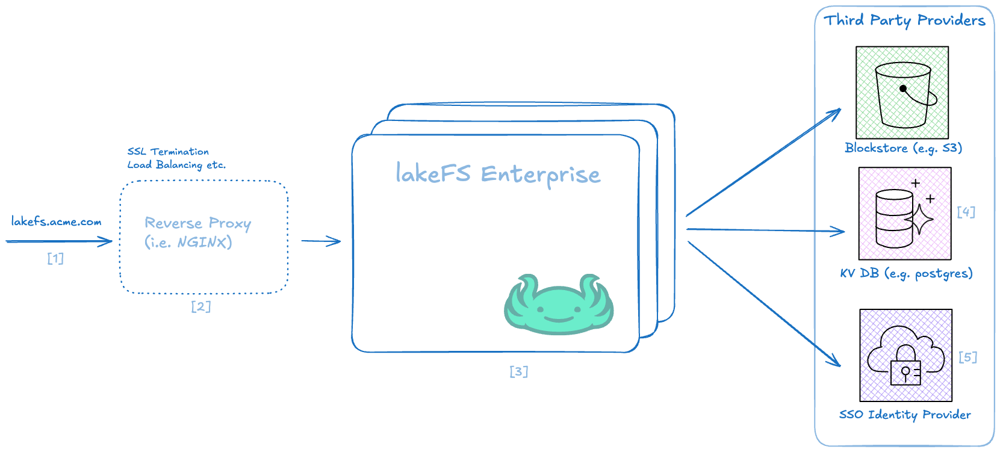

# Architecture

The lakeFS Enterprise software consists of two components:
1. lakeFS Core: The open-source lakeFS engine that handles versioning, branching, and data management
2. Enterprise Extensions: Proprietary modules integrated as submodules that provide advanced features like SSO, RBAC, and audit capabilities

[1] Any user request to lakeFS via Browser or Programmatic access (SDK, HTTP
API, lakectl).

[2] Reverse Proxy (e.g. NGINX, Traefik, K8S Ingress): will handle user requests between lakeFS server instances

[3] lakeFS Enterprise - A proprietary wrapper that extends lakeFS Core using submodules to provide additional enterprise functionality

1. SSO authentication (Browser login via Azure AD, Okta, Auth0)
1. RBAC authorization and policy enforcement

[4] The [KV Store](../understand/architecture.md) - Where metadata is stored, used by both core lakeFS and enterprise features.

[5] SSO IdP - External identity provider (e.g. Azure AD, Okta, JumpCloud). 
lakeFS Enterprise implements SAML, OAuth2, and OIDC protocols.

For more details and pricing, please [contact sales](https://lakefs.io/contact-sales/).

!!! info
    Setting up lakeFS enterprise with an SSO IdP (OIDC, SAML or LDAP) requires
    configuring access from the IdP too.
