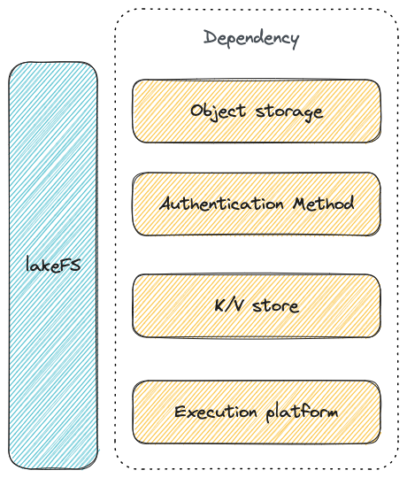

# Deploy and Setup lakeFS

!!! tip
    The instructions given here are for a self-managed deployment of lakeFS.  
    For a hosted lakeFS service with guaranteed SLAs, try [lakeFS Cloud](https://lakefs.cloud)

This section will guide you through deploying lakeFS on top of an object store. You will require a database, and can optionally configure authentication using providers specific to your deployment platform. 

Which options are available depends on your deployment platform. For example, the object store available on Azure differs from that on AWS. 

## Deployment and Setup Details

lakeFS releases include [binaries](https://github.com/treeverse/lakeFS/releases) for common operating systems, a [containerized option](https://hub.docker.com/r/treeverse/lakefs) or a [Helm chart](https://artifacthub.io/packages/helm/lakefs/lakefs).

Check out our guides below for full deployment details: 

* [AWS](aws.md)
* [Azure](azure.md)
* [GCP](gcp.md)
* [On-premises and other cloud providers](onprem.md)
