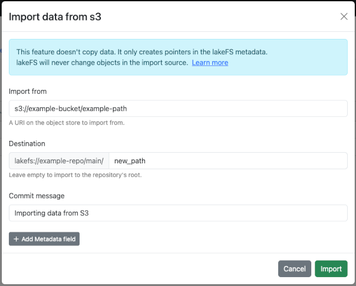

!!! tip
    This section describes how to import existing data into a lakeFS repository, without copying it.
    If you are interested in copying data into lakeFS, see [Copying data to/from lakeFS](./copying.md)._


# Importing data into lakeFS

<iframe width="420" height="315" src="https://www.youtube.com/embed/R6K8tvtFCxQ"></iframe>

## Prerequisites

* Importing is permitted for users in the Supers (open-source) group or the SuperUsers (Cloud/Enterprise) group.
   To learn how lakeFS Cloud and lakeFS Enterprise users can fine-tune import permissions, see [Fine-grained permissions](#fine-grained-permissions) below.
* The lakeFS _server_ must have permissions to list the objects in the source bucket.
* The source bucket must be on the same cloud provider and in the same region as your repository.

## Using the lakeFS UI

1. In your repository's main page, click the _Import_ button to open the import dialog.
2. Under _Import from_, fill in the location on your object store you would like to import from.
3. Fill in the import destination in lakeFS. This should be a path under the current branch.
4. Add a commit message, and optionally commit metadata.
5. Press _Import_.

Once the import is complete, a new commit containing the imported objects will be created in the destination branch.



## Using the CLI: _lakectl import_

The _lakectl import_ command acts the same as the UI import wizard. It commits the changes to the selected branch.


=== "AWS S3 or S3 API Compatible storage"
    ```shell
    lakectl import \
    --from s3://bucket/optional/prefix/ \
    --to lakefs://my-repo/my-branch/optional/path/
    ```
=== "Azure Blob"
    ```shell
    lakectl import \
    --from https://storageAccountName.blob.core.windows.net/container/optional/prefix/ \
    --to lakefs://my-repo/my-branch/optional/path/
    ```
=== "Google Cloud Storage"
    ```shell
    lakectl import \
    --from gs://bucket/optional/prefix/ \
    --to lakefs://my-repo/my-branch/optional/path/
    ```


!!! note
    1. Any previously existing objects under the destination prefix will be deleted.
    1. The import duration depends on the amount of imported objects, but will roughly be a few thousand objects per second.
    1. For security reasons, if you are using lakeFS on top of your local disk (`blockstore.type=local`), you need to enable the import feature explicitly. 
    To do so, set the `blockstore.local.import_enabled` to `true` and specify the allowed import paths in `blockstore.local.allowed_external_prefixes` (see [configuration reference](../reference/configuration.md)).
    When using lakectl or the lakeFS UI, you can currently import only directories locally. If you need to import a single file, use the [HTTP API](../reference/api.md#/import/importStart) or API Clients with `type=object` in the request body and `destination=<full-path-to-file>`. 
    1. Making changes to data in the original bucket will not be reflected in lakeFS, and may cause inconsistencies. 

## Examples

To explore practical examples and real-world use cases of importing data into lakeFS,
we recommend checking out our comprehensive [blog post on the subject](https://lakefs.io/blog/import-data-lakefs/).

## Fine-grained permissions

!!! info
    Available on **lakeFS Cloud** and **lakeFS Enterprise**

With RBAC support, The lakeFS user running the import command should have the following permissions in lakeFS:
`fs:WriteObject`, `fs:CreateCommit`, `fs:ImportFromStorage` and `fs:ImportCancel`.

As mentioned above, all of these permissions are available by default to the Supers (open-source) group or the SuperUsers (Cloud/Enterprise).

## Provider-specific permissions

In addition, the following for provider-specific permissions may be required:


=== "AWS S3 or S3 API Compatible storage"

    lakeFS needs access to the imported location to first list the files to import and later read the files upon users request.

    There are some use cases where the user would like to import from a destination which isn't owned by the account running lakeFS.
    For example, importing public datasets to experiment with lakeFS and Spark.

    lakeFS will require additional permissions to read from public buckets. For example, for S3 public buckets,
    the following policy needs to be attached to the lakeFS S3 service-account to allow access to public buckets, while blocking access to other owned buckets:

    ```json
    {
        "Version": "2012-10-17",
        "Statement": [
        {
            "Sid": "PubliclyAccessibleBuckets",
            "Effect": "Allow",
            "Action": [
                "s3:GetBucketVersioning",
                "s3:ListBucket",
                "s3:GetBucketLocation",
                "s3:ListBucketMultipartUploads",
                "s3:ListBucketVersions",
                "s3:GetObject",
                "s3:GetObjectVersion",
                "s3:AbortMultipartUpload",
                "s3:ListMultipartUploadParts"
            ],
            "Resource": ["*"],
            "Condition": {
            "StringNotEquals": {
                "s3:ResourceAccount": "<YourAccountID>"
            }
            }
        }
        ]
    }
    ```


=== "Azure"

    !!! note
        The use of the `adls` hint for ADLS Gen2 storage accounts is deprecated, please use the original source url for import.

    See [Azure deployment][deploy-azure-storage-account-creds] on limitations when using account credentials.

=== "Google Cloud Storage"
    No specific prerequisites


[deploy-azure-storage-account-creds]:  deploy/azure.md#storage-account-credentials

