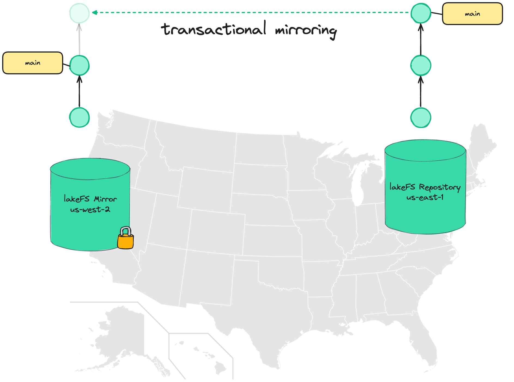

# Transactional Mirroring

!!! info
    Transactional Mirroring requires a [**lakeFS Enterprise**](../enterprise/index.md) license with the Transactional Mirroring capability enabled.


## What is lakeFS Transactional Mirroring?

Transactional Mirroring in lakeFS allows replicating a lakeFS repository ("source") into read-only copies ("mirror") in different locations.

Unlike conventional mirroring, data isn't simply copied between regions - lakeFS tracks the state of each commit, advancing the commit log on the mirror only once a commit has been fully replicated and all data is available.




<iframe data-uc-allowed="true" width="420" height="315" src="https://www.youtube.com/embed/NhOWGVjQrrA"></iframe>

## Use cases

### Disaster recovery

Typically, object stores provide a replication/batch copy API to allow for disaster recovery: as new objects are written, they are asynchronously copied to other geo locations.

In the case of regional failure, users can rely on the other geo-locations which should contain relatively-up-to-date state.

The problem is reasoning about what managed to arrive by the time of disaster and what hasn't:

* have all the necessary files for a given dataset arrived?
* in cases there are dependencies between datasets, are all dependencies also up to date?
* what is currently in-flight or haven't even started replicating yet?

Reasoning about these is non-trivial, especially in the face of a regional disaster, however ensuring business continuity might require that we have these answers.

Using lakeFS Transactional Mirroring makes it much easier to answer: we are guaranteed that the latest commit that exists in the replica is in a consistent state and is fully usable, even if it isn't the absolute latest commit - it still reflects a known, consistent, point in time.


### Data Locality

For certain workloads, it might be cheaper to have data available in multiple regions: Expensive hardware such as GPUs might fluctuate in price, so we'd want to pick the region that currently offers the best pricing. The difference could easily offset to cost of the replicated data.

The challenge is reproducibility - Say we have an ML training job that reads image files from a path in the object store. Which files existed at the time of training?

If data is constantly flowing between regions, this might be harder to answer than we think. And even if we know - how can we recreate that exact state if we want to run the process again (for example, to rebuild that model for troubleshooting).

Using consistent commits solves this problem - with lakeFS Transactional Mirroring, it is guaranteed that a commit ID, regardless of location, will always contain the exact same data.

We can train our model in region A, and a month later feed the same commit ID into another region - and get back the same results.


## Architecture Overview

Transactional Mirroring involves two lakeFS Enterprise installations, each in a different region or location, connected by a **replication service** that runs alongside each installation:

1. **Source lakeFS** - The primary installation where data is written.
2. **Destination lakeFS** - The installation hosting read-only mirror repositories.
3. **Replication Service** - A sidecar service deployed alongside each lakeFS installation. It monitors source repositories, synchronizes commit metadata, and promotes branches on the destination once all data is available.
4. **Object Store Replication** - The underlying object store (e.g., S3) must be configured to replicate objects between the source and destination buckets. lakeFS does not copy object data itself.
5. **Mirrors Database** - A shared KV store (e.g., DynamoDB global table) that both replication services use to coordinate mirror state.

## Setting up Transactional Mirroring

### Prerequisites

1. Two [lakeFS Enterprise](../enterprise/index.md) installations, each in a different region/location.
1. A valid lakeFS Enterprise license with the **Transactional Mirroring** capability. See [License Configuration](../enterprise/getstarted/install.md#lakefs-enterprise-license).
1. Object store replication configured between source and destination buckets (see [below](#configuring-object-store-replication)).
1. A shared KV store accessible from both regions for mirror coordination (e.g., a DynamoDB global table).
1. Network connectivity between the two lakeFS installations (the replication service in each region needs HTTP access to the lakeFS API in the other region).

### Configuring object store replication

The objects within the repository are copied using your cloud provider's object store replication mechanism.

=== "AWS S3"

    Refer to the [AWS S3 replication documentation](https://docs.aws.amazon.com/AmazonS3/latest/userguide/replication-how-setup.html) to configure replication from the source lakeFS repository's [storage namespace](../understand/glossary.md#storage-namespace) to the destination bucket.

    After setting the replication rule, new objects will be replicated to the destination bucket.

    To replicate existing objects, use [S3 batch replication](https://docs.aws.amazon.com/AmazonS3/latest/userguide/s3-batch-replication-batch.html).

    !!! tip
        For bidirectional mirroring (each region acts as source for some repositories), configure replication rules in both directions.

=== "Other object stores"

    Configure your object store's native replication mechanism to replicate objects from the source storage namespace to the destination bucket. The specific steps depend on your cloud provider.


### Creating a lakeFS user with a "replicator" policy

On **each** lakeFS installation, under **Administration** create a new user that will be used by the replication service.
The user should have the following [RBAC policy](../security/rbac.md) attached:

```json
{
   "id": "ReplicationPolicy",
   "statement": [
      {
         "action": [
            "fs:ReadRepository",
            "fs:CreateRepository",
            "fs:UpdateRepository",
            "fs:DeleteRepository",
            "fs:ListRepositories",
            "fs:AttachStorageNamespace",
            "fs:ReadObject",
            "fs:WriteObject",
            "fs:DeleteObject",
            "fs:ListObjects",
            "fs:CreateCommit",
            "fs:ReadCommit",
            "fs:ListCommits",
            "fs:CreateBranch",
            "fs:DeleteBranch",
            "fs:RevertBranch",
            "fs:ReadBranch",
            "fs:ListBranches"
         ],
         "effect": "allow",
         "resource": "*"
      }
   ]
}
```

**Alternatively**, create a policy with a narrower scope, only for a specific repository and/or mirror:

```json
{
   "id": "ReplicationPolicy",
   "statement": [
      {
         "action": [
            "fs:ListRepositories"
         ],
         "effect": "allow",
         "resource": "*"
      },
      {
         "action": [
            "fs:ReadRepository",
            "fs:ReadObject",
            "fs:ListObjects",
            "fs:ReadCommit",
            "fs:ListCommits",
            "fs:ReadBranch",
            "fs:ListBranches"
         ],
         "effect": "allow",
         "resource": "arn:lakefs:fs:::repository/{sourceRepositoryId}"
      },
      {
         "action": [
            "fs:ReadRepository",
            "fs:CreateRepository",
            "fs:UpdateRepository",
            "fs:DeleteRepository",
            "fs:AttachStorageNamespace",
            "fs:ReadObject",
            "fs:WriteObject",
            "fs:DeleteObject",
            "fs:ListObjects",
            "fs:CreateCommit",
            "fs:ReadCommit",
            "fs:ListCommits",
            "fs:CreateBranch",
            "fs:DeleteBranch",
            "fs:RevertBranch",
            "fs:ReadBranch",
            "fs:ListBranches"
         ],
         "effect": "allow",
         "resource": "arn:lakefs:fs:::repository/{mirrorId}"
      },
      {
         "action": [
            "fs:AttachStorageNamespace"
         ],
         "effect": "allow",
         "resource": "arn:lakefs:fs:::namespace/{DestinationStorageNamespace}"
      }
   ]
}
```

Once a user has been created and the replication policy attached to it, create an access key and secret to be used by the replication service.

### Deploying the Replication Service

The replication service is deployed alongside each lakeFS Enterprise installation using the [lakeFS Helm chart](https://github.com/treeverse/charts/tree/master/charts/lakefs). It runs as a separate Deployment within the same Helm release.

#### Mirrors database

The replication service requires a shared KV store to coordinate mirror state between regions. This database must be accessible from both regions.

**DynamoDB global table** is the recommended option for AWS deployments. Create a DynamoDB table with the following schema:

| Attribute    | Type   | Role          |
|-------------|--------|---------------|
| `PartitionKey` | Binary | Partition key |
| `ItemKey`      | Binary | Sort key      |

Enable [DynamoDB Streams](https://docs.aws.amazon.com/amazondynamodb/latest/developerguide/Streams.html) with `NEW_AND_OLD_IMAGES` view type, and add a [global table replica](https://docs.aws.amazon.com/amazondynamodb/latest/developerguide/GlobalTables.html) in the destination region.

Other supported database types (PostgreSQL, CockroachDB) can also be used as long as they are accessible from both regions.

#### Helm chart configuration

Enable the replication service in your `values.yaml` for **each** lakeFS installation:

```yaml
replication:
  enabled: true
  image:
    repository: treeverse/replication
    tag: <version>
  serviceAccountName: <service-account-with-required-permissions>
  extraEnvVarsSecret: <secret-name>  # K8s secret containing replication credentials
  config:
    # Identifier for the region where this lakeFS installation runs
    region: "us-east-1"

    # Organization identifiers
    organization_id: "my-org"
    organization_name: "my-org"

    # The lakeFS endpoint in this region (accessible from within the cluster)
    regional_endpoint: "http://lakefs.default.svc.cluster.local:80"

    # lakeFS endpoints in other regions that this installation mirrors to/from
    dst_endpoints:
      us-west-2: "https://lakefs-west.example.com"

    # Mirror coordination database (must be shared between all regions)
    mirrors_database:
      type: dynamodb
      dynamodb:
        table_name: lakefs-replication-table
        aws_region: us-east-1

    # Block storage configuration (must match the lakeFS blockstore config)
    blockstore:
      type: s3
      s3:
        region: us-east-1

    auth:
      encrypt:
        # Must match the auth.encrypt.secret_key used by the lakeFS installation
        secret_key: "<same-secret-key-as-lakefs>"

    logging:
      level: INFO
      format: json
```

!!! note
    The `refstore_database` (used for replication metadata) is automatically populated from the lakeFS `database` configuration. You do not need to set it unless you want to use a separate database.

#### Replication credentials secret

Create a Kubernetes secret containing the replication user credentials and the auth encryption key:

```bash
kubectl create secret generic replication-secrets \
  --from-literal=source_lakefs_access_key_id=<ACCESS_KEY_ID> \
  --from-literal=source_lakefs_secret_access_key=<SECRET_ACCESS_KEY> \
  --from-literal=auth_encrypt_secret_key=<AUTH_ENCRYPT_SECRET_KEY>
```

Where:

* `ACCESS_KEY_ID` & `SECRET_ACCESS_KEY` - Credentials for the replication user created in the [previous step](#creating-a-lakefs-user-with-a-replicator-policy).
* `AUTH_ENCRYPT_SECRET_KEY` - Must be the same `auth.encrypt.secret_key` configured for the lakeFS installation. This is required for the replication service to authenticate requests.

Then reference the secret in your Helm values:

```yaml
replication:
  extraEnvVarsSecret: replication-secrets
```

#### Example: Two-region setup on AWS

Below is a complete example for a two-region setup with lakeFS in `us-east-1` (source) and `us-west-2` (destination).

**Source region (`us-east-1`) replication config:**

```yaml
replication:
  enabled: true
  config:
    region: "us-east-1"
    organization_id: "my-org"
    organization_name: "my-org"
    regional_endpoint: "http://lakefs-source.mirroring.svc.cluster.local:80"
    dst_endpoints:
      us-west-2: "http://lakefs-dest-internal.example.com:80"
    mirrors_database:
      type: dynamodb
      dynamodb:
        table_name: my-replication-table
        aws_region: us-east-1
    blockstore:
      type: s3
      s3:
        region: us-east-1
    auth:
      encrypt:
        secret_key: "<shared-secret>"
    logging:
      level: INFO
```

**Destination region (`us-west-2`) replication config:**

```yaml
replication:
  enabled: true
  config:
    region: "us-west-2"
    organization_id: "my-org"
    organization_name: "my-org"
    regional_endpoint: "http://lakefs-dest.mirroring.svc.cluster.local:80"
    dst_endpoints:
      us-east-1: "http://lakefs-source-internal.example.com:80"
    mirrors_database:
      type: dynamodb
      dynamodb:
        table_name: my-replication-table
        aws_region: us-west-2
    blockstore:
      type: s3
      s3:
        region: us-west-2
    auth:
      encrypt:
        secret_key: "<shared-secret>"
    logging:
      level: INFO
```

!!! important
    Both installations must use the **same** `organization_id` and the **same** `auth.encrypt.secret_key`. The `mirrors_database` table must be a global/shared table accessible from both regions.

### Creating a mirror

Once both lakeFS installations and their replication services are running, create a mirror using the replication API on the **source** installation:

```bash
curl '<SOURCE_LAKEFS_ENDPOINT>/service/replication/v1/repositories/<SOURCE_REPO>/mirrors' \
--header 'Content-Type: application/json' \
-u <ACCESS_KEY_ID>:<SECRET_ACCESS_KEY> \
-X POST \
--data '{
    "name": "<MIRROR_NAME>",
    "region": "<DESTINATION_REGION>",
    "storage_namespace": "<MIRROR_STORAGE_NAMESPACE>"
}'
```
Using the following parameters:

* `SOURCE_LAKEFS_ENDPOINT` - The URL of the source lakeFS installation (e.g. `https://lakefs-source.example.com`)
* `SOURCE_REPO` - Name of the repository acting as the replication source. It should exist on the source installation
* `ACCESS_KEY_ID` & `SECRET_ACCESS_KEY` - Credentials for your lakeFS replication user (make sure you have the necessary RBAC permissions as [listed below](#rbac))
* `MIRROR_NAME` - Name used for the read-only mirror to be created on the destination
* `DESTINATION_REGION` - The region identifier of the destination (must match the `region` configured in the destination's replication service)
* `MIRROR_STORAGE_NAMESPACE` - The storage namespace on the destination bucket where replicated data is stored

### Transactional Mirroring and Garbage Collection

Garbage collection won't run on mirrored repositories.
Deletions from garbage collection should be replicated from the source:

1. Enable [DELETED marker replication](https://docs.aws.amazon.com/AmazonS3/latest/userguide/delete-marker-replication.html) on the source bucket.
1. Create a [lifecycle policy](https://docs.aws.amazon.com/AmazonS3/latest/userguide/object-lifecycle-mgmt.html) on the destination bucket to delete the objects with the DELETED marker.

## RBAC

These are the required RBAC permissions for working with Transactional Mirroring:

Creating a Mirror:

| Action                     | ARN                                           |
|----------------------------|-----------------------------------------------|
| `fs:CreateRepository`      | `arn:lakefs:fs:::repository/{mirrorId}`       |
| `fs:MirrorRepository`      | `arn:lakefs:fs:::repository/{sourceRepositoryId}` |
| `fs:AttachStorageNamespace` | `arn:lakefs:fs:::namespace/{storageNamespace}`|

Editing Mirrored Branches:

| Action                  | ARN                                           |
|-------------------------|-----------------------------------------------|
| `fs:MirrorRepository`   | `arn:lakefs:fs:::repository/{sourceRepositoryId}` |

Deleting a Mirror:

| Action               | ARN                                     |
|----------------------|-----------------------------------------|
| `fs:DeleteRepository`| `arn:lakefs:fs:::repository/{mirrorId}` |

Listing/Getting Mirrors for a Repository:

| Action                | ARN |
|-----------------------|-----|
| `fs:ListRepositories` | `*` |


## Other replication operations

### Listing all mirrors for a repository

```bash
curl '<SOURCE_LAKEFS_ENDPOINT>/service/replication/v1/repositories/<SOURCE_REPO>/mirrors' \
-u <ACCESS_KEY_ID>:<SECRET_ACCESS_KEY> -s
```

### Getting a specific mirror

```bash
curl '<SOURCE_LAKEFS_ENDPOINT>/service/replication/v1/repositories/<SOURCE_REPO>/mirrors/<MIRROR_ID>' \
-u <ACCESS_KEY_ID>:<SECRET_ACCESS_KEY> -s
```

### Deleting a specific mirror

```bash
curl -X DELETE '<SOURCE_LAKEFS_ENDPOINT>/service/replication/v1/repositories/<SOURCE_REPO>/mirrors/<MIRROR_ID>' \
-u <ACCESS_KEY_ID>:<SECRET_ACCESS_KEY>
```

## Limitations

1. Transactional Mirroring is currently only supported on [AWS S3](https://aws.amazon.com/s3/)
1. Read-only mirrors cannot be written to. Transactional Mirroring is one-way, from source to destination(s)
1. Currently, only branches are mirrored. Tags and arbitrary commits that do not belong to any branch are not replicated
1. [lakeFS Hooks](./hooks/index.md) will only run on the source repository, not its replicas
1. Replication is still asynchronous: reading from a branch will always return a valid commit that the source has pointed to, but it is not guaranteed to be the **latest commit** the source branch is pointing to
