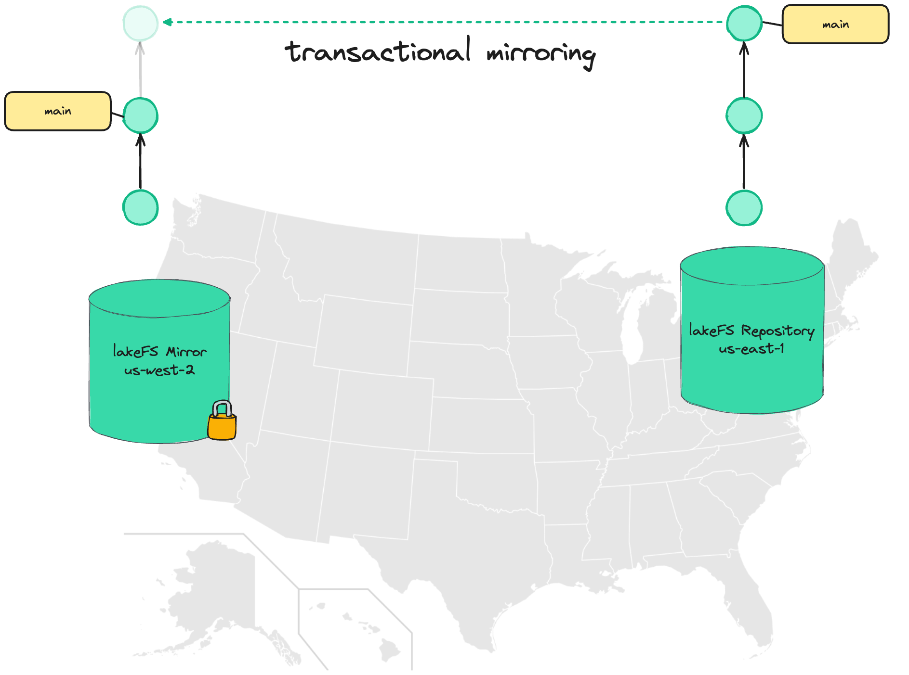

# Transactional Mirroring

!!! info
    Transactional Mirroring requires a [**lakeFS Enterprise**](../enterprise/index.md) license with the Transactional Mirroring capability enabled.


## What is lakeFS Transactional Mirroring?

Transactional Mirroring in lakeFS allows replicating a lakeFS repository ("source") into read-only copies ("mirror") in different locations.

Unlike conventional mirroring, data isn't simply copied between regions - lakeFS tracks the state of each commit, advancing the commit log on the mirror only once a commit has been fully replicated and all data is available.




<iframe data-uc-allowed="true" width="420" height="315" src="https://www.youtube.com/embed/NhOWGVjQrrA"></iframe>

## Use cases

### Disaster recovery

Typically, object stores provide a replication/batch copy API to allow for disaster recovery: as new objects are written, they are asynchronously copied to other geo locations.

In the case of regional failure, users can rely on the other geo-locations which should contain relatively-up-to-date state.

The problem is reasoning about what managed to arrive by the time of disaster and what hasn't:

* have all the necessary files for a given dataset arrived?
* in cases there are dependencies between datasets, are all dependencies also up to date?
* what is currently in-flight or haven't even started replicating yet?

Reasoning about these is non-trivial, especially in the face of a regional disaster, however ensuring business continuity might require that we have these answers.

Using lakeFS Transactional Mirroring makes it much easier to answer: we are guaranteed that the latest commit that exists in the replica is in a consistent state and is fully usable, even if it isn't the absolute latest commit - it still reflects a known, consistent, point in time.


### Data Locality

For certain workloads, it might be cheaper to have data available in multiple regions: Expensive hardware such as GPUs might fluctuate in price, so we'd want to pick the region that currently offers the best pricing. The difference could easily offset to cost of the replicated data.

The challenge is reproducibility - Say we have an ML training job that reads image files from a path in the object store. Which files existed at the time of training?

If data is constantly flowing between regions, this might be harder to answer than we think. And even if we know - how can we recreate that exact state if we want to run the process again (for example, to rebuild that model for troubleshooting).

Using consistent commits solves this problem - with lakeFS Transactional Mirroring, it is guaranteed that a commit ID, regardless of location, will always contain the exact same data.

We can train our model in region A, and a month later feed the same commit ID into another region - and get back the same results.


## Architecture Overview

At minimum, Transactional Mirroring involves two lakeFS Enterprise installations, each in a different region or location, connected by a **replication service** that runs alongside each installation:

1. **Source lakeFS** - The primary installation where data is written.
2. **Destination lakeFS** - The installation hosting read-only mirror repositories.
3. **Replication Service** - A sidecar service deployed alongside each lakeFS installation. It monitors source repositories, synchronizes commit metadata, and promotes branches on the destination once all data is available. Only branches are replicated; tags are not mirrored.
4. **Object Store Replication** - The underlying object store (e.g., S3) must be configured to replicate objects between the source and destination buckets. lakeFS does not copy object data itself.
5. **Mirrors Database** - A shared database (e.g., DynamoDB global table) that all replication services use to coordinate mirror state.

!!! note "Multi-region topologies"
    The architecture is not limited to two regions. A source repository can be mirrored to multiple destinations (one-to-many), and each installation can participate in multiple mirroring relationships. Simply add additional `dst_endpoints` entries and configure object store replication for each destination.

## Setting up Transactional Mirroring

### Prerequisites

1. Two or more [lakeFS Enterprise](../enterprise/index.md) installations, each in a different region/location.
1. A valid lakeFS Enterprise license with the **Transactional Mirroring** capability. See [License Configuration](../enterprise/getstarted/install.md#lakefs-enterprise-license).
1. Object store replication configured between source and destination buckets (see [below](#configuring-object-store-replication)).
1. A shared database accessible from all regions for mirror coordination (e.g., a DynamoDB global table).
1. Network connectivity between the lakeFS installations. The replication service in each region needs HTTP access to the lakeFS API in the other regions.

### Configuring object store replication

The objects within the repository are copied using your cloud provider's object store replication mechanism.

=== "AWS S3"

    Refer to the [AWS S3 replication documentation](https://docs.aws.amazon.com/AmazonS3/latest/userguide/replication-how-setup.html) to configure replication from the source lakeFS repository's [storage namespace](../understand/glossary.md#storage-namespace) to the destination bucket.

    After setting the replication rule, new objects will be replicated to the destination bucket.

    To replicate existing objects, use [S3 batch replication](https://docs.aws.amazon.com/AmazonS3/latest/userguide/s3-batch-replication-batch.html).

    !!! tip
        For bidirectional mirroring (each region acts as source for some repositories), configure replication rules in both directions.

=== "Other object stores"

    Configure your object store's native replication mechanism to replicate objects from the source storage namespace to the destination bucket. The specific steps depend on your cloud provider.


### Creating a lakeFS user with a "replicator" policy

On **each** lakeFS installation, under **Administration** create a new user that will be used by the replication service.
The user should have the following [RBAC policy](../security/rbac.md) attached:

```json
{
   "id": "ReplicationPolicy",
   "statement": [
      {
         "action": [
            "fs:ReadRepository",
            "fs:CreateRepository",
            "fs:UpdateRepository",
            "fs:DeleteRepository",
            "fs:ListRepositories",
            "fs:AttachStorageNamespace",
            "fs:ReadObject",
            "fs:WriteObject",
            "fs:DeleteObject",
            "fs:ListObjects",
            "fs:CreateCommit",
            "fs:ReadCommit",
            "fs:ListCommits",
            "fs:CreateBranch",
            "fs:DeleteBranch",
            "fs:RevertBranch",
            "fs:ReadBranch",
            "fs:ListBranches"
         ],
         "effect": "allow",
         "resource": "*"
      }
   ]
}
```

**Alternatively**, create a policy with a narrower scope, only for a specific repository and/or mirror:

```json
{
   "id": "ReplicationPolicy",
   "statement": [
      {
         "action": [
            "fs:ListRepositories"
         ],
         "effect": "allow",
         "resource": "*"
      },
      {
         "action": [
            "fs:ReadRepository",
            "fs:ReadObject",
            "fs:ListObjects",
            "fs:ReadCommit",
            "fs:ListCommits",
            "fs:ReadBranch",
            "fs:ListBranches"
         ],
         "effect": "allow",
         "resource": "arn:lakefs:fs:::repository/{sourceRepositoryId}"
      },
      {
         "action": [
            "fs:ReadRepository",
            "fs:CreateRepository",
            "fs:UpdateRepository",
            "fs:DeleteRepository",
            "fs:AttachStorageNamespace",
            "fs:ReadObject",
            "fs:WriteObject",
            "fs:DeleteObject",
            "fs:ListObjects",
            "fs:CreateCommit",
            "fs:ReadCommit",
            "fs:ListCommits",
            "fs:CreateBranch",
            "fs:DeleteBranch",
            "fs:RevertBranch",
            "fs:ReadBranch",
            "fs:ListBranches"
         ],
         "effect": "allow",
         "resource": "arn:lakefs:fs:::repository/{mirrorId}"
      },
      {
         "action": [
            "fs:AttachStorageNamespace"
         ],
         "effect": "allow",
         "resource": "arn:lakefs:fs:::namespace/{DestinationStorageNamespace}"
      }
   ]
}
```

Once a user has been created and the replication policy attached to it, create an access key and secret for the replication service.

!!! important "Same credentials on all installations"
    The replication service authenticates requests across regions using the same lakeFS credentials. The replication user must have **the same access key ID and secret access key** on every lakeFS installation involved in mirroring.

    Use `lakefs create-credentials` to create a user with specific credentials on each installation:

    ```bash
    lakefs create-credentials --access-key-id <ACCESS_KEY_ID> --secret-access-key <SECRET_ACCESS_KEY> <username>
    ```

    Run this command against each lakeFS installation to ensure the replication user has identical credentials everywhere.

### Deploying the Replication Service

The replication service is deployed alongside each lakeFS Enterprise installation using the [lakeFS Helm chart](https://github.com/treeverse/charts/tree/master/charts/lakefs). It runs as a separate Deployment within the same Helm release.

#### Mirrors database

The replication service requires a shared database to coordinate mirror state between regions. This database must be accessible from both regions. It supports the same database types as lakeFS (see [database configuration](../reference/configuration.md#database)). The table/schema is created automatically by the replication service on startup if it doesn't already exist.

=== "DynamoDB"

    Provide the table name in the `mirrors_database` configuration. The replication service will create the table automatically if it doesn't exist.

    To enable cross-region replication, you must configure the table as a [DynamoDB global table](https://docs.aws.amazon.com/amazondynamodb/latest/developerguide/GlobalTables.html) with a replica in the destination region. This requires enabling [DynamoDB Streams](https://docs.aws.amazon.com/amazondynamodb/latest/developerguide/Streams.html) with `NEW_AND_OLD_IMAGES` view type on the table.

=== "PostgreSQL / CockroachDB"

    Provide a PostgreSQL or CockroachDB database that is accessible from both regions. Use the same connection string in the `mirrors_database` configuration on each installation.

#### Helm chart configuration

Enable the replication service in your `values.yaml` for **each** lakeFS installation:

```yaml
replication:
  enabled: true
  image:
    repository: treeverse/replication
    tag: <version>
  serviceAccountName: <service-account-with-required-permissions>
  extraEnvVarsSecret: <secret-name>  # K8s secret containing replication credentials
  config:
    # Identifier for the region where this lakeFS installation runs
    region: "us-east-1"

    # Organization identifiers
    organization_id: "my-org"

    # The lakeFS endpoint in this region (accessible from within the cluster)
    regional_endpoint: "http://lakefs.default.svc.cluster.local:80"

    # lakeFS endpoints in other regions that this installation mirrors to/from
    dst_endpoints:
      us-west-2: "https://lakefs-west.example.com"

    # Mirror coordination database (must be shared between all regions)
    mirrors_database:
      type: dynamodb
      dynamodb:
        table_name: lakefs-replication-table
        aws_region: us-east-1

    # Block storage configuration (must match the lakeFS blockstore config)
    blockstore:
      type: s3
      s3:
        region: us-east-1

    auth:
      encrypt:
        # Must match the auth.encrypt.secret_key used by the lakeFS installation
        secret_key: "<same-secret-key-as-lakefs>"

    logging:
      level: INFO
      format: json
```

!!! note
    The `refstore_database` (used for replication metadata) is automatically populated from the lakeFS `database` configuration. You do not need to set it unless you want to use a separate database.

#### Replication credentials secret

Create a Kubernetes secret containing the replication user credentials and the auth encryption key:

```bash
kubectl create secret generic replication-secrets \
  --from-literal=source_lakefs_access_key_id=<ACCESS_KEY_ID> \
  --from-literal=source_lakefs_secret_access_key=<SECRET_ACCESS_KEY> \
  --from-literal=auth_encrypt_secret_key=<AUTH_ENCRYPT_SECRET_KEY>
```

Where:

* `ACCESS_KEY_ID` & `SECRET_ACCESS_KEY` - Credentials for the replication user created in the [previous step](#creating-a-lakefs-user-with-a-replicator-policy).
* `AUTH_ENCRYPT_SECRET_KEY` - Must be the same `auth.encrypt.secret_key` configured for the lakeFS installation. This is required for the replication service to authenticate requests.

Then reference the secret in your Helm values:

```yaml
replication:
  extraEnvVarsSecret: replication-secrets
```

#### Example: Two-region setup on AWS

Below is a complete example for a two-region setup with lakeFS in `us-east-1` (source) and `us-west-2` (destination).

**Source region (`us-east-1`) replication config:**

```yaml
replication:
  enabled: true
  config:
    region: "us-east-1"
    organization_id: "my-org"
    regional_endpoint: "http://lakefs-source.mirroring.svc.cluster.local:80"
    dst_endpoints:
      us-west-2: "http://lakefs-dest-internal.example.com:80"
    mirrors_database:
      type: dynamodb
      dynamodb:
        table_name: my-replication-table
        aws_region: us-east-1
    blockstore:
      type: s3
      s3:
        region: us-east-1
    auth:
      encrypt:
        secret_key: "<shared-secret>"
    logging:
      level: INFO
```

**Destination region (`us-west-2`) replication config:**

```yaml
replication:
  enabled: true
  config:
    region: "us-west-2"
    organization_id: "my-org"
    regional_endpoint: "http://lakefs-dest.mirroring.svc.cluster.local:80"
    dst_endpoints:
      us-east-1: "http://lakefs-source-internal.example.com:80"
    mirrors_database:
      type: dynamodb
      dynamodb:
        table_name: my-replication-table
        aws_region: us-west-2
    blockstore:
      type: s3
      s3:
        region: us-west-2
    auth:
      encrypt:
        secret_key: "<shared-secret>"
    logging:
      level: INFO
```

!!! important
    Both installations must use the **same** `organization_id` and the **same** `auth.encrypt.secret_key`. The `mirrors_database` table must be a global/shared table accessible from both regions.

### Creating a mirror

Once both lakeFS installations and their replication services are running, create a mirror using the replication API on the **source** region's replication service:

```bash
curl '<REPLICATION_ENDPOINT>/service/replication/v1/repositories/<SOURCE_REPO>/mirrors' \
--header 'Content-Type: application/json' \
-u <ACCESS_KEY_ID>:<SECRET_ACCESS_KEY> \
-X POST \
--data '{
    "name": "<MIRROR_NAME>",
    "region": "<DESTINATION_REGION>",
    "storage_namespace": "<MIRROR_STORAGE_NAMESPACE>"
}'
```
Using the following parameters:

* `REPLICATION_ENDPOINT` - The URL of the replication service in the source region (default port 8008). This is **not** the lakeFS endpoint - the replication service runs as a separate process
* `SOURCE_REPO` - Name of the repository acting as the replication source. It should exist on the source installation
* `ACCESS_KEY_ID` & `SECRET_ACCESS_KEY` - Credentials for your lakeFS replication user (make sure you have the necessary RBAC permissions as [listed below](#rbac))
* `MIRROR_NAME` - Name used for the read-only mirror to be created on the destination
* `DESTINATION_REGION` - The region identifier of the destination (must match the `region` configured in the destination's replication service)
* `MIRROR_STORAGE_NAMESPACE` - The storage namespace on the destination bucket where replicated data is stored

### Transactional Mirroring and Garbage Collection

Garbage collection won't run on mirrored repositories.
Deletions from garbage collection should be replicated from the source:

1. Enable [DELETED marker replication](https://docs.aws.amazon.com/AmazonS3/latest/userguide/delete-marker-replication.html) on the source bucket.
1. Create a [lifecycle policy](https://docs.aws.amazon.com/AmazonS3/latest/userguide/object-lifecycle-mgmt.html) on the destination bucket to delete the objects with the DELETED marker.

## RBAC

These are the required RBAC permissions for working with Transactional Mirroring:

Creating a Mirror:

| Action                     | ARN                                           |
|----------------------------|-----------------------------------------------|
| `fs:CreateRepository`      | `arn:lakefs:fs:::repository/{mirrorId}`       |
| `fs:MirrorRepository`      | `arn:lakefs:fs:::repository/{sourceRepositoryId}` |
| `fs:AttachStorageNamespace` | `arn:lakefs:fs:::namespace/{storageNamespace}`|

Editing Mirrored Branches:

| Action                  | ARN                                           |
|-------------------------|-----------------------------------------------|
| `fs:MirrorRepository`   | `arn:lakefs:fs:::repository/{sourceRepositoryId}` |

Deleting a Mirror:

| Action               | ARN                                     |
|----------------------|-----------------------------------------|
| `fs:DeleteRepository`| `arn:lakefs:fs:::repository/{mirrorId}` |

Listing/Getting Mirrors for a Repository:

| Action                | ARN |
|-----------------------|-----|
| `fs:ListRepositories` | `*` |


## Other replication operations

### Listing all mirrors for a repository

```bash
curl '<REPLICATION_ENDPOINT>/service/replication/v1/repositories/<SOURCE_REPO>/mirrors' \
-u <ACCESS_KEY_ID>:<SECRET_ACCESS_KEY> -s
```

### Getting a specific mirror

```bash
curl '<REPLICATION_ENDPOINT>/service/replication/v1/repositories/<SOURCE_REPO>/mirrors/<MIRROR_ID>' \
-u <ACCESS_KEY_ID>:<SECRET_ACCESS_KEY> -s
```

### Deleting a specific mirror

```bash
curl -X DELETE '<REPLICATION_ENDPOINT>/service/replication/v1/repositories/<SOURCE_REPO>/mirrors/<MIRROR_ID>' \
-u <ACCESS_KEY_ID>:<SECRET_ACCESS_KEY>
```

## Configuration Reference

The replication service configuration has two layers:

1. **Helm chart values** (`replication.*`) - Controls the Kubernetes deployment (image, resources, secrets, service account).
2. **Replication service config** (`replication.config.*`) - Controls the replication service behavior (regions, endpoints, databases, auth).

Configuration can also be set via environment variables with the `REPLICATION_` prefix (e.g., `REPLICATION_REGION=us-east-1`).

### Helm chart values

| Field | Default | Required | Description |
|-------|---------|----------|-------------|
| `replication.enabled` | `false` | Yes | Enable the replication service deployment |
| `replication.image.repository` | `treeverse/replication` | | Docker image repository |
| `replication.image.tag` | `0.1.17` | | Docker image tag |
| `replication.image.pullPolicy` | `IfNotPresent` | | Image pull policy |
| `replication.port` | `8008` | | Service port |
| `replication.serviceAccountName` | `""` | | Kubernetes service account to use for the replication pod. Required when the replication service needs cloud IAM permissions (e.g., to access DynamoDB or S3). See [Service account and cloud permissions](#service-account-and-cloud-permissions) |
| `replication.extraEnvVarsSecret` | | | Name of a Kubernetes Secret containing sensitive configuration. When set, the following keys are injected as environment variables: `source_lakefs_access_key_id`, `source_lakefs_secret_access_key`, `auth_encrypt_secret_key` |
| `replication.extraEnvVars` | `[]` | | Additional environment variables for the replication pod |
| `replication.resources` | `{}` | | Kubernetes resource requests/limits |
| `replication.podAnnotations` | `{}` | | Additional pod annotations |
| `replication.local_cache.base_dir` | `/cache` | | Local cache directory path (auto-injected into `committed.local_cache.dir`) |
| `replication.local_cache.size_bytes` | `512000000` | | Local cache size in bytes (auto-injected into `committed.local_cache.size_bytes`) |

#### Service account and cloud permissions

The `serviceAccountName` field specifies a Kubernetes service account for the replication pod. This is used to grant the replication service access to cloud resources (e.g., DynamoDB, S3) without embedding cloud credentials in the configuration.

On AWS, this is typically done using [IAM Roles for Service Accounts (IRSA)](https://docs.aws.amazon.com/eks/latest/userguide/iam-roles-for-service-accounts.html):

1. Create an IAM role with the required permissions (DynamoDB access for the mirrors database, S3 access for the blockstore).
2. Create a Kubernetes service account annotated with the IAM role ARN:
    ```yaml
    apiVersion: v1
    kind: ServiceAccount
    metadata:
      name: replication-sa
      annotations:
        eks.amazonaws.com/role-arn: arn:aws:iam::<ACCOUNT_ID>:role/<ROLE_NAME>
    ```
3. Set `replication.serviceAccountName: replication-sa` in the Helm values.

The replication pod will then automatically assume the IAM role and have access to the configured cloud resources.

### Replication service config

These fields are set under `replication.config` in the Helm values.

#### Required fields

| Field | Description |
|-------|-------------|
| `region` | Region identifier for this lakeFS installation (e.g., `us-east-1`) |
| `organization_id` | Organization identifier, used internally as a partition key in the mirrors database. For on-prem deployments, use any consistent string (e.g., your company name). Must be the same across all installations |
| `regional_endpoint` | URL of the lakeFS API in this region (e.g., `http://lakefs.default.svc.cluster.local:80`) |
| `dst_endpoints` | Map of region identifier to lakeFS URL for each remote region |
| `mirrors_database` | Database configuration for mirror coordination. Supports the same [database types](../reference/configuration.md#database) as lakeFS. Must be shared across all regions |
| `blockstore` | Block storage configuration. Must match the lakeFS blockstore config |
| `lakefs_access_key_id` | Access key ID for the replication lakeFS user. Can also be provided via `extraEnvVarsSecret` (recommended) |
| `lakefs_secret_access_key` | Secret access key for the replication lakeFS user. Can also be provided via `extraEnvVarsSecret` (recommended) |
| `auth.encrypt.secret_key` | Encryption secret key. Must match the lakeFS `auth.encrypt.secret_key`. Can also be provided via `extraEnvVarsSecret` (recommended) |

#### Optional fields

| Field | Default | Description |
|-------|---------|-------------|
| `organization_name` | | Organization name. Only used to auto-construct `regional_endpoint` for lakeFS Cloud. Not needed when `regional_endpoint` is set |
| `listen_address` | `0.0.0.0:8008` | HTTP listen address for the replication service API |
| `refstore_database` | lakeFS `database` config | Database for replication metadata (commits, ranges, metaranges). When deployed via the Helm chart, this defaults to the lakeFS `database` configuration if not explicitly set |
| `cloud_domain` | | Cloud domain for auto-constructing endpoints. Not needed when `regional_endpoint` is set |
| `list_mirrors_page_size` | `1000` | Page size when listing mirrors |
| `list_repositories_page_size` | `1000` | Page size when listing repositories |
| `logging.level` | `INFO` | Log level (`DEBUG`, `INFO`, `WARN`, `ERROR`) |
| `logging.format` | `text` | Log format (`text`, `json`) |

#### Committed (metadata cache)

Controls local caching for committed metadata (ranges and metaranges). When deployed via the Helm chart, `committed.local_cache.dir` and `committed.local_cache.size_bytes` are automatically injected from `replication.local_cache`.

| Field | Default | Description |
|-------|---------|-------------|
| `committed.local_cache.size_bytes` | `1073741824` (1 GiB) | Local cache size in bytes |
| `committed.local_cache.dir` | | Cache directory path |
| `committed.local_cache.range_proportion` | `0.9` | Proportion of cache allocated to ranges |
| `committed.local_cache.metarange_proportion` | `0.1` | Proportion of cache allocated to metaranges |
| `committed.metadata_prefix` | `_lakefs/` | Prefix used by lakeFS for metadata files in the storage namespace. Must match `committed.block_storage_prefix` in lakeFS |

#### Commit sensor

Controls how the service detects and synchronizes new commits from source to destination.

| Field | Default | Description |
|-------|---------|-------------|
| `commit_sensor.process_branches_duration` | `1m` | How often to scan for branch changes |
| `commit_sensor.branches_scanner_concurrency_limit` | `10` | Number of concurrent branch scanning workers |
| `commit_sensor.list_branch_page_size` | `1000` | Page size when listing branches |
| `commit_sensor.log_commit_page_size` | `1000` | Page size when fetching commit logs |

#### Mirrors manager

Controls how the service reconciles mirror state (creates/deletes mirror repositories).

| Field | Default | Description |
|-------|---------|-------------|
| `mirrors_manager.process_mirrors_interval_duration` | `20s` | Interval between mirror reconciliation runs |

#### Validator

Controls how the service validates that all metadata for promoted commits exists in block storage before advancing the mirror.

| Field | Default | Description |
|-------|---------|-------------|
| `validator.run_interval` | `1m` | Interval between validation runs |
| `validator.num_workers` | `3` | Number of concurrent metarange validation workers |
| `validator.cooldown_on_missing` | `1m` | Cooldown before retrying validation of a missing metarange |
| `validator.cooldown_on_error` | `1m` | Cooldown before retrying validation after an error |
| `validator.metarange_presence_cache.size` | `5000` | Number of metarange presence results to cache |
| `validator.metarange_presence_cache.expiry` | `1440h` (60 days) | Metarange cache entry expiry |
| `validator.metarange_presence_cache.cooldown` | `30s` | Cooldown before retrying a missing metarange in cache |
| `validator.range_presence_cache.size` | `500000` | Number of range presence results to cache |
| `validator.range_presence_cache.expiry` | `1440h` (60 days) | Range cache entry expiry |
| `validator.range_presence_cache.cooldown` | `10s` | Cooldown before retrying a missing range in cache |
| `validator.object_presence_cache.size` | `5000000` | Number of object presence results to cache |
| `validator.object_presence_cache.expiry` | `24h` | Object cache entry expiry |
| `validator.object_presence_cache.cooldown` | `5s` | Cooldown before retrying a missing object in cache |
| `validator.storage_namespace_cache.size` | `1000` | Number of repository-to-storage-namespace mappings to cache |
| `validator.storage_namespace_cache.expiry` | `17s` | Storage namespace cache entry expiry |

#### Auth

| Field | Default | Description |
|-------|---------|-------------|
| `auth.encrypt.secret_key` | _(required)_ | Encryption key for stored credentials. Must match the lakeFS installation. Can also be provided via `extraEnvVarsSecret` (recommended) |
| `auth.cache.enabled` | `false` | Enable auth response caching |
| `auth.cache.size` | | Number of cached auth entries |
| `auth.cache.ttl` | | Cache entry time-to-live |
| `auth.cache.jitter` | | Random jitter added to cache TTL to prevent thundering herd |

## Limitations

1. Transactional Mirroring is currently only supported on [AWS S3](https://aws.amazon.com/s3/)
1. Read-only mirrors cannot be written to. Transactional Mirroring is one-way, from source to destination(s)
1. Currently, only branches are mirrored. Tags and arbitrary commits that do not belong to any branch are not replicated
1. [lakeFS Hooks](./hooks/index.md) will only run on the source repository, not its replicas
1. Replication is asynchronous: reading from a branch will always return a valid commit that the source has pointed to, but it is not guaranteed to be the **latest commit** the source branch is pointing to
