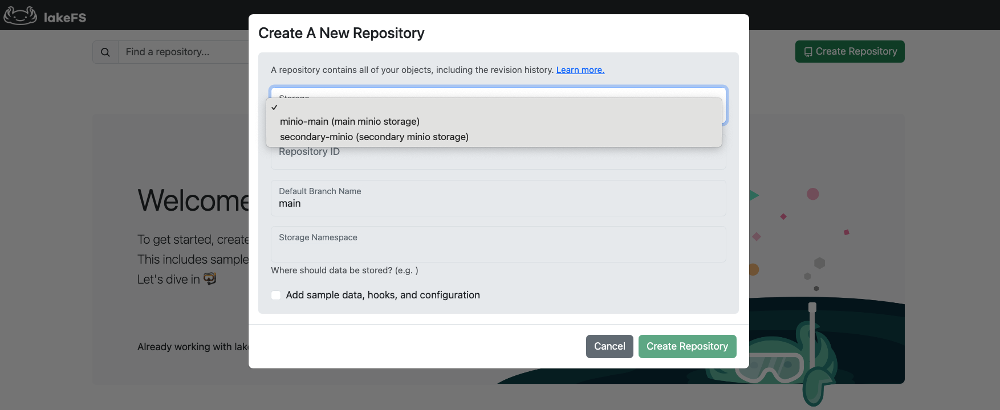
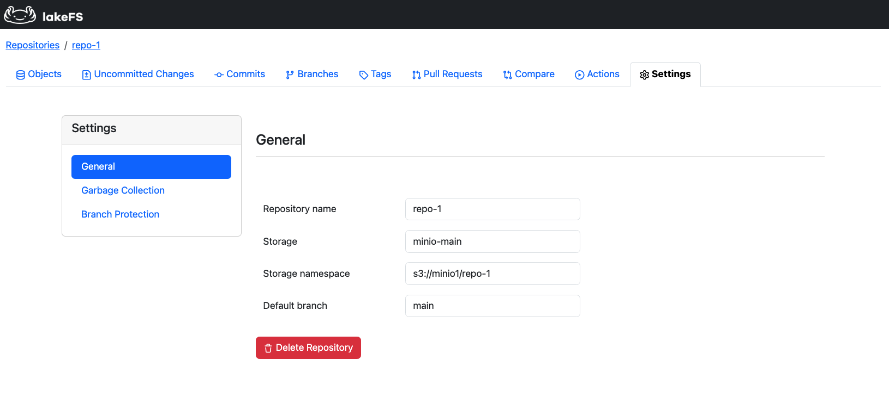

# Multi-Storage Backend

!!! info
    Multi-storage backend support is only available to licensed [lakeFS Enterprise](../enterprise/index.md) customers.
    [Contact us](https://info.lakefs.io/thanks-msb) to get started!


## What is Multi-storage Backend Support?

lakeFS multi-storage backend support enables seamless data management across multiple storage systems —
on-premises, across public clouds, or hybrid environments. This capability makes lakeFS a unified data management platform
for all organizational data assets, which is especially critical in AI/ML environments that rely on diverse datasets stored
in multiple locations.

With a multi-store setup, lakeFS can connect to and manage any combination of supported storage systems, including:

* AWS S3
* Azure Blob
* Google Cloud Storage
* other S3-compatible storage
* local storage

!!! note
    Multi-storage backends support is available from version **1.51.0** of lakeFS Enterprise.

## Use Cases

1. **Distributed Data Management**:
    * Eliminate data silos and enable seamless cross-cloud collaboration.
    * Maintain version control across different storage providers for consistency and reproducibility.
    * Ideal for AI/ML environments where datasets are distributed across multiple storage locations.
2. **Unified Data Access**:
    * Access data across multiple storage backends using a single, consistent [URI format](../understand/model.md#lakefs-protocol-uris).
3. **Centralized Access Control & Governance**:
    * Access permissions and policies can be centrally managed across all connected storage systems using lakeFS [RBAC](../security/rbac.md).
    * Compliance and security controls remain consistent, regardless of where the data is stored.

## Configuration

To configure your lakeFS server to connect to multiple storage backends, define them under the `blockstores` section in your server configurations.
The `blockstores.stores` field is an array of storage backends, each with its own configuration.  

For a complete list of available options, refer to the [server configuration reference](../reference/configuration.md#blockstores).

!!! note
    If you're upgrading from a single-store lakeFS setup, refer to the [upgrade guidelines](#upgrading-from-single-to-multi-store)
    to ensure a smooth transition.

### Example Configurations


=== "On-Prem"
    This example setup configures lakeFS to manage data across two separate MinIO instances:

    ```yaml
    blockstores:
    signing:
        secret_key: "some-secret"
    stores:
        - id: "minio-prod"
        description: "Primary on-prem MinIO storage for production data"
        type: "s3"
        s3:
            force_path_style: true
            endpoint: 'http://minio-prod.local'
            discover_bucket_region: false
            credentials:
            access_key_id: "prod_access_key"
            secret_access_key: "prod_secret_key"
        - id: "minio-backup"
        description: "Backup MinIO storage for disaster recovery"
        type: "s3"
        s3:
            force_path_style: true
            endpoint: 'http://minio-backup.local'
            discover_bucket_region: false
            credentials:
            access_key_id: "backup_access_key"
            secret_access_key: "backup_secret_key"
    ```

=== "Multi-Cloud"
    This example setup configures lakeFS to manage data across two public cloud providers: AWS and Azure:

    ```yaml
    blockstores:
    signing:
        secret_key: "some-secret"
    stores:
        - id: "s3-prod"
        description: "AWS S3 storage for production data"
        type: "s3"
        s3:
            region: "us-east-1"
        - id: "azure-analytics"
        description: "Azure Blob storage for analytics data"
        type: "azure"
        azure:
            storage_account: "analytics-account"
            storage_access_key: "EXAMPLE45551FSAsVVCXCF"
    ```


=== "Hybrid"
    This hybrid setup allows lakeFS to manage data across both cloud and on-prem storages.

    ```yaml
    blockstores:
    signing:
        secret_key: "some-secret"
    stores:
        - id: "s3-archive"
        description: "AWS S3 storage for long-term archival"
        type: "s3"
        s3:
            region: "us-west-2"
        - id: "minio-fast-access"
        description: "On-prem MinIO for high-performance workloads"
        type: "s3"
        s3:
            force_path_style: true
            endpoint: 'http://minio.local'
            discover_bucket_region: false
            credentials:
            access_key_id: "minio_access_key"
            secret_access_key: "minio_secret_key"
    ```

### Key Considerations

* Unique Blockstore IDs: Each storage must have a unique id.
* Persistence of Blockstore IDs: Once defined, an id must not change.
* S3 Authentication Handling:
  * All standard S3 authentication methods are supported.
  * Every blockstore needs to be authenticated.  So make sure to configure a profile or static credentials for all storages of type `s3`.
      S3 storage will use the credentials chain by default, so you might be able to use that for one storage.

!!! warning
    Changing a storage ID is not supported and may result in unexpected behavior. Ensure IDs remain consistent once configured.

### Upgrading from a single storage backend to Multiple Storage backends

When upgrading from a single storage backend to a multi-storage setup, follow these guidelines:

* Use the new `blockstores` structure, **replacing** the existing `blockstore` configuration. Note that `blockstore` and `blockstores`
  configurations are mutually exclusive - lakeFS does not support both simultaneously.
* Define all previously available [single-blockstore settings](../reference/configuration.md#blockstore) under their respective storage backends.
* The `signing.secret_key` is a required setting global to all connected stores.
* Set `backward_compatible: true` for the existing storage backend to ensure:
    * Existing repositories continue to use the original storage backend.
    * Newly created repositories default to this backend unless explicitly assigned a different one, to ensure a non-breaking upgrade process.
    * **This setting is mandatory** — lakeFS will not function if it is unset.  
    * **Do not remove this setting** as long as you need to support repositories created before the upgrade.
    If removed, lakeFS will fail to start because it will treat existing repositories as disconnected from any configured storage.

### Adding or Removing a Storage Backend

To add a storage backend, update the server configuration with the new storage entry and restart the server.

To remove a storage backend:

* Delete all repositories associated with the storage backend. (definition only)
* Remove the storage entry from the configuration.
* Restart the server.

!!! warning
    lakeFS will fail to start if there are repositories defined on a removed storage. Ensure all necessary cleanup is completed before removing a storage backend.

### Listing Connected Storage Backends

The [Get Config](../reference/api.md#/config/getConfig) API endpoint returns a list of storage
configurations. In multi-storage setups, this is the recommended method to list connected storage backends and view their details.

### Troubleshooting

| Issue                                                               | Cause | Solution                                                 |
|---------------------------------------------------------------------|-------|----------------------------------------------------------|
| Blockstore ID conflicts                                             | Duplicate `id` values in `stores` | Ensure each storage backend has a unique ID              |
| Missing `backward_compatible`                                       | Upgrade from single to multi-storage without setting the flag | Add `backward_compatible: true` for the existing storage |
| Unsupported configurations in OSS or unlicensed Enterprise accounts | Using multi-storage features in an unsupported setup | Contact us to start using the feature                    |

### Migrating from Multiple Storage Backend to Single Storage Backend

Once you upgrade to a multi-storage setup, you cannot simply revert back by changing the configuration from `blockstores` to `blockstore`. The internal repository metadata format changes to support multiple storage backends, and is not backward compatible with the single storage format. If you need to consolidate your data and revert from a multi-storage setup to a single storage backend, you'll need to perform a full migration by following these steps:

#### Overview

The migration process involves:

1. Dumping repository references from the multi-storage setup
2. Deleting repositories in the multi-storage environment
3. Configuring lakeFS with a single storage backend
4. [Optional]: Copying repository data to the new single storage location
5. Restoring repositories to the single storage environment

#### Step-by-Step Guide

Use the `lakefs-refs.py` script, instruction on how to aquire found in [Backup and Restore](backup-and-restore.md#python-helper-script-for-backup-and-restore).

1. **Dump Repository References**
    To dump the repository metadata:

    ```bash
    # Dump a single repository
    python lakefs-refs.py dump my-repository
    
    # Or dump all repositories
    python lakefs-refs.py dump --all
    ```

    This will create manifest files for each repository.

    Optionally, you can use the `--rm` flag to automatically delete repositories after successful dump:

    ```bash
    # Dump and delete a single repository
    python lakefs-refs.py dump my-repository --rm
    
    # Or dump and delete all repositories
    python lakefs-refs.py dump --all --rm
    ```
2. **Delete Source Repositories** (if not using --rm flag)

    If you didn't use the `--rm` flag in step 1, you'll need to delete the repositories manually. Note that deleting a repository only removes the repository record from lakeFS - it does not delete the actual data files or metadata from your storage.

    You can delete repositories through:

    a. The lakeFS UI
    b. Using lakectl (ex: `lakectl repo delete lakefs://my-repository`)

3. **Configure lakeFS Single Storage**

    * Update your lakeFS configuration to use a single storage backend (using the `blockstore` section instead of `blockstores`).
    * Start or restart lakeFS after applying the new configuration
    * Example of single storage backend configuration: (multi storage backend example can be found in the [Configuration](#configuration) section)

    ```yaml
    ...
    blockstore:
        type: s3
        s3:
        region: us-east-1
    ...
    ```

4. **Copy Repository Data** (if needed)

    If the repositories you want to restore were created on a storage system that lakeFS is no longer connected to:

    a. Copy data from the old storage locations to the new one:

    ```bash
    # Example for S3
    aws s3 sync s3://old-bucket/path/to/storge-namespace s3://new-bucket/path/to/storage-namespace

    # Alternative: Using rclone for cross-provider transfers
    # rclone supports various storage providers (S3, Azure, GCS, etc.)
    rclone sync azure:old-container/path/to/storage-namespace aws:new-bucket/path/to/storage-namespace
    ```

    b. Update the manifest file, created on step 1 (dump repository references) with the new storage namespace:

    ```json
    {
        "repository": {
        "name": "my-repository",
        "storage_namespace": "s3://new-bucket/path/to/repo", // ... update here ...
        "default_branch": "main",
        "storage_id": "storage-1"
        },
        "refs": {
        // ... existing refs data ...
        }
    }
    ```

5. **Restore Repositories**
    !!! note
        If you copied the data to a new location in step 4, make sure to update the storage namespace in the manifest files before restoring.

    Use the `--ignore-storage-id` flag to ensure repositories are created without storage IDs in the single-storage environment:

    ```bash
    # Restore a single repository
    python lakefs-refs.py restore my-repository_manifest.json --ignore-storage-id

    # Or restore multiple repositories
    python lakefs-refs.py restore repo1_manifest.json repo2_manifest.json --ignore-storage-id
    ```

#### Important Notes

* Keep the manifest files safe as they contain repository metadata
* If using different storage backends, ensure proper access permissions to copy the data
* The `--commit` flag can be used if you want to ensure all changes are committed before dumping
* Make sure the new storage backend has sufficient space for all repository data
* A lakeFS instance configured with a single storage type will not start if repositories created on multiple storage setup still exist

## Working with Repositories  

After setting up lakeFS Enterprise to connect with multiple storage backends, this section explains how to use these
connected storages when working with lakeFS.

With multiple storage backends configured, lakeFS repositories are now linked to a specific storage. Together with
the repository's [storage namespace](../understand/model.md#concepts-unique-to-lakefs), this defines the exact location in
the underlying storage where the repository's data is stored.

The choice of storage backend impacts the following lakeFS operations:

### Creating a Repository

In a multi-storage setup, users must specify a storage ID when creating a repository. This can be done using the following methods:

=== "UI"
    Select a storage backend from the dropdown menu.
    

=== "CLI"
    Use the `--storage-id` flag with the [repo create](../reference/cli.md#lakectl-repo-create) command:

    ```bash
    lakectl repo create lakefs://my-repo s3://my-bucket --storage-id my-storage
    ```

    !!! note
        The `--storage-id` flag is currently hidden in the CLI.

=== "API"
    Use the `storage_id` parameter in the [Create Repository endpoint](../reference/api.md#/repositories/createRepository).

=== "High-Level Python SDK"
    Starting from version 0.9.0 of the [High-level Python SDK](../integrations/python.md#using-the-lakefs-sdk),
    you can use `kwargs` to pass `storage_id` dynamically when calling the [create repository method](https://pydocs-lakefs.lakefs.io/lakefs.repository.html#lakefs.repository.Repository.create):

    ```python
    import lakefs

    repo = lakefs.Repository("example-repo").create(storage_namespace="s3://storage-bucket/repos/example-repo", storage_id="my-storage-id")
    ```

!!! warning "Important Notes"
    * In multi-storage setups where a storage backend is marked as `backward_compatible: true`, repository creation requests
    without a storage ID will default to this storage.
    * If no storage backend is marked as `backward_compatible`, repository creation requests without a storage ID will fail.
    * Each repository is linked to a single backend and stores data within a single storage namespace on that backend.

### Viewing Repository Details

To check which storage backend is associated with a repository:

=== "UI"
    The storage ID is displayed under "Storage" in the repository settings page.
    

=== "API"
    Use the [List Repositories](../reference/api.md#/repositories/listRepositories) endpoint. Its response includes the storage ID.


### Importing Data into a Repository

Importing data into a repository is supported when the credentials used for the repository's backing blockstore allow
read and list access to the storage location.

## Limitations

### Supported storages

Multi-storage backend support has been validated on:

* Self-managed S3-compatible object storage (MinIO)
* Amazon S3
* Local storage

!!! warning
    Other storage backends may work but have not been officially tested. If you're interested in exploring
    additional configurations, please reach [contact us](https://info.lakefs.io/thanks-msb).

### Unsupported clients

The following clients do not currently support working with multiple storage backends. However, we are actively working
to bridge this gap:

* [Spark-based GC](../howto/garbage-collection/gc.md)
* [Spark client](../reference/spark-client.md)
* [lakeFS Hadoop FileSystem](../integrations/spark.md#lakefs-hadoop-filesystem)
* [Everest](../reference/mount.md)
