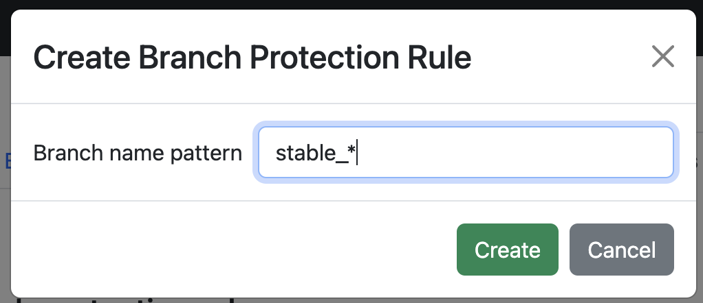
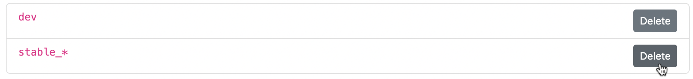

# Branch Protection Rules

Define branch protection rules to prevent direct changes and commits to specific branches.
Only merges are allowed into protected branches. Together with the power of pre-merge [hooks][data-quality-gates],
you can run validations on your data before it reaches your important branches and is exposed to consumers.

You can create rules for a specific branch or any branch that matches a name pattern you specify with [glob](https://en.wikipedia.org/wiki/Glob_(programming)) syntax (supporting `?` and `*` wildcards).

## How it works

When at least one protection rule applies to a branch, the branch is protected. You can configure which operations are blocked for protected branches:

1. **Object write operations**: **upload** and **delete** objects.
1. **Branch operations**: **commit** and **reset uncommitted changes**.
1. **Branch deletion**: **delete** the branch entirely.

You can selectively enable or disable each type of protection when creating or updating a protection rule. By default, new rules block object writes and commits, but allow branch deletion.

To operate on a protected branch, merge commits from other branches into
it. Use pre-merge [hooks][data-quality-gates] to validate the changes before
they are merged.

!!! note
    Reverting a previous commit using `lakectl branch revert` is **allowed** on a protected branch.

## Managing branch protection rules

This section explains how to use the lakeFS UI to manage rules. You can also use the [command line][lakectl-branch-protect] and [API][api].

### Reaching the branch protection rules page 

1. On lakeFS, navigate to the main page of the repository.
2. Click on the _Settings_ tab.
3. In the left menu, click _Branches_.

### Adding a rule

To add a new rule, click the _Add_ button. In the dialog:

1. Enter the branch name pattern using [glob](https://en.wikipedia.org/wiki/Glob_(programming)) syntax (supporting `?` and `*` wildcards).
2. Select which actions to block:
   - **Block staging area writes**: Prevents uploading and deleting objects on the branch
   - **Block commits**: Prevents creating new commits on the branch  
   - **Block branch deletion**: Prevents deleting the branch entirely
3. Click _Create_ to save the rule.

By default, new rules block staging writes and commits, but allow branch deletion.

### Deleting a rule

To delete a rule, click the _Delete_ button next to it.

[data-quality-gates]:  ../understand/use_cases/cicd_for_data.md#using-hooks-as-data-quality-gates
[lakectl-branch-protect]:  ../reference/cli.md#lakectl-branch-protect
[api]: ../reference/api.md
