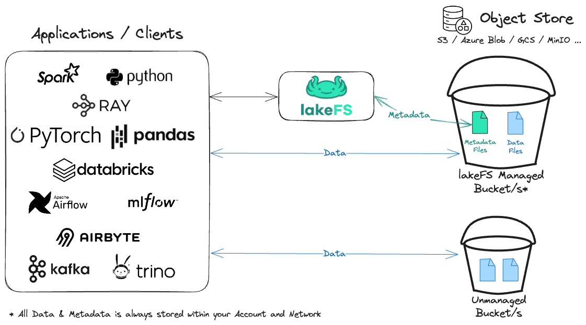

# Welcome to the Lake!

### Change1


<h2>lakeFS brings software engineering best practices and applies them to data</h2>

lakeFS provides version control over the data lake, and uses Git-like semantics to create and access those versions. If you know git, you'll be right at home with lakeFS.

With lakeFS, you can apply concepts to your data lake such as **branching** to create an isolated version of the data, **committing** to create a reproducible point in time, and **merging** in order to incorporate your changes in one atomic action.

???+ note "📽️ lakeFS in under 2 minutes"
    <div class="video-wrapper">
        <iframe width="1280" height="720" src="https://www.youtube.com/embed/GTxsyeoLccw" frameborder="0" allowfullscreen></iframe>
    </div>

## How Do I Get Started?

**[The hands-on quickstart](./quickstart/index.md) guides you through some core features of lakeFS**.

These include [branching](./quickstart/branch.md), [merging](./quickstart/commit-and-merge.md), and [rolling back changes](./quickstart/rollback.md) to data.

!!! tip
    You can use the [30-day free trial of lakeFS Cloud](https://lakefs.cloud/register) if you want to try out lakeFS without installing anything.

## Key lakeFS Features

* It is format-agnostic and works with both structured and unstructured data
* It works with numerous data tools and platforms.
* Your data stays in place, with no need to copy existing data
* It eliminates the need for data duplication using [zero-copy branching](./understand/model.md#zero-copy-branching).
* It maintains high performance over data lakes of any size
* It includes configurable garbage collection capabilities
* It is proven in production and has an active community


## How Does lakeFS Work With Other Tools?

lakeFS is an open source project that supports managing data in AWS S3, Azure Blob Storage, Google Cloud Storage (GCS), S3-Compatible storage solutions and even locally mounted directories.
It integrates seamlessly with popular data frameworks such as [Spark](./integrations/spark.md), [AWS SageMaker](./integrations/sagemaker.md), [Pandas](./integrations/python.md#integrations-with-popular-data-science-packages), [Tensorflow](./integrations/python.md#integrations-with-popular-data-science-packages), [Polars](./integrations/python.md#integrations-with-popular-data-science-packages), [HuggingFace Datasets](./integrations/huggingface_datasets.md) and many more.

With lakeFS, you can use any of the tools and libraries you are used to work with to read and write data directly from a repository.

!!! example "Example: lakeFS with Pandas"

    ```python
    >>> import pandas as pd
    >>>
    >>> df = pd.read_csv('lakefs://example-repository/main-branch/path/to.csv')
    ```

Using this method, lakeFS acts as a metadata layer: it figures out which objects need to be fetched from the underlying storage for that version of the data and then lets the client read or write these files directly from the storage using [pre-signed URLs](./security/presigned-url.md). This allows lakeFS to be both very efficient but also highly secure:

<p class="center">
    
</p>


Additionally, lakeFS maintains compatibility with the S3 API to minimize adoption
friction. You can use it as a drop-in replacement for S3 from the perspective of
any tool interacting with a data lake.

!!! example
    For example, take the common operation of reading unstructured data from the object store using [Boto3](https://boto3.amazonaws.com/v1/documentation/api/latest/index.html){: target="_blank" } (Python):

    ```python
    >>> import boto3
    >>>
    >>> s3 = boto3.resource('s3')
    >>> obj = s3.Object('example-repository', 'main-branch/path/image.png')
    >>> image_data = obj.get()['Body'].read()
    ```

You can use the same methods and syntax you are already using to read and write data when using a lakeFS repository.
This simplifies the adoption of lakeFS - minimal changes are needed to get started, making further changes an incremental process.

## lakeFS is Git for Data

Git became ubiquitous when it comes to code because it had best supported engineering best practices required by developers, in particular:

* Collaborate during development.
* Reproduce and troubleshoot issues with a given version of the code
* Develop and Test in isolation
* Revert code to a stable version in case of an error
* Continuously integrate and deploy new code (CI/CD)

lakeFS provides these exact benefits, that data practitioners are missing today, and enables them a clear intuitive Git-like interface to easily manage data like they manage code.
Through its versioning engine, lakeFS enables the following built-in operations familiar from Git:


- :octicons-git-branch-24: __Branch__ <br/>a consistent copy of a repository, isolated from other branches and their changes. Initial creation of a branch is a metadata operation that does not duplicate objects.
- :octicons-git-commit-24: __Commit__ <br/>an immutable checkpoint containing a complete snapshot of a repository.
- :octicons-git-merge-24: __Merge__ <br/>performed between two branches &mdash; merges atomically update one branch with the changes from another.
- :octicons-undo-24: __Revert__ <br/>returns a repo to the exact state of a previous commit.
- :octicons-tag-24: __Tag__ <br/>a pointer to a single immutable commit with a readable, meaningful name.
- :material-hook: __Hooks__ <br/>run validations and actions when actions occur (`pre-merge`, `post-create-branch`, etc).

!!! info
    See the [object model](./understand/model.md) for an in-depth
    definition of these, and the [CLI reference](./reference/cli.md) for the
    full list of commands.

Incorporating these operations into your data and model development provides the same collaboration and organizational benefits you get when managing application code with source control.

## How Can lakeFS Help Me?

lakeFS helps you maintain a tidy data lake in several ways, including:

### Reproducibility: What Did My Data Look Like at a Point In Time?

Being able to look at data as it was at a given point is particularly useful in at least two scenarios:

1. **Reproducibility of ML experiments**

    ML experimentation is iterative, requiring the ability to reproduce specific results. With lakeFS, you can version all aspects of an ML experiment, including the data. This enables:

    **Data Lineage**: Track the transformation of data from raw datasets to the final version used in experiments, ensuring transparency and traceability.

    **Zero-Copy Branching**: Minimize storage use by creating lightweight branches of your data, allowing for easy experimentation across different versions.

    **Easy Integration**: Seamlessly integrate with ML tools like MLFlow, linking experiments directly to the exact data versions used, making reproducibility straightforward.

    lakeFS enhances your ML workflow by ensuring that all versions of data are easily accessible, traceable, and reproducible.

2. **Troubleshooting production problems**

    In some cases, a user might report inconsistencies, question the accuracy, or simply report data or inference results as incorrect.

    Since data continuously changes, it is challenging to understand its state at the time of the error.

    With lakeFS you can create a branch from a commit to debug an issue in isolation.


[👉🏻 Read More](./understand/use_cases/reproducibility.md){ .md-button }

### Collaboration during development and training

With lakeFS, each member of the team can create their own branch, isolated from other people's changes.

This allows to iterate on changes to an algorithm or transformation, without stepping on eachother's toes. These branches are centralized - they could be share among users for collaboration, and can even be merged.

With lakeFS you can even open [pull requests](./howto/pull-requests.md), allowing you to easily share changes with other members and collaborate on them.

### Isolated Dev/Test Environments with zero-copy branching

lakeFS makes creating isolated dev/test environments for transformations, model development, parallel experiments, and ETL processes- achieved through the use of zero-copy branches.
This enables you to test and validate code changes on production data without impacting it, as well as run analysis and experiments on production data in an isolated clone.

[👉🏻 Read More](./understand/use_cases/etl_testing.md){ .md-button }


### Rollback of Data Changes and Recovery from Data Errors

Human error or misconfigurations can lead to erroneous data making its way into production or critical data being accidentally deleted. Traditional backups are often inadequate for recovery in these situations, as they may be outdated and require time-consuming object-level sifting.

With lakeFS, you can avoid these inefficiencies by committing snapshots of data at well-defined times.
This allows for instant recovery: simply identify a good historical commit and restore or copy from it with a single operation.

[👉🏻 Read More](./understand/use_cases/rollback.md){ .md-button }

### Establishing data quality guarantees - Write-Audit-Publish

The best way to deal with mistakes is to avoid them. A data source that is ingested into the lake introducing low-quality data should be blocked before exposure if possible.

With lakeFS, you can achieve this by tying data quality tests to commit and merge operations via lakeFS [hooks](./understand/use_cases/cicd_for_data.md#using-hooks-as-data-quality-gates).

[👉🏻 Read more](./understand/use_cases/cicd_for_data.md){ .md-button }

## Next Step

Try lakeFS on the [cloud](./cloud/index.md) or [run it locally](./quickstart/index.md)
