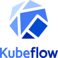

# Integrations with lakeFS

You can use lakeFS with a wide range of tools and frameworks.

lakeFS provides several clients directly, as well as an [S3-compatible gateway](../understand/architecture.md#s3-gateway). This gateway means that if you want to use something with lakeFS, so long as that technology can interface with S3, it can interface with lakeFS.

See below for detailed instructions for using different technologies with lakeFS.

!!! info "Missing Something?"
    If there is a technology not listed here that you would like to use with lakeFS, please drop by [our Slack](https://lakefs.io/slack) and we'll help you get started with it.

<table>
    <tr>
        <td width="25%" align=center><a href="airbyte/"> Airbyte</a></td>
        <td width="25%" align=center><a href="athena/"> Amazon Athena</a></td>
        <td width="25%" align=center><a href="sagemaker/"> Amazon SageMaker</a></td>
        <td width="25%" align=center><a href="airflow/"> Apache Airflow</a></td>
    </tr>
    <tr>
        <td width="25%" align=center><a href="hive/"> Apache Hive</a></td>
        <td width="25%" align=center><a href="iceberg/"> Apache Iceberg</a></td>
        <td width="25%" align=center><a href="kafka/"> Apache Kafka</a></td>
        <td width="25%" align=center><a href="spark/"> Apache Spark</a></td>
    </tr>
    <tr>
        <td width="25%" align=center><a href="aws_cli/"> AWS CLI</a></td>
        <td width="25%" align=center><a href="cloudera/"> Cloudera</a></td>
        <td width="25%" align=center><a href="databricks/"> Databricks</a></td>
        <td width="25%" align=center><a href="delta/"> Delta Lake</a></td>
    </tr>
    <tr>
        <td width="25%" align=center><a href="dremio/"> Dremio</a></td>
        <td width="25%" align=center><a href="duckdb/"> DuckDB</a></td>
        <td width="25%" align=center><a href="git/"> Git</a></td>
        <td width="25%" align=center><a href="glue_hive_metastore/"> Glue / Hive metastore</a></td>
    </tr>
    <tr>
        <td width="25%" align=center><a href="huggingface_datasets/"> HuggingFace Datasets</a></td>
        <td width="25%" align=center><a href="kubeflow/"> Kubeflow</a></td>
        <td width="25%" align=center><a href="presto_trino/"> Presto / Trino</a></td>
        <td width="25%" align=center><a href="python/"> Python</a></td>
    </tr>
    <tr>
        <td width="25%" align=center><a href="r/"> R</a></td>
        <td width="25%" align=center><a href="red_hat_openshift_ai/"> Red Hat OpenShift AI</a></td>
        <td width="25%" align=center><a href="vertex_ai/"> Vertex AI</a></td>
        <td width="25%" align=center><a href="mlflow/"> MLflow</a></td>
    </tr>
</table>
