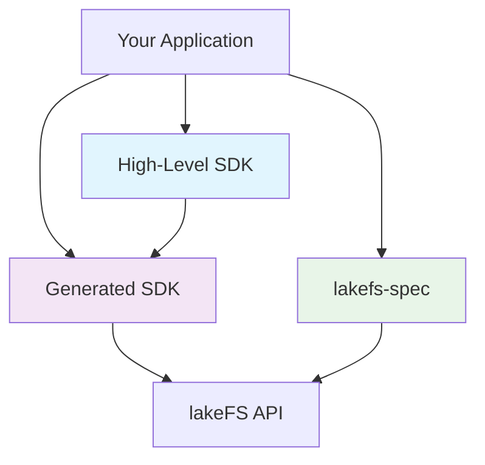

# Python Integration with lakeFS

lakeFS provides multiple Python integration options to suit different use cases and development patterns. This comprehensive guide helps you choose the right SDK and get started quickly.

!!! warning "Legacy SDK Deprecation"
    If your project is currently using the [legacy Python `lakefs-client`](https://pypi.org/project/lakefs-client/), please be aware that this version has been [deprecated](../posts/deprecate-py-legacy.md). As of release **v1.44.0**, it's no longer supported for new updates or features.

## SDK Architecture and Relationships

Understanding the relationship between different Python SDKs helps you make informed decisions:

- **High-Level SDK** is built on top of the **Generated SDK**, providing simplified interfaces while maintaining access to the underlying client
- **Generated SDK** provides direct access to all lakeFS API endpoints based on the OpenAPI specification
- **lakefs-spec** offers a filesystem-like interface compatible with the fsspec ecosystem

## Comprehensive SDK Comparison

| Feature | High-Level SDK | Generated SDK | lakefs-spec |
|---------|----------------|---------------|-------------|
| **Installation** | `pip install lakefs` | `pip install lakefs-sdk` | `pip install lakefs-spec` |
| **API Style** | Object-oriented, simplified | Direct API mapping | Filesystem-like |
| **Learning Curve** | Easy | Moderate | Easy |
| **Repository Management** | ✅ Full support | ✅ Full support | ❌ Not supported |
| **Branch Operations** | ✅ Simplified interface | ✅ Full API access | ❌ Limited |
| **Object Operations** | ✅ Streaming I/O | ✅ Manual handling | ✅ File-like operations |
| **Transactions** | ✅ Built-in support | ⚠️ Manual implementation | ✅ Context managers |
| **Data Science Integration** | ⚠️ Via file-like objects | ❌ Manual integration | ✅ Native pandas/dask support |
| **Async Support** | ❌ Sync only | ⚠️ Limited | ❌ Sync only |
| **Error Handling** | ✅ Pythonic exceptions | ✅ API-level exceptions | ✅ Filesystem exceptions |
| **Performance** | Good | Best (direct API) | Good |
| **Maintenance** | lakeFS team | Auto-generated | Third-party |

### SDK Strengths and Use Cases

#### High-Level SDK
**Strengths:**
- Intuitive, Pythonic API design
- Built-in transaction support with context managers
- Streaming I/O operations for large files
- Automatic connection management and retries
- Access to underlying Generated SDK when needed

**Best for:**
- Data engineers building ETL pipelines
- Python developers new to lakeFS
- Applications requiring transaction semantics
- Workflows with large file uploads/downloads

**Example use cases:**
- Data pipeline orchestration
- Batch data processing
- Model training workflows
- Data quality validation

#### Generated SDK
**Strengths:**
- Complete API coverage (all endpoints available)
- Direct mapping to lakeFS REST API
- Fine-grained control over requests
- Auto-generated from OpenAPI specification
- Consistent with other language SDKs

**Best for:**
- Advanced users needing full API control
- Custom tooling and integrations
- Operations not covered by High-Level SDK
- Performance-critical applications

**Example use cases:**
- Custom lakeFS management tools
- Advanced metadata operations
- Integration with existing API frameworks
- Performance-optimized data access

#### lakefs-spec
**Strengths:**
- Filesystem-like API familiar to Python developers
- Native integration with pandas, dask, and other fsspec libraries
- Transparent handling of lakeFS URIs
- Built-in transaction support
- Third-party maintained with active community

**Best for:**
- Data scientists and analysts
- Jupyter notebook workflows
- Existing fsspec-based applications
- Quick prototyping and exploration

**Example use cases:**
- Interactive data analysis
- Machine learning experimentation
- Data exploration in notebooks
- Integration with existing data science stacks

## SDK Selection Decision Matrix

Use this decision tree to choose the right SDK for your needs:

### 🤔 What's your primary use case?

#### 📊 Data Science & Analytics
- **Working with pandas/dask?** → [lakefs-spec](lakefs-spec/)
- **Need transactions in notebooks?** → [lakefs-spec](lakefs-spec/) or [High-Level SDK](high-level-sdk/)
- **Building ML pipelines?** → [High-Level SDK](high-level-sdk/)

#### 🔧 Data Engineering & ETL
- **Building data pipelines?** → [High-Level SDK](high-level-sdk/)
- **Need transaction support?** → [High-Level SDK](high-level-sdk/)
- **Processing large files?** → [High-Level SDK](high-level-sdk/) (streaming I/O)

#### 🏗️ Application Development
- **Building lakeFS management tools?** → [Generated SDK](generated-sdk/)
- **Need full API control?** → [Generated SDK](generated-sdk/)
- **Integrating with existing systems?** → [Generated SDK](generated-sdk/)

### 🎯 Feature-Based Selection

| If you need... | Choose... | Why? |
|----------------|-----------|------|
| **Simplest API** | High-Level SDK | Pythonic, intuitive interface |
| **Complete API access** | Generated SDK | All endpoints available |
| **Pandas integration** | lakefs-spec | Native fsspec support |
| **Transaction support** | High-Level SDK or lakefs-spec | Built-in context managers |
| **Streaming large files** | High-Level SDK | Optimized I/O operations |
| **Custom tooling** | Generated SDK | Full control and flexibility |
| **Jupyter notebooks** | lakefs-spec | Filesystem-like operations |

### 🚀 Experience Level Guide

#### New to lakeFS
1. Start with [Getting Started](getting-started.md)
2. Try [High-Level SDK](high-level-sdk/quickstart.md) for general use
3. Or [lakefs-spec](lakefs-spec/) for data science workflows

#### Experienced with lakeFS
- Use [Generated SDK](generated-sdk/) for advanced operations
- Combine multiple SDKs as needed
- Check [best practices](reference/best-practices.md) for optimization

#### Migrating from S3
1. Review [S3 Gateway documentation](../../understand/architecture.md#s3-gateway) for S3-compatible access
2. Consider gradual migration strategies
3. Plan integration with existing S3-based workflows

## Quick Start

1. **[Getting Started](getting-started.md)** - Installation and setup guide
2. **Choose your SDK** - Select the appropriate SDK for your use case
3. **Follow tutorials** - Learn with real-world examples

## Documentation Sections

- **[Getting Started](getting-started.md)** - Installation, authentication, and basic setup
- **[High-Level SDK](high-level-sdk/)** - Comprehensive SDK documentation
- **[Generated SDK](generated-sdk/)** - Direct API access patterns
- **[lakefs-spec](lakefs-spec/)** - Filesystem API and data science integrations

- **[Tutorials](tutorials/)** - Real-world examples and workflows
- **[Reference](reference/)** - API comparison, best practices, and troubleshooting

## Need Help?

- Check the [troubleshooting guide](reference/troubleshooting.md)
- Review [best practices](reference/best-practices.md)
- Compare [API features](reference/api-comparison.md)

## See Also

**Getting Started:**
- [Installation and Setup Guide](getting-started.md) - Complete setup instructions for all SDKs
- [Authentication Methods](getting-started.md#authentication-and-configuration) - Configure credentials and connections

**SDK-Specific Documentation:**
- [High-Level SDK Overview](high-level-sdk/index.md) - Simplified Python interface
- [Generated SDK Overview](generated-sdk/index.md) - Direct API access
- [lakefs-spec Overview](lakefs-spec/index.md) - Filesystem operations

**Learning Resources:**
- [Real-World Tutorials](tutorials/index.md) - End-to-end examples and workflows
- [Best Practices Guide](reference/best-practices.md) - Production deployment guidance
- [API Comparison Matrix](reference/api-comparison.md) - Feature comparison across SDKs

**External Resources:**
- [High-Level SDK Documentation](https://pydocs-lakefs.lakefs.io){:target="_blank"} - Complete API reference
- [Generated SDK Documentation](https://pydocs-sdk.lakefs.io){:target="_blank"} - Auto-generated API docs
- [lakefs-spec Documentation](https://lakefs-spec.org/){:target="_blank"} - Third-party filesystem interface