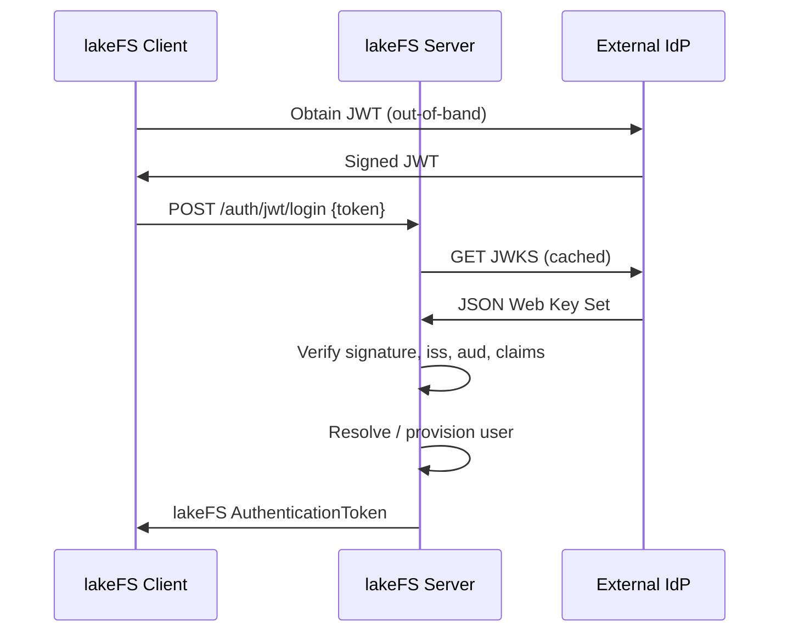

# JWT IdP login (token exchange)

lakeFS can accept a JWT issued by an external identity provider (IdP) and
exchange it for a lakeFS session token. Clients POST their IdP-issued JWT to
`/api/v1/auth/jwt/login`; lakeFS verifies the token against the configured
issuer, audience and JWKS, maps its claims to a lakeFS user (auto-provisioning
on first login), and returns a standard lakeFS `AuthenticationToken` that can
be used as a bearer token on subsequent API calls.

This is a vendor-agnostic alternative to the built-in IAM and STS logins. It
works with any IdP that publishes a JWKS endpoint and issues asymmetrically
signed JWTs (RS*, ES*, PS*), e.g. AWS Outbound Identity Federation, Okta,
Keycloak, Microsoft Entra ID.

## Architecture



## Configuring lakeFS

The endpoint is enabled as soon as `auth.jwt.jwks_url` is set. When unset, the
endpoint responds with `501 Not Implemented`.

```yaml
auth:
  jwt:
    issuer: "https://idp.example.com"                          # required: expected `iss`
    audience:                                                  # required: accepted `aud` values (any match)
      - "https://lakefs.example.com"
    jwks_url: "https://idp.example.com/.well-known/jwks.json"  # required

    # Optional: require specific top-level claims to have exact values.
    validate_id_token_claims:
      hd: "example.com"

    # Per-user identifiers use RFC 6901 JSON pointers so nested and
    # namespaced claims are supported without custom code.
    external_user_id_claim_ref: "/sub"              # stable per-user id; defaults to /sub
    friendly_name_claim_ref: "/name"                # optional display name

    # Group assignment uses a JMESPath expression evaluated against the
    # full claim map on first login. Must return a string or array of
    # strings of lakeFS group names. Bake the default into the
    # expression with `|| [...]`; a null, empty, or errored result leaves
    # the user with no initial groups. Wrap optional claims with
    # `not_null(claim, `[]`)` so a missing claim flows through the `||`
    # branch instead of aborting evaluation.
    initial_groups_path: |
      contains(not_null(groups, `[]`), 'admin') && ['Admins']
        || contains(not_null(groups, `[]`), 'eng') && ['Developers']
        || ['Viewers']

    persist_friendly_name: false
```

See the [configuration reference](../reference/configuration.md#authjwt) for
the full list of keys, types, and defaults.

!!! info
    Group assignment runs only on first provisioning. Subsequent logins do not
    resync group membership, so RBAC changes made in lakeFS are preserved.

!!! tip "`initial_groups_path` examples"
    - Everyone the same group: `"['Viewers']"`
    - Pass-through an IdP claim: `groups`
    - Filter by prefix: ``not_null(groups, `[]`)[?starts_with(@, 'lakefs-')]``
    - Tenant-scoped: `tenant == 'acme' && ['AcmeUsers'] || ['Viewers']`
    - Nested / namespaced claim (e.g. AWS STS session tag at `"https://sts.amazonaws.com/".request_tags.lakefs_role`): `` `"https://sts.amazonaws.com/".request_tags.lakefs_role == 'eng' && ['Developers'] || ['Viewers']` ``

    See the [JMESPath tutorial](https://jmespath.org/tutorial.html) for the full grammar.

## Using the endpoint

```bash
curl -X POST "$LAKEFS_URL/api/v1/auth/jwt/login" \
  -H "Content-Type: application/json" \
  -d '{"token":"<JWT issued by your IdP>"}'
# => {"token":"<lakefs session token>","token_expiration":...}
```

The returned token can then be sent as `Authorization: Bearer <token>` to any
lakeFS API endpoint. The lakeFS Python SDK and other generated clients expose
this as the `jwt_login` method on the `Auth` API.

## Security notes

- Only asymmetric signatures are accepted (`RS*`, `ES*`, `PS*`). HMAC (`HS*`) is
  rejected outright: a JWT accepted here must be verifiable against the
  published JWKS, never against a shared symmetric secret.
- The JWKS is fetched once at startup (fail-fast) and re-fetched on demand when
  a token presents an unknown `kid`. A failed refresh leaves the previously
  known keys in place.
- Standard claim validation (`iss`, `aud`, `exp`, `iat`, `nbf`) is applied with
  a 60s clock-skew leeway.
- `validate_id_token_claims` lets you require exact matches on additional
  top-level claims (tenant, domain, etc.) before provisioning is attempted.
