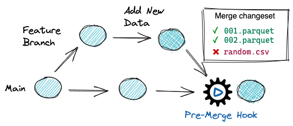

# Data Contract Enforcement 

## Why Does Data Contract Enforcement Matter?

Modern data pipelines continuously move data from data lakes to downstream consumers such as business intelligence dashboards, analytics systems, 
and machine learning models. As organizations increasingly rely on data to drive business-critical decisions, ensuring data reliability and trust becomes essential.

Production data must consistently adhere to defined quality standards and governance policies. These requirements can range
from simple validations — such as file format checks and schema enforcement—to more advanced controls like PII (Personally
Identifiable Information) detection and removal across organizational datasets.

To maintain quality throughout the data lifecycle, teams implement data quality gates. Similar to software development practices, 
data changes should go through an audit before being published to production. Automated checks verify
that data meets defined contracts and governance requirements. Only validated data is allowed to move forward.

As a best practice, every update to production data should trigger automated validation tests. If the data passes all checks, 
it can be safely published. If it fails, the changes are blocked — preventing unreliable or non-compliant data from reaching 
downstream consumers.

## How Do I Automate Data Contract Enforcement with lakeFS?

lakeFS enables automated data contract enforcement through a built-in mechanism called [hooks](../../howto/hooks/index.md). 

Hooks allow you to automatically validate data changes when specific repository events occur, such as:
* `pre-merge`
* `pre-commit`
* `post-merge`
* `post-commit`
* `pre-create-branch`
* `post-create-branch`

Conceptually similar to Git hooks, lakeFS hooks are executed remotely and are guaranteed to run when the configured event
is triggered. This makes them reliable enforcement points for validating data contracts and governance policies.

By using `pre-commit` and `pre-merge` hooks, you can enforce data contracts before changes are finalized or promoted to 
production. For example, you can:
* Validate schema compatibility
* Enforce file format policies
* Detect or block PII
* Run data quality checks 
* Ensure naming, partitioning, or structural conventions



Hook behavior is defined declaratively in an `actions.yaml` file. This file specifies:
* The triggering event (for example, pre-merge)
* The branches the rule applies to
* The validation logic to execute

When the configured event occurs, lakeFS runs all validations defined in `actions.yaml`. If any validation fails, the operation 
(such as a merge into main) is blocked — preventing data that violates the contract from reaching production.

Below is an example actions.yaml file that enforces a file format contract on the main branch, allowing only Parquet and 
Delta Lake files under a specific prefix:

```yaml
name: ParquetOnlyInProduction
description: This webhook ensures that only parquet files are written under production/
on:
  pre-merge:
    branches:
      - main
hooks:
  - id: production_format_validator
    type: webhook
    description: Validate file formats
    properties:
      url: "http://lakefs-hooks:5001/webhooks/format"
      query_params:
        allow: ["parquet", "delta_lake"]
        prefix: analytics/
```
In this example, any attempt to merge changes into main that violate the defined data contract will be rejected.

## Example: Automating Data Contract Enforcement with lakeFS

The sample below provides a lakeFS environment, a Jupyter notebook, and a server on which for the lakeFS webhooks to run. 

### Prerequisites & Setup

Before we get started, make sure [Docker](https://docs.docker.com/engine/install/) is installed on your machine.

* Start by cloning the lakeFS samples Git repository:

```bash
git clone https://github.com/treeverse/lakeFS-samples.git
cd lakeFS-samples
```

* Run following commands to start the components: 

```bash
git submodule init
git submodule update
docker compose up
```

Open the [local Jupyter Notebook](http://localhost:8888) and go to the `hooks-demo.ipynb` notebook.

## Resources 

To explore different checks and validations on your data, refer to [pre-built hooks config](https://github.com/treeverse/lakeFS-hooks#included-webhooks) by the lakeFS team. 

To understand the comprehensive list of hooks supported by lakeFS, refer to the [documentation](https://github.com/treeverse/lakeFS-hooks).

[data-quality-gates]:  ../../howto/hooks/index.md
