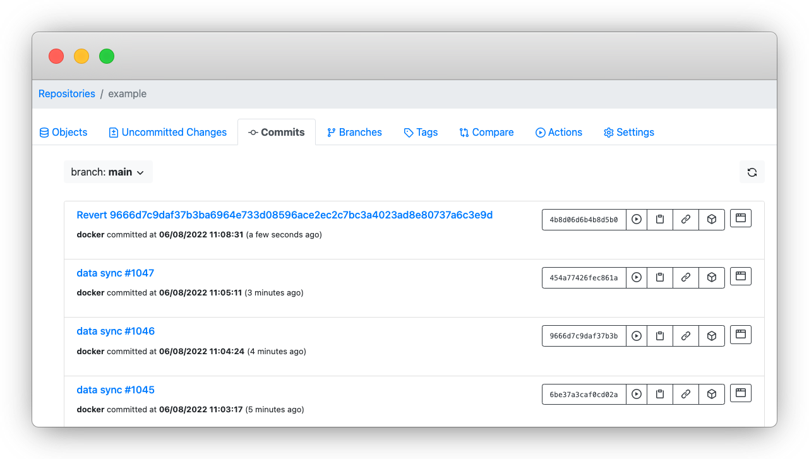

# Rollbacks

## What Is a Rollback?

A rollback operation is used to to fix critical data errors immediately.

What is a critical data error? Think of a situation where erroneous or misformatted data causes a significant issue with an important service or function. In such situations, the first thing to do is stop the bleeding.

Rolling back returns data to a state in the past, before the error was present. You might not be showing all the latest data after a rollback, but at least you aren’t showing incorrect data or raising errors.

## Why Rollbacks Are Useful

A Rollback is used as a stopgap measure to “put out the fire” as quickly as possible while RCA (root cause analysis) is performed to understand 1) exactly how the error happened, and 2) what can be done to prevent it from happening again.

It can be a pressured, stressful situation to deal with a critical data error. Having the ability to employ a rollback relieves some of the pressure and makes it more likely you can figure out what happened without creating additional issues.

!!! example
    As a real world example, the [14-day outage](https://devops.com/what-sres-can-learn-from-the-atlassian-outage-of-2022/) some Atlassian users experienced in May 2022 could have been an uninteresting minor incident had rolling back the deleted customer data been an option.

## Performing Rollbacks with lakeFS

lakeFS lets you develop in your data lake in such a way that rollbacks are simple to perform. This starts by taking a commit over your lakeFS repository whenever a change to its state occurs.

Using the lakeFS UI or CLI, you can set the current state, or HEAD, of a branch to any historical commit in seconds, effectively performing a rollback.

To demonstrate how this works, let's take the example of a lakeFS repo with the following commit history:


As can be inferred from the history, this repo is updated every minute with a data sync from some data source. An example data sync is a typical ETL job that replicates data from an internal database or any other data source. After each sync, a commit is taken in lakeFS to save a snapshot of data at that point in time.

### How to Rollback From a Bad Data Sync?

Say a situation occurs where one of the syncs had bad data and is causing downstream dashboards to fail to load. Since we took a commit of the repo right after the sync ran, we can use a `revert` operation to undo the changes introduced in that sync.


Step 1: Copy the `commit_id` associated with the commit we want to revert. As the screenshot above shows, you can use the _Copy ID to Clipboard_ button to do this.

Step 2: Run the revert command using [lakectl](../../reference/cli.md), the lakeFS CLI. In this example, the command will be as follows:

```bash
lakectl branch revert "lakefs://example/main" 9666d7c9daf37b3ba6964e733d08596ace2ec2c7bc3a4023ad8e80737a6c3e9d
```

This will undo the changes introduced by this commit, completing the rollback! 



The rollback operation is that simple, even if many changes were introduced in a commit, spanning acrossmultiple data collections.

In lakeFS, rolling back data is always a one-liner.
