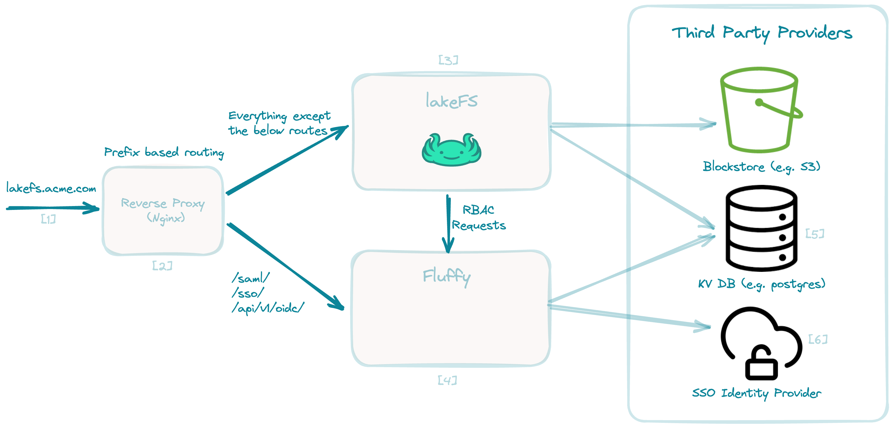

# Architecture

[1] Any user request to lakeFS via Browser or Programmatic access (SDK, HTTP
API, lakectl).

[2] Reverse Proxy (e.g. NGINX, Traefik, K8S Ingress): will handle user requests
and proxy between lakeFS server and fluffy server based on the path prefix
while maintaining the same host.

[3] lakeFS server - the main lakeFS service.

[4] fluffy server - service that is responsible for the Enterprise features.,
it is separated by ports for security reasons.

1. SSO auth (i.e Browser login via Azure AD, Okta, Auth0), default port 8000.
1. RBAC authorization, default port 9000.

[5] The [KV Store]() - Where metadata is stored used both by lakeFS and fluffy.

[6] SSO IdP - Identity provider (e.g. Azure AD, Okta, JumpCloud). fluffy
implements SAML and Oauth2 protocols.

For more details and pricing, please [contact sales](https://lakefs.io/contact-sales/).

**Note:** Setting up lakeFS enterprise with an SSO IdP (OIDC, SAML or LDAP) requires
configuring access from the IdP too.
{: .note }