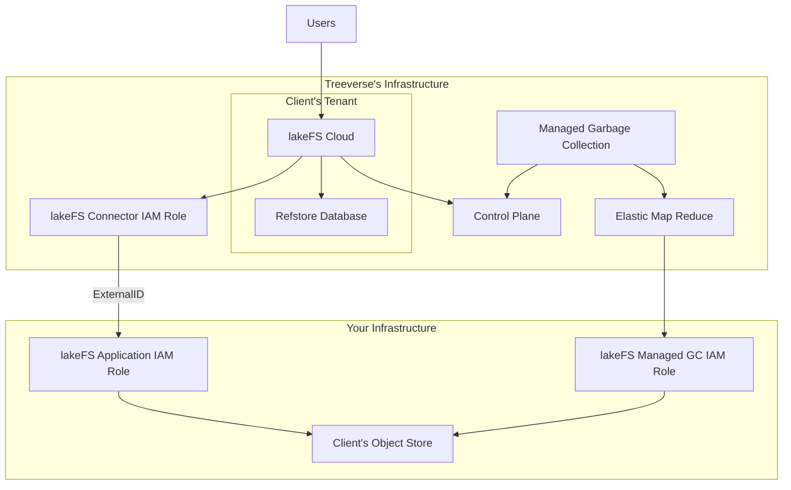

# lakeFS Cloud

[lakeFS Cloud](https://lakefs.cloud) is a fully-managed lakeFS solution provided by Treeverse, implemented using our best practices, providing high availability, auto-scaling, support and enterprise-ready features.
	
## lakeFS Cloud Features
* [Role-Based Access Control]()
* [Auditing]()
* [Single-Sign-On](#sso-for-lakefs-cloud) (including support for SAML, OIDC, AD FS, Okta, and Azure AD)
* [Managed Garbage Collection]()
* [Private-Link]()
* [Unity Delta Sharing]()
* SOC 2 Type II Compliance

## How lakeFS Cloud interacts with your infrastructure

Treeverse hosts and manages a dedicated lakeFS instance that interfaces with data held in your object store, such as S3. 

## Setting up lakeFS Cloud

### AWS / Azure
Please follow the self-service setup wizard on [lakeFS Cloud](https://lakefs.cloud)

### GCP
Please [contact us](mailto:support@treeverse.io) for onboarding instructions.

## Scalability Model

In lakeFS Cloud, a branch is the performance isolation unit.
The defaults for a lakeFS Cloud installation is 1500 write operations per second and
1500 read operations per second for all branches combined.
This limit can be increased by contacting [support]((mailto:support@treeverse.io)).
lakeFS Cloud offers clients up to 1000 write operations per second and
3000 read operations per second for each branch.
