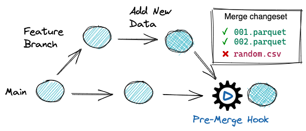

# CI/CD for Data

## Why do I need CI/CD?

Data pipelines feed processed data from data lakes to downstream consumers like business dashboards and machine learning models. As more and more organizations rely on data to enable business critical decisions, data reliability and trust are of paramount concern. Thus, it's important to ensure that production data adheres to the data governance policies of businesses. These data governance requirements can be as simple as a **file format validation, schema check, or an exhaustive PII(Personally Identifiable Information)** data removal from all of organization's data. 

Thus, to ensure the quality and reliability at each stage of the data lifecycle, data quality gates need to be implemented. That is, we need to run **Continuous Integration(CI)** tests on the data, and only if data governance requirements are met can the data can be promoted to production for business use. 

Everytime there is an update to production data, the best practice would be to run CI tests and then promote(deploy) the data to production. 

## How do I implement CI/CD for data with lakeFS?

lakeFS makes implementing CI/CD pipelines for data simpler. lakeFS provides a feature called hooks that allow automation of checks and validations of data on lakeFS branches. These checks can be triggered by certain data operations like committing, merging, etc. 

Functionally, lakeFS hooks are similar to Git Hooks. lakeFS hooks are run remotely on a server, and they are guaranteed to run when the appropriate event is triggered.

Here are some examples of the hooks lakeFS supports:
* pre-merge
* pre-commit
* post-merge
* post-commit
* pre-create-branch
* post-create-branch

and so on.

By leveraging the pre-commit and pre-merge hooks with lakeFS, you can implement CI/CD pipelines on your data lakes.

Specific trigger rules, quality checks and the branch on which the rules are to be applied are declared in `actions.yaml` file. When a specific event (say, pre-merge) occurs, lakeFS runs all the validations declared in `actions.yaml` file. If validations error out, the merge event is blocked.

Here is a sample `actions.yaml` file that has pre-merge hook configured to allow only parquet and delta lake file formats on main branch.

```bash
name: ParquetOnlyInProduction
description: This webhook ensures that only parquet files are written under production/
on:
  pre-merge:
    branches:
      - main
hooks:
  - id: production_format_validator
    type: webhook
    description: Validate file formats
    properties:
      url: "http://lakefs-hooks:5001/webhooks/format"
      query_params:
        allow: ["parquet", "delta_lake"]
        prefix: analytics/
```

## Using hooks as data quality gates

Hooks are run on a remote server that can serve http requests from lakeFS server. lakeFS supports two types of hooks.
1. webhooks (run remotely on a web server. e.g.: flask server in python) 
2. airflow hooks (a dag of complex data quality checks/tasks that can be run on airflow server) 

In this tutorial, we will show how to use webhooks (python flask webserver) to implement quality gates on your data branches. Specifically, how to configure hooks to allow only parquet and delta lake format files in the main branch.

The tutorial uses an existing lakeFS environment (lakeFS running on [everything bagel docker](https://lakefs.io/the-docker-everything-bagel-spin-up-a-local-data-stack/) container), python flask server running on a docker container, a Jupyter notebook and sample data sets to demonstrate the integration of lakeFS hooks with Apache Spark and Python. 

To understand how hooks work and how to configure hooks in your production system, refer to the documentation: [Hooks](../use_cases/cicd_for_data.md#using-hooks-as-data-quality-gates). To configure lakeFS hooks with custom quality check rules, refer to the [lakefs-hooks](https://github.com/treeverse/lakeFS-hooks) repository.



Follow the steps below to clone the hooks demo repository and to implement CI/CD for data lakes.

# Implementing CI/CD pipeline with lakeFS
### Prerequisites

Before we get started, make sure [docker](https://docs.docker.com/engine/install/) is installed on your machine.

## Setup Webhooks server

First, as you know, lakeFS webhooks need a remote server to serve the http requests from lakeFS. So let us set up the python flask server for webhooks.

Start with cloning the [lakeFS-hooks](https://github.com/treeverse/lakeFS-hooks) repository. The following command can be run in your terminal to get the hooks image.

```bash
git clone https://github.com/treeverse/lakeFS-hooks.git && cd lakeFS-hooks/
docker build -t <lakefs-hooks-image-name> .
```
Once you have the `<lakefs-hooks-image-name>` image built, you can add this image in the lakeFS everything bagel docker. This ensures that flask server and lakeFS server are running inside the same docker container, and are part of the same docker network. This is to simplify the setup, and is not mandatory to have both the services running in the same container.
{: .note .note-info }

## Setup lakeFS server

To get a local lakeFS instance running on docker, you can use everything bagel docker. Let us start with cloning the [lakeFS](https://github.com/treeverse/lakeFS) repository.

```bash
git clone https://github.com/treeverse/lakeFS.git && cd lakeFS/deployments/compose
```

The python flask server image we built in the above section needs to be added to everything bagel `docker-compose.yaml` file. So add the following contents to the yaml file. For lakeFS instance running on everything bagel, the lakeFS endpoint, access key id and secret key are found in the `docker-compose.yaml` file under `lakefs` section.

```bash
  lakefs-webhooks:
    image: <lakefs-hooks-image-name>
    container_name: lakefs-hooks
    ports:
      - 5001:5001
    environment:
      - LAKEFS_SERVER_ADDRESS=<lakefs_server_endpoint>
      - LAKEFS_ACCESS_KEY_ID=<lakefs_access_key_id>
      - LAKEFS_SECRET_ACCESS_KEY=<lakefs_secret_key>
```
Start the docker container to run lakeFS server and hooks server: ```docker compose up -d```

Next step is to configure the custom logic for your hooks server and configuring hooks in lakeFS. 

## Set up your first lakeFS webhook under 10 minutes

To configure and set up a pre-merge lakeFS hook that validates file format of your data on staging branch before promoting it to production, refer to [this notebook](https://github.com/treeverse/lakeFS-samples/blob/main/notebooks/hooks-demo.ipynb) in the [lakeFS samples repository](https://github.com/treeverse/lakeFS-samples).

To explore different checks and validations on your data, refer to [pre-built hooks config](https://github.com/treeverse/lakeFS-hooks#included-webhooks) by the lakeFS team. 

To understand the comprehensive list of hooks supported by lakeFS, refer to the [documentation](https://github.com/treeverse/lakeFS-hooks).
