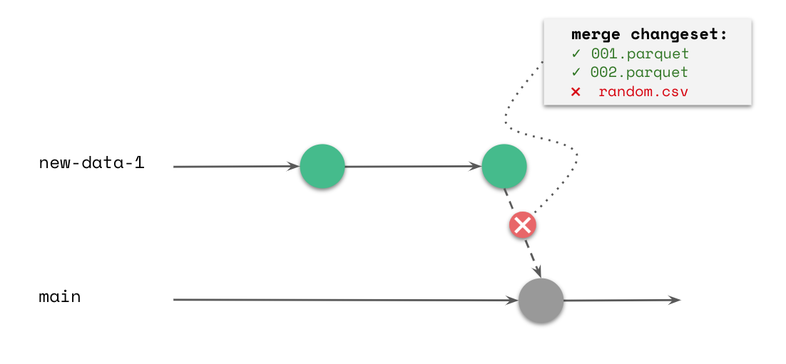

## Continuous Data Integration

Everyday data lake  management includes ingestion of new data collections, and a growing number of consumers reading and writing analysis results to the lake. In order to ensure our lake is reliable  we need to validate new data sources, enforce good practices to maintain  a clean lake (avoid the swamp) and validate metadata. lakeFS simplifies continuous integration of data to the lake by supporting ingestion on a designated branch. Merging data to main is enabled only if conditions apply. To make this tenable, let’s look at a few examples:

### Example 1: Pre-merge hooks - enforce best practices

Examples of good practices enforced in organizations:  

 - No user_* columns except under /private/...
 - Only `(*.parquet | *.orc | _delta_log/*.json)` files allowed
 - Under /production, only backward-compatible schema changes are allowed
 - New tables on main must be registered in our metadata repository first, with owner and SLA

lakeFS will assist in enforcing best practices by giving you a designated branch to ingest new data (“new-data-1” in the drawing). . You may run automated tests to validate predefined best practices as pre-merge hooks. If the validation passes, the new data will be automatically and atomically merged to the main branch. However, if the validation fails, you will be alerted, and the new data will not be exposed to consumers.

By using this branching model and implementing best practices as pre merge hooks, you ensure the main lake is never compromised.

