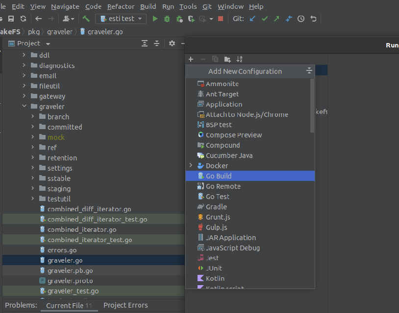
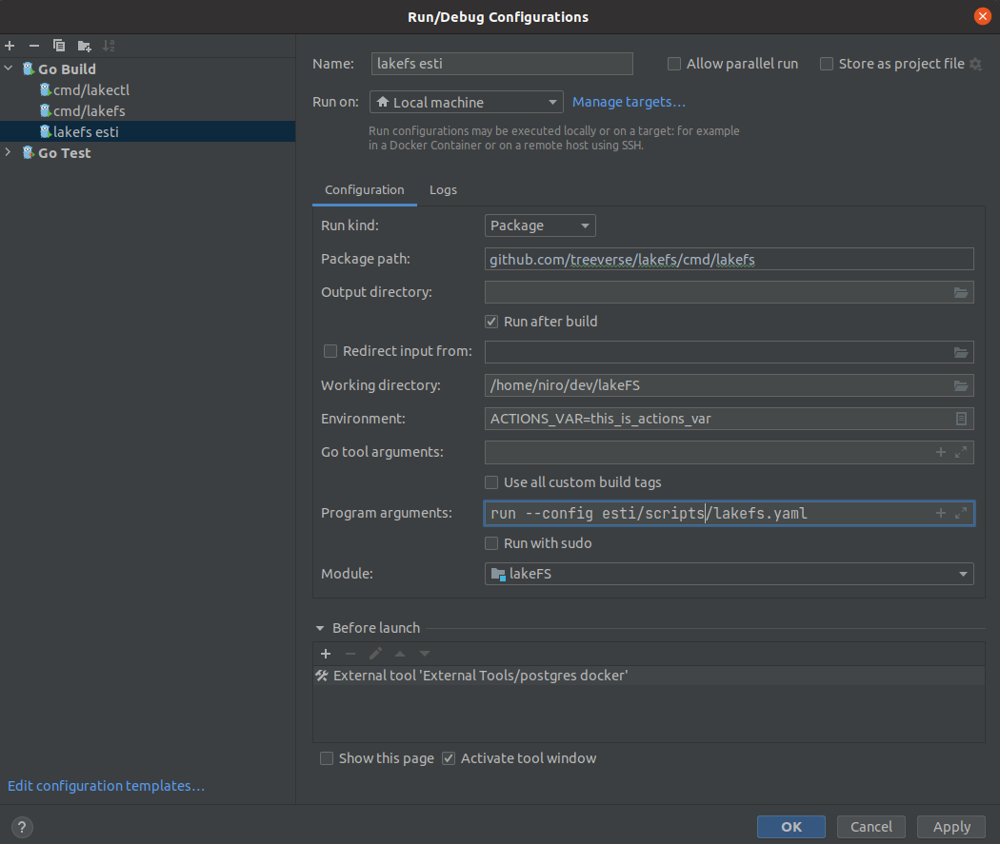
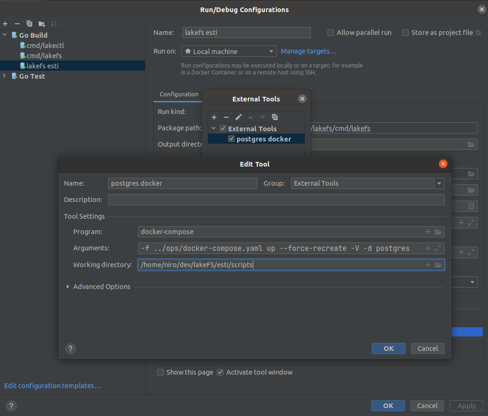
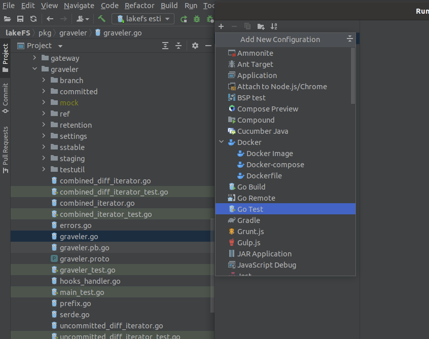
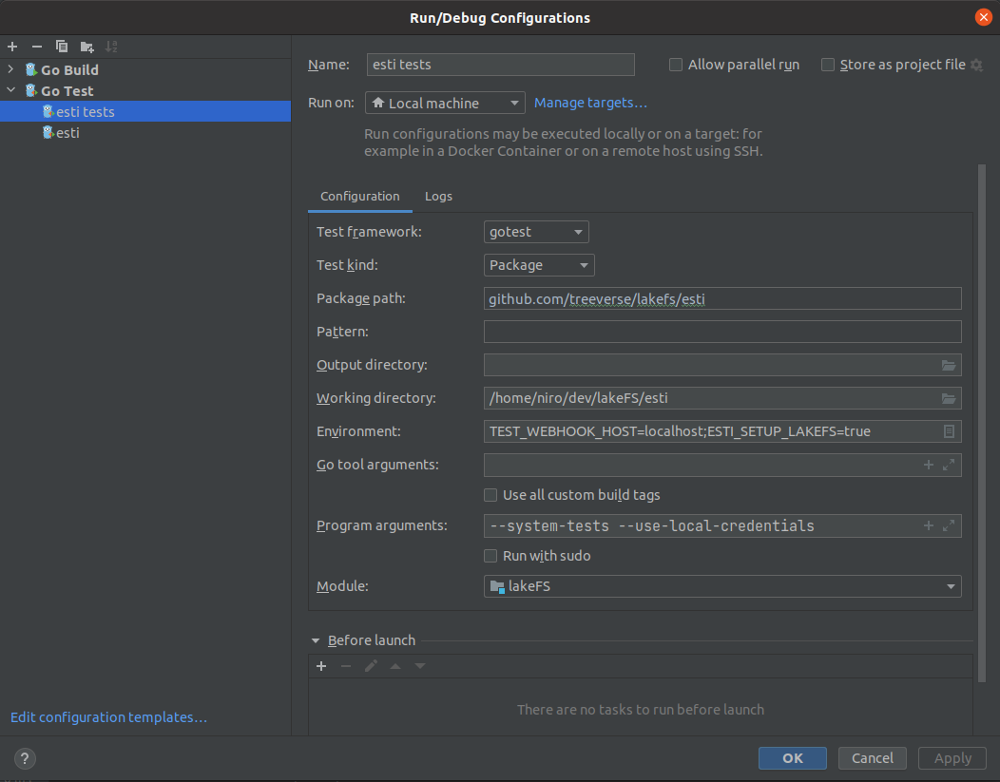

# System and Integration Testing

When a pull request is being committed / merged, we run several test suites to ensure nothing got broken due to the introduced changes.
Since these are system level tests, we created an infrastructure which deploys lakeFS on a VM and executes the tests using different clients on various storage adapters.

The following guide explains how to set up and execute the system tests infrastructure in order to optimize the development process, and enable debugging of the tests in a local environment.

## Running system tests

A couple of prerequisites before we start:

* Go over our [contributing](https://docs.lakefs.io/contributing.html) page and make sure you have a working lakeFS environment.
* [Docker](https://www.docker.com/)
* [Curl](https://curl.se/)

### Running lakeFS

*Before running the tests we need to run a lakeFS instance configured for local execution of system tests*

Under _**esti/scripts**_ you will find the following

1. **lakefs.yaml**
   1. Contains the lakeFS configuration required for local test execution
   2. We use local storage type to run the tests
   3. The data will be stored under the filesystem's _/tmp_ folder (can be configured to any folder with the required permissions)
2. **runner.sh**
   1. Script to execute lakeFS and tests
3. **set_env_vars.sh**
   1. Defines and sets all environment variables required for both tests and lakeFS execution
   2. Adding env vars or modifying existing variables should be done on this file
   3. Used as a reference for debug env as well (see next)
   

To run lakeFS for testing simply execute the following command in a shell console:
```shell
   esti/scripts/runner.sh -r lakefs 
```
The lakeFS server will run in the console and logs will be piped to both stdout and in a temporary file in the form of lakefs_<XXX>.log

### Executing tests

To run all the tests under the system tests folder, execute the following command in a new shell console:
```shell
   esti/scripts/runner.sh -r test
```
The tests will run, with the output piped to both stdout and in a temporary file in the form of lakefs_tests_<XXX>.log

The system test infrastructure allows additional flags and parameters to be passed for execution.
For example to run a specific test (by regex) we can use:
```shell
   esti/scripts/runner.sh -r test -test.run TestHooksSuccess
```
This command will execute all tests which match the given string regex (in this case it will run a single test by that name)  
For a full list of arguments run: 
```shell
   esti/scripts/runner.sh -r test --help
```

---

Notes:
1. By default, tests are performing lakeFS setup using predefined credentials. As consequence:
   1. Tests that validate creation of access key id and secret access key will not test this functionality
   2. This will require stopping and re-running the lakeFS server on each test execution
2. To run tests on an already existing lakeFS instance (after initial setup has occurred):
   1. Modify the ESTI_SETUP_LAKEFS environment variable from 'true' to 'false'
   2. Use cautiously as some test preconditions will cause tests to fail on existing lakeFS environments

---

## Debugging lakeFS and the system tests using IntelliJ

To debug the tests and server code we must create run configurations for both lakeFS and the system tests.

### LakeFS run configuration

1. From the '**Run**' menu select '**Edit Configurations...**', then '**Add New Configuration**' (the plus sign) and create a new '**go build**' configuration  
    
2. Copy the configuration from the following screenshot
   1. Add basic environment variables from the _set_env_vars.sh_ script's lakeFS section
   2. Add additional / modify environment variables as needed
   
   
3. Create a before launch, external tool to load the postgres docker image
   
4. Press 'Apply', make sure the configuration is saved (it is not grayed out on the left side menu) and press 'OK'
5. Try to execute the target (either by run / debug) and verify lakeFS server is running

### System tests run configuration

1. From the '**Run**' menu select '**Edit Configurations...**', and then '**Add New Configuration**' (the plus sign) and create a new '**go test**' configuration

   
2. Copy the configuration from the following screenshot
   1. Add basic environment variables from the _set_env_vars.sh_ script's System tests section
   2. Add additional / modify environment variables as needed
   3. To filter tests, you can provide a regular expression in the '**Pattern**' text box or alternatively provide the proper command line argument in the '**Prgram arguments**' text box
   
   
3. Press 'Apply', make sure the configuration is saved (it is not grayed out on the left side menu) and press 'OK'
4. Try to execute the target (either by run / debug) and verify tests are running

---

Don't know where to start? Experiencing difficulties? Reach out on the #dev channel on [our Slack](https://lakefs.io/slack), and we will help you get started.

---

